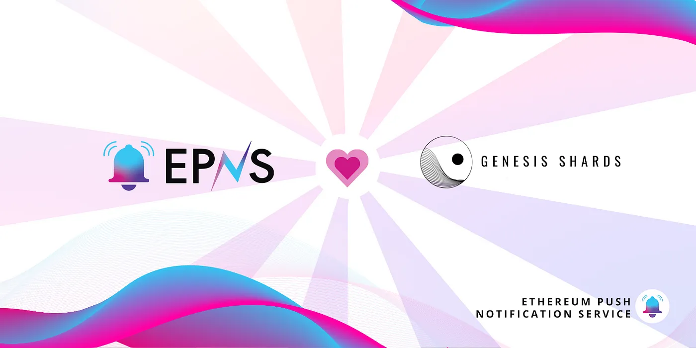

import { ImageText } from '@site/src/css/SharedStyling';

<!--truncate-->

Genesis Shards, the new-age marketplace transforming NFTs into a vehicle for pre-IDO tokens collaborates with EPNS to enable direct communication between the platform and its users. Users of Genesis Shards can now expect to receive timely updates about staking pools and whitelists on the platform through push notifications.

### Creating a Market for Illiquid Tokens

After the monumental success of ICOs (Initial Coin Offerings) in the early stages of the crypto industry, the emergent DeFi space came up with Initial DEX Offerings (IDOs) to solve the issue of centralization and allow any upcoming DeFi project to raise funds. Today, IDOs seem to be the popular choice for token distribution, however, in the Pre-IDO stages projects still struggle with low token liquidity due to the lack of a tradable market.

In this context, Genesis Shards is a decentralized ecosystem that aims to create a new Pre-IDO market using NFTs to solve these issues. The platform transforms NFTs into vehicles that carry Pre-IDO tokens, creating a tradable market for previously illiquid tokens. Projects leveraging these new Pre-IDO NFTs can get access to liquidity in the early stages of development. Moreover, owing to the appeal of NFTs, these projects can build a strong community presence early on.

As such, Genesis Shards could vastly benefit from a communication channel that allows the platform to directly convey updates about newly available whitelists and investment opportunities to its users. This is where the collaboration with EPNS could be pivotal.

### What Does the Alliance Entail?

As a part of the collaboration between EPNS and Genesis Shards, Genesis Shards will have an official channel on the EPNS platform. Users are free to subscribe to this channel and upon doing so, they become recipients of decentralized push notifications coming directly from Genesis Shards. They can expect notifications if and wherever

- New staking pools are available
- Staking pools are closing
- A new project goes live
- They win an IDO whitelist

As Genesis Shards is transforming IDOs with its innovative Pre-IDO approach, we’re enthralled to be a part of this journey and hope to be an integral part of their operations.

About Genesis Shards
Genesis Shards is a marketplace for transforming NFTs into a liquidity vehicle for Pre-IDO tokens and a whole new suite of DeFi products across multiple blockchains. By wrapping time-locked fungible tokens into NFTs, the platform aims to create a new market for previously illiquid tokens.

Stay in touch! [Website](https://www.genshards.com/)
