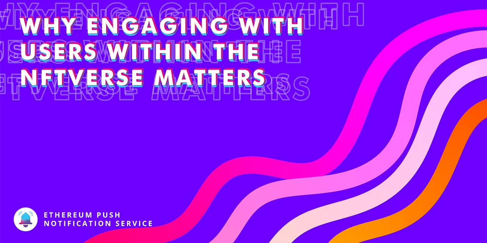
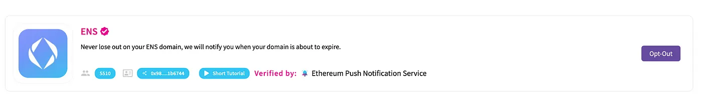

import { SubHeader, ImageText } from '@site/src/components/SharedStylingV2';

<!--truncate-->

With the recent launches of Coinbase NFT, a peer-to-peer NFT marketplace with a personalised social feed feature; and Lens Protocol 🌿 a social graph to build decentralized social media platforms NFTs and the dawn of decentralized censorship-free social media is eventually bound to happen soon.

<iframe src="https://cdn.embedly.com/widgets/media.html?type=text%2Fhtml&amp;key=a19fcc184b9711e1b4764040d3dc5c07&amp;schema=twitter&amp;url=https%3A//twitter.com/lensprotocol/status/1526918065409216512&amp;image=https%3A//i.embed.ly/1/image%3Furl%3Dhttps%253A%252F%252Fabs.twimg.com%252Ferrors%252Flogo46x38.png%26key%3Da19fcc184b9711e1b4764040d3dc5c07" allowfullscreen="" frameborder="0" height="576" width="680" title="LensProtocol.lens 🌿 on Twitter: &quot;Bloom into a new era of social 🌿 Lens Protocol is ready for you to build the next gen of social media apps. The garden is open... https://t.co/bhzgxs9JFt pic.twitter.com/m2IqtIfb7P / Twitter&quot;" class="ek n fc dx bg" scrolling="no"></iframe>

As we see the advent of NFT marketplaces like Soundxyz, OurZora, Coinbase NFT including social features to make the experience similar to that of scrolling a social media site with personalised recommendations, Instagram and Twitter starting to support NFTs, Lens protocol launching a decentralized framework for building social media applications that utilises NFTs for pfps and much more, it is evident that social media and NFTs (even NFT marketplaces) will soon go hand in hand, each one building off the other, building a more cohesive creator economy.

The unprecedented growth of NFTs (and hence NFT Marketplaces like Opensea) has led to an influx in new users in web3 in the past year. Although, with increased demand and users, comes the need for better user experiences and communication between protocols and its users.

### A Need for a Better Solution for Web3 Communication
The current state of web3 social media and NFT marketplaces are reliant on web2 based centralized platforms in order to communicate with their users. This usually means one would need to dox their email, or any other personal handle in order to stay connected and updated about the state of their profile. One needs to reveal more than their wallet address in order to receive updates on the platform, or else they need to actively login to the platform in order to receive updates. In a world where users are accustomed to having information right at their fingertips, this is cumbersome and inefficient. Such a user flow is akin to that of the early 2000s when emails and early social media expected users to keep refreshing their pages to check if they have any updates. That is, until push notifications arrived.

<iframe src="https://cdn.embedly.com/widgets/media.html?type=text%2Fhtml&amp;key=a19fcc184b9711e1b4764040d3dc5c07&amp;schema=twitter&amp;url=https%3A//twitter.com/petrdu/status/1486059854137643008&amp;image=https%3A//i.embed.ly/1/image%3Furl%3Dhttps%253A%252F%252Fabs.twimg.com%252Ferrors%252Flogo46x38.png%26key%3Da19fcc184b9711e1b4764040d3dc5c07" allowfullscreen="" frameborder="0" height="849" width="680" title="petrduda.eth 💯 on Twitter: &quot;Houston, we have a problem. @BudweiserUSA introduced me to @Sanchezsammyy with an #NFT drop. She is a brilliant artist but the only way she can reach me &amp; her new community is via Budweiser Discord. We need better tools so artists can reach their fans directly. pic.twitter.com/qEfApBgDbZ / Twitter&quot;" class="ek n fc dx bg" scrolling="no"></iframe>

Nowadays, push notifications are so engraved into our lives that without it things will not be the same. The value of platform-to-user communication and vice versa is crucial to cultivating user retention in the long term.

Such a communication layer has been lacking in web3 for a long time, that is until EPNS arrived. EPNS is a decentralized communication layer for the Web3 ecosystem. It allows any dApp, protocol, or smart contract to send send communication (starting with on chain / off chain / gasless notifs) tied to user wallet addresses in an open, gasless, multichain and platform agnostic fashion. This allows users to receive updates in real-time without revealing more than their wallet address connected to their favorite platforms and protocols.

Let us explore some of the ways web3 social media platforms and NFT marketplaces can leverage EPNS to effectively communicate with their users:

### NFT Trading (Buy, Sell, Auction, Offers)
NFT Marketplaces need to communicate with their users when one’s NFT has received an offer or got sold. This sort of communication is crucial for a trader’s user experience in a marketplace.

<iframe src="https://cdn.embedly.com/widgets/media.html?type=text%2Fhtml&amp;key=a19fcc184b9711e1b4764040d3dc5c07&amp;schema=twitter&amp;url=https%3A//twitter.com/opensea/status/1534957511777914881&amp;image=https%3A//i.embed.ly/1/image%3Furl%3Dhttps%253A%252F%252Fabs.twimg.com%252Ferrors%252Flogo46x38.png%26key%3Da19fcc184b9711e1b4764040d3dc5c07" allowfullscreen="" frameborder="0" height="983" width="680" title="OpenSea on Twitter: &quot;New drop from @playSHRAPNEL goes live at 1pm PST 👀check out the deets below ↯ https://t.co/qYpiJzAsXe / Twitter&quot;" class="ek n fc dx bg" scrolling="no"></iframe>

The idea is to bring notifications to users when activities happen on the marketplace. For example, an NFT is bought or sold, or even when someone has put up an offer for it. The need for realtime notifications also arise during NFT auctions where time is of the essence in most cases. Notifications allow NFT traders to know if they either won an auction or if they got outbid, this allows them to make educated decisions and be on top of the situation.

Popular NFT activities can also be monitored by tracking its on-chain movement and notifying interested users, this allows users to create watchlists for NFTs they are eyeing for when they are put for sale or for any other reason.

### Artist drops and New Project Launches
With new projects and celebrity and artist drops happening every day, it is hard to keep track of what is happening and when. With the help of EPNS, fans can finally get notified when their favorite artist is about to drop their next collection, or if a new promising project goes live. Users can follow these creators and be notified of news that could be interesting to them.

<iframe src="https://cdn.embedly.com/widgets/media.html?type=text%2Fhtml&amp;key=a19fcc184b9711e1b4764040d3dc5c07&amp;schema=twitter&amp;url=https%3A//twitter.com/beeple/status/1536413438347460616&amp;image=https%3A//i.embed.ly/1/image%3Furl%3Dhttps%253A%252F%252Fabs.twimg.com%252Ferrors%252Flogo46x38.png%26key%3Da19fcc184b9711e1b4764040d3dc5c07" allowfullscreen="" frameborder="0" height="753" width="680" title="beeple on Twitter: &quot;ART BASEL pic.twitter.com/uUDllQyFZf / Twitter&quot;" class="ek n fc dx bg" scrolling="no"></iframe>

### NFT’s are GOOD!
Some projects are more than just being a marketplace, like [DoinGud](https://twitter.com/DoinGudHQ), which is a social marketplace focused on inspiring creativity and positive social impact.

Speaking of creators, there’s a great project we are collaborating up with which is celebrating Manga culture and OG NFTs being the first platformless P2E called [CryptoMangaNFT](https://twitter.com/CryptoMangaNFT)

And then of course we have your most famous [ENS domains](https://twitter.com/ensdomains), which also are your own NFTs! And with most domains, you’d know they become priceless especially if they’re unique and in the Web3 world in the future, those domain names for your wallet will become all the more important if they’re unique! Having said that, you might forget when they expire, given that most folks buy it for extended periods.

Always good to be notified about that right? Given the value? We have built an ENS domain expiration channel that can notify users when their ENS domain is about to expire, so you never miss out on your domain name. To subscribe to the ENS channel head to [app.epns.io](http://app.epns.io/) and opt-in.

### The Social Network for NFTs (chat, like, share, comments)
As the NFT ecosystem explodes, complimentary NFT platforms are gaining traction. These platforms can help users explore new NFTs, connect communities, measure social engagement in a decentralized manner, platforms like Lenster, TryShowtime.

The current state of web3 social media is still evolving and EPNS is the perfect solution that allows for protocol to user communication in a decentralized manner. With EPNS, an on-chain or off-chain action can be used to trigger a notification, and hence be able to disperse information to the concerned people right at their fingertips. EPNS soon to be launched wallet to wallet chat will be an interesting addition to the social lego for creator economy — connecting buyers- sellers, group messaging, artist- fans, and even platform-to-user and vice versa communication such as customer care services, etc.

NFTVerse is still an early market, but there is a significant opportunity for native communication to accelerate the adoption.

### About Push Protocol

Push is the communication protocol of web3. Push protocol enables cross-chain notifications and messaging for dapps, wallets, and services tied to wallet addresses in an open, gasless, and platform-agnostic fashion. The open communication layer allows any crypto wallet /frontend to tap into the network and get the communication across.

To keep up-to-date with Push Protocol: [Website](https://push.org/), [Twitter](https://twitter.com/pushprotocol), [Telegram](https://t.me/epnsproject), [Discord](https://discord.gg/pushprotocol), [YouTube](https://www.youtube.com/c/EthereumPushNotificationService), and [Linktree](https://linktr.ee/pushprotocol).

