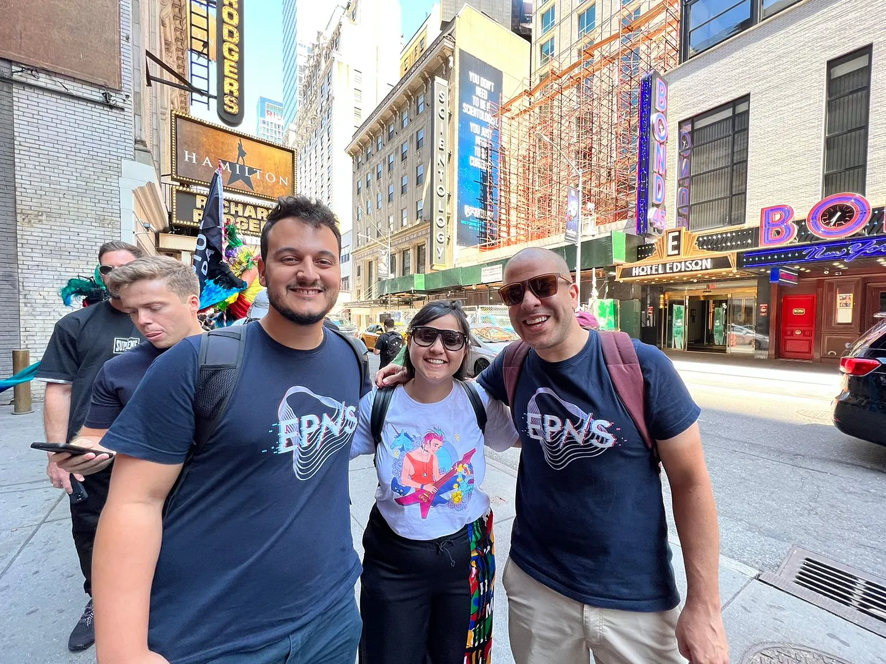
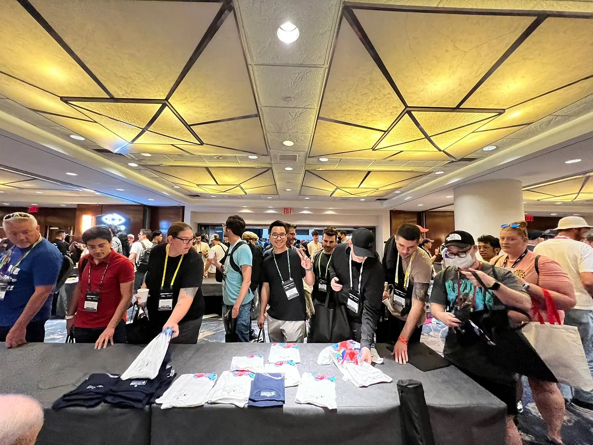
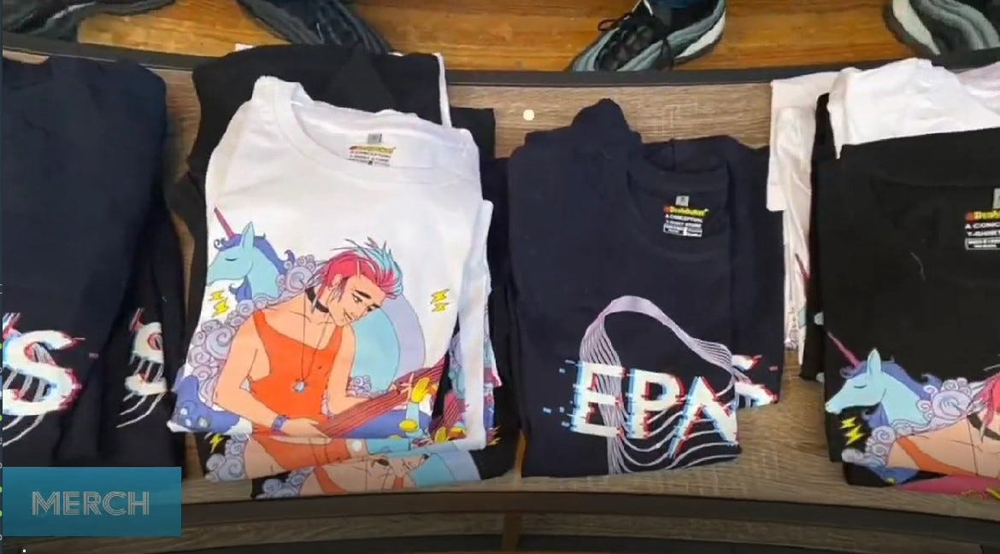
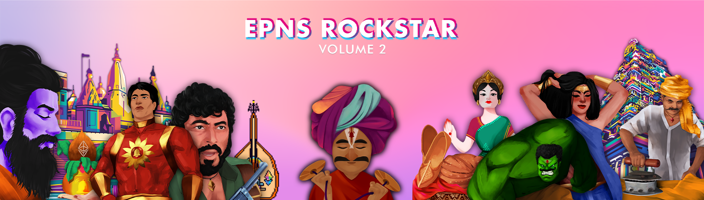

import { SubHeader, ImageText } from '@site/src/components/SharedStylingV2';

<!--truncate-->

We’re all set and headed to the biggest NFT Party in the world! Touted as the Superbowl of the NFTs and the new CES for NFTs by our frens at Coinbase and Ledger respectively, hsow can we miss this event!

So excited to be part of this <b>4th Annual NFT Industry Event</b> in person and the EPNS Team is going to be doing some really exciting things while we’re at NFT NYC!

Here’s a little bit about what we’re up to at <b></b>

<b>Catch up the EPNS Team over a coffee</b>

<ImageText>From L-R — Fabio, Richa & Jaf (EPNS Team at NFT NYC)</ImageText>

As excited as we are about a ton of things we’re doing at NFT NYC, we’re truly excited to meet new frens, and the community at this amazing event!

You can drop by and say hello at the <b>Barista Coffee Cart on June 22 - Marriott 7th floor!</b>

If you’re a channel, marketplace, developer or an NFT artist, there’s a ton of opportunities for us to sync up on! So we’d really love to meet up irl!

Feel free to reach out to our team members [Richa](http://twitter.com/riijo/), [Jaf](https://twitter.com/jafetsc) or [Fabio](https://twitter.com/learn4life6) on Twitter!

Oh and of course you’d also get to grab some of our cool EPNS Merch while you’re there!

<ImageText>Come say hello when you’re at NFT NYC</ImageText>

<ImageText>A closer look at our EPNS Swag Tees!</ImageText>

<b>Launch of Rockstars of EPNS V2</b>

Almost about a year ago, EPNS did a really awesome activity for our amazing community!

We kicked off [The Rockstars of EPNS](https://medium.com/ethereum-push-notification-service/the-first-nft-collection-from-epns-677e23173c95), our first collection of [NFTS](https://opensea.io/collection/rockstars-of-epns) which we dropped to celebrate the launch of $PUSH!

<iframe src="https://cdn.embedly.com/widgets/media.html?type=text%2Fhtml&amp;key=a19fcc184b9711e1b4764040d3dc5c07&amp;schema=twitter&amp;url=https%3A//twitter.com/epnsproject/status/1519367021695172615&amp;image=https%3A//i.embed.ly/1/image%3Furl%3Dhttps%253A%252F%252Fabs.twimg.com%252Ferrors%252Flogo46x38.png%26key%3Da19fcc184b9711e1b4764040d3dc5c07" allowfullscreen="" frameborder="0" height="689" width="680" title="EPNS | $PUSH on Twitter: &quot;1/ And just like that, this amazing ride of 52 weeks of #RockstarsOfEpns has come to an end🥺We've never felt so loved!💕Thank you everyone for all the love &amp; support over these past 52 weeks &amp; more!✨But what next?👀 Dive in to learn what's coming!👇https://t.co/azt3vlmUhN pic.twitter.com/9nc6ebO376 / Twitter&quot;" class="ek n fc dx bg" scrolling="no"></iframe>

At EPNS we are huge fans of the NFT space and the emerging creator economy and we were so thrilled to be witnessing a wave of adoption among creators and artists.

So, we decided to throw our hat in the ring by supporting artists, celebrating our origins, and giving back to the community along the way. And that was just in time for the $PUSH token sale and the EPNS mainnet launch! 🙌

And guess what? Just in time for NFT NYC, we’re super excited and thrilled to announce the launch of <b>The Rockstars of EPNS V2.</b>

And of course you’ll get to know how you could partake in collecting these NFTs, pretty soon.

Stay tuned for more updates on our social media for that one!

While we’re there, on the <b>22nd of June 2022</b>, our <b>Co-Founder Richa Joshi</b> will be doing an interesting talk about Building the communication layer for NFTs which would focus on:

The what and why web3 communication is important for NFTs. Use cases of web3 communication across NFTs, DeFi, Gaming, Content and How to Notify using EPNS across the NFTverse.

- <b>Title:</b> Why NFT Communication Matters
- <b>Speaker 💬:</b> Richa Joshi — Co-Founder EPNS
- <b>Time ⏲️:</b> 10:30 AM
- <b>Date 📅:</b> Wed 6/22/2022
- <b>Location📍:</b> Tron DAO Theatre at the Marriott Marquis (7th Floor)

Speaking of NFTVerse, you might want to check out our latest blog we wrote on <b>Why engaging with your users within the NFTVerse matters!</b>

<iframe src="https://cdn.embedly.com/widgets/media.html?type=text%2Fhtml&amp;key=a19fcc184b9711e1b4764040d3dc5c07&amp;schema=twitter&amp;url=https%3A//twitter.com/epnsproject/status/1537480225256136704&amp;image=https%3A//i.embed.ly/1/image%3Furl%3Dhttps%253A%252F%252Fabs.twimg.com%252Ferrors%252Flogo46x38.png%26key%3Da19fcc184b9711e1b4764040d3dc5c07" allowfullscreen="" frameborder="0" height="689" width="680" title="EPNS | $PUSH on Twitter: &quot;As we approach #NFTNYC2022 &amp; the #NFTVerse grows we feel a strong need for a native communication layer to accelerate growth! 🌱In our latest blog we share exactly Why Engaging with Users Within the NFTVerse Matters &amp; how #Web3Comm will help! 👩🏾‍🤝‍👩🏻🤝📰👉 https://t.co/w7URfE6Pkz pic.twitter.com/LCWGkk55jh / Twitter&quot;" class="ek n fc dx bg" scrolling="no"></iframe>

#### Lastly, What’s #MYNFTStory

<iframe width="100%" height="382" src="https://www.youtube.com/embed/rPtUvV_1hW0" title="At @NFTNYC we ask you &quot;What&#39;s #MyNFTStory&quot;" frameborder="0" allow="accelerometer; autoplay; clipboard-write; encrypted-media; gyroscope; picture-in-picture; web-share" allowfullscreen></iframe>

Since NFT NYC is also one of the biggest NFT Parties across the world, we were like, almost certain that a bunch of us frens would share a ton of #NFTStories as conversation starters, icebreakers and what not!

And that’s when we struck this idea of launching a really cool campaign where you ask yourselves

‘Whats <b>#MYNFTStory?’</b>

- #### You might be an NFTHODLer
- #### An NFT Artist!
- #### Founder of an NFTProject
- #### Or just part of NFT Projects and eager to get in

A chance to share your NFTStory and heck, even WIN something BIG!

#### Participate in this campaign of ours!

<iframe src="https://cdn.embedly.com/widgets/media.html?type=text%2Fhtml&amp;key=a19fcc184b9711e1b4764040d3dc5c07&amp;schema=twitter&amp;url=https%3A//twitter.com/epnsproject/status/1538873089945006080&amp;image=https%3A//i.embed.ly/1/image%3Furl%3Dhttps%253A%252F%252Fabs.twimg.com%252Ferrors%252Flogo46x38.png%26key%3Da19fcc184b9711e1b4764040d3dc5c07" allowfullscreen="" frameborder="0" height="600" width="680" title="EPNS | $PUSH on Twitter: &quot;Ok, NFT Time! In 250 chars or less, tell us about your favorite NFT story by replying below 👇 and we might drop something! LFG!!!! #MyNFTStory #NFTNYC2022 @NFT_NYC pic.twitter.com/EObxYvSzJi / Twitter&quot;" class="ek n fc dx bg" scrolling="no"></iframe>

- Go to our [#MyNFTStory Twitter Campaign](https://twitter.com/epnsproject/status/1538873089945006080)
- Reply to this tweet with a story of your first or your favorite NFT
- Use #MYNFTStory #NFTNYC2022
- And you might WIN one of our Rockstars Of EPNS NFT & 2400 $PUSH

With so many awesome happenings at this great event, we’re really looking forward to being part of them and interacting with all you community members! Given that it’s been a while since we’ve been to an IRL event post ETHAmsterdam.

Speaking of which, post NFT NYC, we’ll also be doing a Hackathon as part of ETHGLobal’s ETHNYC! So stay tuned for more details on that one soon.

### About Push Protocol

Push is the communication protocol of web3. Push protocol enables cross-chain notifications and messaging for dapps, wallets, and services tied to wallet addresses in an open, gasless, and platform-agnostic fashion. The open communication layer allows any crypto wallet /frontend to tap into the network and get the communication across.

To keep up-to-date with Push Protocol: [Website](https://push.org/), [Twitter](https://twitter.com/pushprotocol), [Telegram](https://t.me/epnsproject), [Discord](https://discord.gg/pushprotocol), [YouTube](https://www.youtube.com/c/EthereumPushNotificationService), and [Linktree](https://linktr.ee/pushprotocol).
