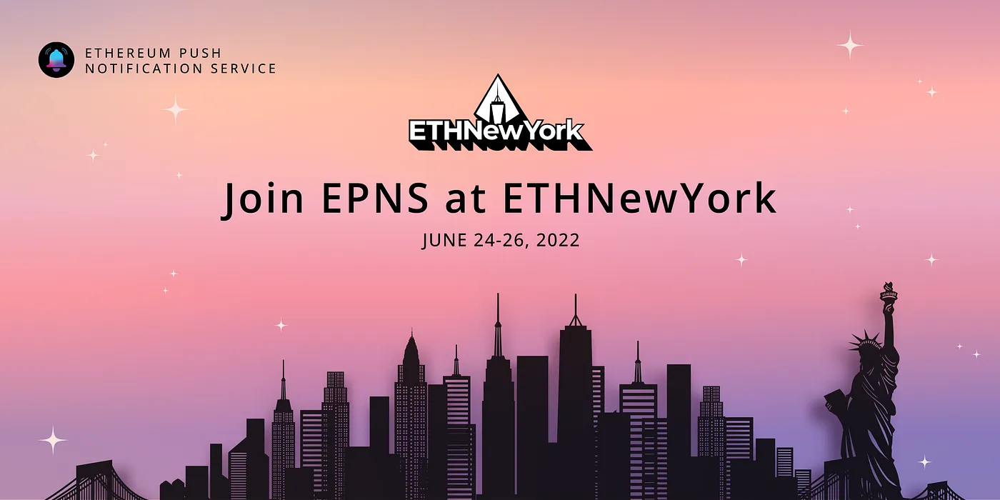
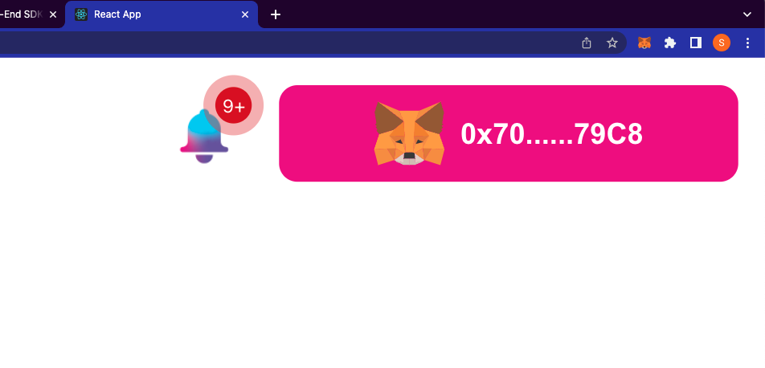

import { SubHeader, ImageText } from '@site/src/components/SharedStylingV2';

<!--truncate-->

<b>Hello Hello Hello ETHNewYork!</b>

It feels so great to be here in NYC! One of the coolest cities in the world! The city of diversity and dynamism!

And of course having to meet some of the most amazing, coolest and rockstar BUIDlers of Web3!

As you join us from <b>June 24th-26th for ETHNewYork</b> alongside developers and creatives from the globe, we’re teaming up with ETHGlobal to build an awesome Web3 hackathon experience IRL, and hope you have an amazing experience!

And to help you out with this Hackathon, we thought we’d quickly set up a blog to help you build on top of EPNS protocol for our amazing prize pool and then some..

### About Ethereum Push Notification Service
EPNS is a decentralized communication protocol for Web3! Using which any dApps, smart contracts, backends or protocols can send comm (starting with on chain / off chain / gasless notifs) tied to user wallet in an open, gasless, multichain and platform agnostic fashion. Open comm layer allows any crypto wallet / frontend to tap into the network and get the comm across.

### Prize Overview — For ETHNewYork Hackathon
- 1st PRIZE — $ 2000 USDC
- 2nd PRIZE — $1500 USDC
- 3rd PRIZE — $ 500 USDC
- Runner Ups x 5 — $100

But that’s not just it! Over and above this we have an exciting grants program for you as well!

### Push Grants Program approved for $1 Million!
This you’ll also be able to partake in and it’s running all the way up until the second quarter of this year! You’ll be able to find more details of this in our blog [here](https://medium.com/ethereum-push-notification-service/push-grants-program-going-live-6841515f95d8)!

### 🔗 Important Reference links for Developers
- [EPNS Documentation Hub](https://docs.epns.io/)
- [EPNS Discord](https://discord.gg/n4EYGyPJcF)

Also, while you’re at the venue, come to our table & grab our Cheat Sheet! Will come in handy! And we’d get to meet you too irl… 🤝😊

<ImageText>Cheat Sheet for Devs and Hackers</ImageText>

### TL;DR — Quick Demo Video to get you started
While you read through the blog for references, links and all the useful tips to BUIDL with us, if you prefer to, we have made a Workshop Video for you to view directly, which would also be provided to you by the ETHGlobal team and will show up on their channels.

<iframe width="100%" height="382" src="https://www.youtube.com/embed/cD5PSb97K5c" title="EPNS 🛠 Building Web3 Communication in your DeFi App" frameborder="0" allow="accelerometer; autoplay; clipboard-write; encrypted-media; gyroscope; picture-in-picture; web-share" allowfullscreen></iframe>

### Ideas to Buidl. Solve. Conquer.
For those who’d prefer to go the reading way here’s how you can Buidl. Solve. Conquer this weekend!

As the blockchain ecosystem has evolved into a composable, multi-chain network, native Web3 communication is growing more and more necessary for user experience, developer operations, investor security, protocol architecture, and a lot more.

Today’s methods of communication between and among Web3 users and companies — dominated by Twitter, Discord, and Telegram — give rise to poor UX, scams, and sub optimal communication. Among some of the most pressing issues: smart contract version releases are missed, liquidation thresholds are not warned, NFT drops are forgotten, and vulnerabilities aren’t communicated well.

The result is a fractured and siloed approach towards communication in the blockchain ecosystem, making room for an optimised, Web3-native solution. EPNS is created to fix this! This is how:

Integrate EPNS to your dApp and improve UX for all Web3 users

- This is probably the easiest, As EPNS is a communication layer, the best and quickest way to get this going is to integrate EPNS in your dApp via our frontend sdk & tutorial here
- This will not only improve the user experience for your dApp as users can now instantly see all their notifications across all their activities that they have opted in for but it also vastly improves the entire UX of the Web3 space.

<b><i>Screen1- User is connected to their wallet and has loaded their dApp.</i></b>

<b><i>Screen2 — User sees the EPNS notifications if they are subscribed to any channels in a sidebar which comes on the click on the bell icon.</i></b>

<b>Create your dApp / protocol channel and send notifs</b>

- So, you already integrated EPNS but like to also improve the experience for your users. Well, this is where you can jump in and create your own channel (any service that sends notifications are called channels).
- After which you can easily start sending important notifications about your project directly to the wallet address in a gasless way.
- Whether you are creating DAO, DeFi, NFT, Metaverse or anything in between, having a direct form of communication tied to user’s wallet address massively improves the experience of your dApp (and goes extremely well with the bell icon you have integrated)

<b>Check out our <a href='https://docs.epns.io/developers/developer-tooling/showrunners-framework'>Showrunners</a> and <a href='https://docs.epns.io/developers/developer-zone/examples/showrunners-example'>Tutorials</a> here for more details</b>

<b>Create notifications channel for anything Web3</b>

- A lot of projects and protocols are popular but still don’t have notifications, you can build notifications for them, not only you get prizes for it but some amazing incentives are coming for the channels that are popular (though this is a different conversation). Some ideas that you can use if you want to build out a notif channel.

<b>Web3Comm for DeFi</b>

The DeFi ecosystem is a landscape of constant innovation. We have seen an unprecedented amount of on-chain activity, prompting acute needs from users to keep on top of what is happening. EPNS is poised to accelerate the adoption of the DeFi ecosystem to meet the needs of users and dapps to keep up with rapid innovation.

This of course is one while most important we’ve made quite a headway with a bunch of partners, however if you think you are able to renovate some of this, and build your own technology and have protocols that change the DeFi space for the better, we’d definitely invite you to explore this side of things. Some of the things that EPNS can enable for DeFI protocols and their users is to solve critical DeFi problems as below..

- Near Liquidation Alert (Borrowers & Liquidators)
- Staking Rewards Available to Claim (Stakers)
- Staking Rewards About to Expire (Stakers)
- Price Alerts (Traders)
- Stablecoin Peg Slippage (Arbitrageurs)
- Low Gas Cost (Devs, ETH Power Users)
- Rebalances (Token Set Users)
- Index Selection/Weighting Changes (Index Users)
- Token/Contract Migrations (Protocol Users)
- Governance Updates, Token Launches
- New Collateral Types on Money Markets
- New Liquidity Mining Incentives
- Yield Farming APY alerts
- Escrow Periods Ending / Tokens Coming Unlocked

Besides these there are a ton of other applications that’ll most Web3 users in terms of getting communication or help on notification for that are of important notifications across the board.

Hope these ideas are some that you find exciting to build, and if you do have any queries feel free to reach out to us on Twitter @epnsproject

### ☎️ Who do we reach out to for assistance?
Feel free to reach out to us at <b>ETHNewYork</b>, our Co-Founder Richa and the EPNS team will be at the venue till the end of the hackathon. And of course on the <b>#sponsor-epns</b> channel on <b>ETHGlobal Discord</b>

- [Fabio](http://twitter.com/learn4life6), Our Senior Developer Lead [Balkage#7666 on Discord]
- [Richa](http://twitter.com/riijo/), Our Co-Founder [Richa | EPNS#321]1
- [Jaf](http://twitter.com/jafetsc), Integration Lead [Jaf | EPNS#7611 on Discord]

### 🎁EPNS Merch up for grabs!
While of course we’ll get to know you when we meet up, interact with you guys, and will have some snacks for y’all awesome teams during the hackathon, we also got some goodies as giveaways for you to take back home as memories. So feel free to drop by at our table and grab some of our awesome merch!

### Throwback: ETHAmsterdam Hackathon
As you get cracking on BUIDLing with us we thought we’ll sign off with some memorable moments from our last hackathon at [ETHAmsterdam](https://twitter.com/epnsproject/status/1518558686498594816) and you’d know, when we go all out with our hackathons, we go all out!

All the best! 👍🤞👍🍀

### About Push Protocol

Push is the communication protocol of web3. Push protocol enables cross-chain notifications and messaging for dapps, wallets, and services tied to wallet addresses in an open, gasless, and platform-agnostic fashion. The open communication layer allows any crypto wallet /frontend to tap into the network and get the communication across.

To keep up-to-date with Push Protocol: [Website](https://push.org/), [Twitter](https://twitter.com/pushprotocol), [Telegram](https://t.me/epnsproject), [Discord](https://discord.gg/pushprotocol), [YouTube](https://www.youtube.com/c/EthereumPushNotificationService), and [Linktree](https://linktr.ee/pushprotocol).

