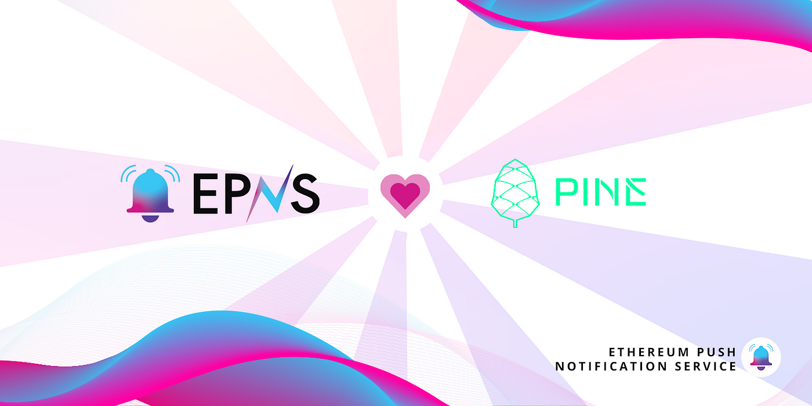

import { SubHeader, ImageText } from '@site/src/components/SharedStylingV2';

<!--truncate-->

EPNS and Pine, the decentralized NFT loan platform, join hands in a pilot collaboration to bring push notifications to users. As such, Pine will now be able to seamlessly interact with its users and keep them updated about the status of their loans on the platform.

### NFT Backed Lending
Pine is a decentralized lending and borrowing protocol in DeFi that allows users to borrow funds against their NFTs. Now, the NFT industry is one of the fastest-growing and most valuable in the world, with a market value of more than $40 billion. In the beginning, digital artists sold individual pieces of art as NFTs. And now, it’s a field with thousands of projects that could change the way the world’s biggest industries work. With an increase in utility, the net value of this asset class has increased exponentially with some NFTs going in the millions.

As such, NFT investments make for good collateral and Pine aims to bring this convenience to investors. The platform provides permissionless, instant loan transactions that evade the need for negotiations. The NFTs are valuated in real-time to ensure that both the borrower and the lender get a fair deal on the loan. Once the NFT is locked as collateral, borrowers can receive the loan amount in a cryptocurrency of their choice, even if it is different from the NFTs native chain.

In this regard, Pine can benefit from a decentralized communication medium that keeps users updated about the status of their loans.

### What Does the Alliance Entail
As a result of our pilot collaboration with the platform, Pine will have an official channel on the EPNS platform. Users who choose to subscribe to this channel, are directly connected for seamless communication with the platform in a decentralized manner. They can expect to receive notifications like

- Loan Liquidation alerts
- Loan about to expire alerts
These notifications save users time and efforts of manually checking for loan updates and helps them take the right action on time. With a chrome extension, a dApp, and a mobile application, EPNS ensures that notifications are delivered to all devices and are not missed.

As Pine continues to revolutionize the DeFi lending space, we are pleased to collaborate with them to ensure the smooth running of their processes. We are hopeful that EPNS push notifications will become an integral part of the Pine Protocol.

### About Pine

Pine Protocol is a lending and borrowing protocol built on multiple blockchains to facilitate on-chain asset-backed financing. As a two-sided protocol, Pine allows borrowers to use their assets, represented on-chain via NFTs, as collaterals to borrow cryptocurrencies from lenders in real-time, in a fair, transparent, and efficient way. Pine is built by a team of NFT lovers who come from diverse backgrounds in blockchain engineering, investment banking, and management consulting.

Stay in touch! [Website](https://pine.loans/), [Twitter](https://twitter.com/PineLoans), [Medium](https://medium.com/@PineLoans)

### About Push Protocol

Push is the communication protocol of web3. Push protocol enables cross-chain notifications and messaging for dapps, wallets, and services tied to wallet addresses in an open, gasless, and platform-agnostic fashion. The open communication layer allows any crypto wallet /frontend to tap into the network and get the communication across.

To keep up-to-date with Push Protocol: [Website](https://push.org/), [Twitter](https://twitter.com/pushprotocol), [Telegram](https://t.me/epnsproject), [Discord](https://discord.gg/pushprotocol), [YouTube](https://www.youtube.com/c/EthereumPushNotificationService), and [Linktree](https://linktr.ee/pushprotocol).

