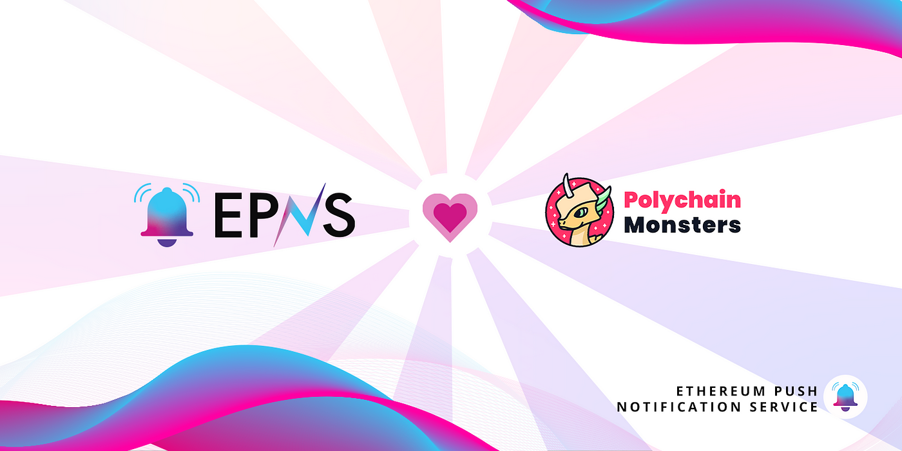

import { ImageText } from '@site/src/css/SharedStyling';

<!--truncate-->

<!--customheaderpoint-->

# EPNS and Polychain Monsters join forces to enable direct communication for users through decentralized push notifications.

Polychain Monsters, the cross-chain digital collectible and gaming ecosystem, and EPNS team up in a pilot collaboration to bring decentralized push notifications for users. As such, Polychain Monsters will now be able to seamlessly interact with its users and keep them updated about the status of their various activities in the rapidly expanding “Polyverse”.

## Polychain Monsters: The Cross-Chain Collectible Ecosystem

Polychain Monsters is an NFT project that aims to build a cross-chain digital collectible and gaming experience. At the very core of this project are Polymon, intricately designed and animated NFTs which can be unpacked in digital booster packs using $PMON tokens. These booster packs are available on the Ethereum, Binance Smart Chain, and Polygon networks, in addition to a one-off 10k Solana drop featuring Polychain Monsters’ latest expansion — Exomon. Each booster pack includes three Polymon, which come in a variety of traits that define their rarity. Some combinations of traits are extremely rare and valuable, and have sold on secondaries for over $100,000.

Polymon holders can earn weekly rewards by staking their NFTs or participating in yield farming using $PMON tokens. These Polymon will eventually play a crucial part in multiple play-and-earn games that are currently being developed within the Polychain ecosystem. As such, this project can significantly benefit from a decentralized communication channel that updates its users every time a new booster pack is available or when their rewards are deployed. This is where the alliance with EPNS comes into play.

## What Does the Collaboration Entail?

The main aim of our collaboration with Polychain Monsters is the creation of a decentralized communication channel that enables direct communication between users and the platform. This channel will be housed on EPNS and users of Polychain Monsters can subscribe to it to become beneficiaries of decentralized notifications. They can expect to receive notifications whenever:

- Their rewards are sent
- They pulled a rare Polymon
- Other incoming features to be revealed
  This saves users from manually checking for updates, making the platform easy to use. EPNS has a Chrome extension, a dApp, and a mobile application to ensure that users do not miss out on notifications on any device.

We’re excited to strike this alliance with Polychain Monsters and hope to become an integral part of their operations.

### About Polychain Monsters

Polychain Monsters are beautifully animated cross-chain NFTs with varying scarcity, waiting to be discovered in digital booster packs. These NFTs will play an integral part in upcoming off- and on-chain games. In addition, Polychain Monsters offers DeFi features such as ERC-20 & BEP-20 PMON, as well as NFT staking.

Stay in touch! [Web](http://polychainmonsters.com/), [Discord](https://discord.gg/polychainmonsters), [Twitter](http://twitter.com/polychainmon), [Reddit](http://reddit.com/r/polychainmonsters), [Telegram](http://t.me/polychainmonsters), [OpenSea (ETH / Polygon)](https://opensea.io/assets/polychainmonsters), [tofuNFT (BNB Smart Chain / Polygon)](https://tofunft.com/collection/polychain-monsters/items), [Magic Eden (Solana)](https://magiceden.io/marketplace/exomon)
