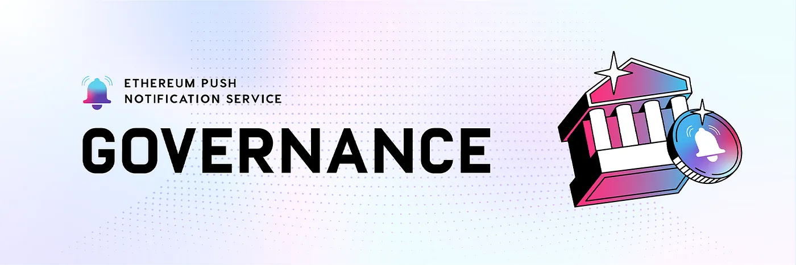
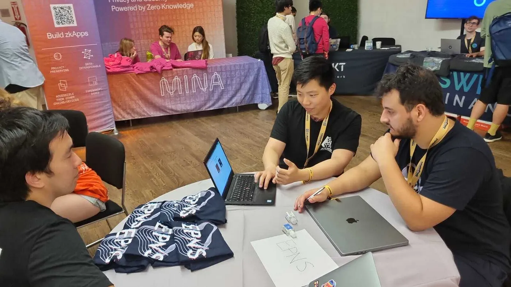

import { SubHeader, ImageText } from '@site/src/components/SharedStylingV2';

<!--truncate-->

Wow! Half of 2022 is done!

Can’t believe it’s been more than six months since our Mainnet launch!

And not to mention that we’ve got some of the best collaborations in the Web3 space packed with some amazing feature upgrades to help build a truly decentralized communication layer across Web3!

At EPNS, we believe in the ‘build at speed’ philosophy and at the same time, support fellow builders in the community to help build and grow the ecosystem. To ensure that, as you might know, we had approved Grants for some amazing projects via our [Push Grants Program](https://gov.epns.io/c/grants/10).

To top it all, what could be better than getting amazing participation from builders all around the World at ETH NewYork!

## Highlights for the latest Q2 — 2022
- Starting with channels, the total number of live channels on EPNS has reached 74, a 45% increase from the previous quarter.
- Also, we witnessed ~16% growth in unique users and opt-ins across the platform.
- We have delivered over 11 million+ notifications to date, a 175% increase from 4 million notifications that were delivered till Q1 2022.

These were some sneak peeks of what happened in Q2 at EPNS, let’s dive into details of how we achieved these numbers 🦈

## Development
Our awesome team of builders has been hustling with the latest developments. And these updates are successfully echoing the EPNS mission of building <b>decentralized communications</b>.

Take a look at the latest <b>Development Updates for Q2!</b>

## Smart Contract V2 Development and Audit
Smart Contracts V1.5 has now been developed completely. While we are working towards V2 of the contract, we decided to roll it out after V1.5 is launched. Some of the important features of EPNS Core V1.5 are:

<b>Use of $PUSH token for Channel Creation:</b> EPNS Core Contract shall no longer require DAI tokens for channel creation. Instead, developers can now create Channels with a minimum deposit of 50 $PUSH tokens.

<b>Claim Reward Function:</b> V1.5 of the EPNS Core Contract will include a function that allows $PUSH Holders to claim rewards from the contract.

<b>Time-Bound Channels:</b> Special Channels that can be created for a specific time duration and will be destroyed upon expiry.

Smart Contract V1.5 has already qualified for the initial security audit phase. After the final audit report, V1.5 of the EPNS contracts would be deployed on the <b>Ethereum Mainnet</b> and Testnets like <b>Kovan</b> and <b>Ropsten.</b>

A separate blog to provide detailed updates on V1.5 will be published soon.

### Editing Channel Details Feature
This feature on the Frontend dapp allows Channels to edit or modify essential details like Logo, Description, and Channel Name. Once Smart Contract V1.5 is deployed on the Mainnet, this feature will be made live on Prod.

## EPNS x The Graph Integration
Ever since launching, The Graph has been one of the key supporters of EPNS. To foster this relationship and our shared values of decentralization, we have announced EPNS Integration with Subgraphs hosted on The Graph Protocol.

To enable this, we have created special tooling for a Helper Function that allows you to <b>read events across the Subgraph</b> and generate <b>Notifications</b> accordingly. If you are a developer and want to:

- Track volumes of NFT collections on <b>LooksRare</b>, or
- Access the data related to swaps and pairs on <b>Sushiswap</b>, or
- Get notified whenever a sale happens on <b>CryptoPunks</b>

You can accomplish all these and a lot more with the latest Subgraph integration. Here is an [example guide](https://docs.epns.io/developers/developer-zone/examples/notification-via-subgraph-example) on sending notifications from Subgraphs.

## Polygon Deployment
We have already deployed the EPNS Communicator contract on Polygon Mumbai Testnet as well as Mainnet. Imperative features like sending notifications on Polygon have now been developed, tested, and deployed in the Staging environment.

The UI/UX for the entire channel creation flow, specifically for Polygon, is currently under development and will soon be live on Prod.

## Wallet to Wallet Chat
We initiated the building of our Wallet-to-Wallet Protocol: a cross-chain communication protocol that allows wallets to exchange messages between them.

We also started building the UI for the Chat App, which will interact with W2W Protocol. Our Push nodes have been extended to support this amazing new functionality.

## Analytics Dashboard
Frontend and majority of the APIs for analytics dashboard are ready. Backend for the dashboard is also progressing at a rapid speed. We will roll out the dashboard as soon as the APIs are live.

## Some More Updates
There are some other equally significant tasks that we worked upon in this quarter.

Our devs extensively worked on standardization of the channel and notification payloads. The architecture for <b>Decentralized Push Nodes</b> is progressing at a rapid speed as well. <b>Browser notifications</b> are live on Dev and Staging environments.

Also, added the <b>Notification Preview</b> feature into the Frontend dApp. We are working on a<b> Mono Repo for Developers</b>, which is in its final stages. Besides, the <b>Ledger integration</b> with EPNS will go live in Q3.

<b>Channel notifications</b> settings and <b>advanced search</b> are underway and will be deployed once the crucial updates for Smart Contract goes live.

### Collaborations
We are building for the community, and bridging the communication gap between Web3 services and users is our mission. To enable this change, EPNS partnered with 21 amazing new dApps in Q2, a staggering 131% increase from the previous quarter. And when we call it amazing, we truly mean it

Check out the list below for yourself 👇🏼

- April — Started the month with a banger by collaborating with [Decentraland](https://medium.com/ethereum-push-notification-service/push-notifications-for-the-metaverse-epns-partners-with-decentraland-to-build-its-communication-786afb1e481c) in bringing <b>Push Notifications to the Metaverse</b>. Landed awesome collaborations with [Uniswap](https://medium.com/ethereum-push-notification-service/accelerating-defi-with-epns-f2cbfaa33c91), [Cryptex Finance](https://medium.com/ethereum-push-notification-service/epns-integration-underway-to-enable-seamless-communication-for-users-within-the-cryptex-finance-app-c9f9bfbba612), [TokenBrice](https://medium.com/ethereum-push-notification-service/epns-collaborates-with-tokenbrice-to-bring-decentralized-push-notifications-to-readers-629910237582), and [NewOrderDAO](https://medium.com/ethereum-push-notification-service/epns-collaboration-with-new-order-will-bring-push-notifications-to-its-venture-dao-governance-dd7485494604) in bringing push notifications to their users.
- May — Established a strategic alliance with [Shapeshift](https://medium.com/ethereum-push-notification-service/epns-allies-with-shapeshift-to-encourage-participation-for-platform-governance-2b6006342bf4) to bring Push Notifications for Protocol Governance. Overall, a great month with significant collaborations from [0vixProtocol](https://medium.com/ethereum-push-notification-service/epns-x-0vix-enabling-communication-for-the-next-generation-of-money-markets-304a26092e14), [**DoinGud](https://medium.com/ethereum-push-notification-service/epns-x-doingud-improving-user-experience-and-creating-impact-in-the-nft-market-ab6604316770), [OpenBiSea](https://medium.com/ethereum-push-notification-service/simplifying-nft-trading-epns-team-up-with-openbisea-to-facilitate-notifications-for-nft-traders-adfb33cfc458), [NFT TiX](https://medium.com/ethereum-push-notification-service/epns-allies-with-nft-tix-to-bring-push-notifications-to-the-platform-b88b3b8ee83a), [Azuro Protocol](https://medium.com/ethereum-push-notification-service/epns-and-azuro-announce-a-pilot-collaboration-to-bring-push-notifications-to-the-betting-protocol-140f96f621d8), [EthSign](https://medium.com/ethereum-push-notification-service/epns-team-up-with-ethsign-to-deliver-notifications-for-the-next-generation-of-e-signing-platforms-a4ee81bacd3d), [GenesisShards](https://medium.com/ethereum-push-notification-service/epns-and-genesis-shards-join-forces-to-bring-push-notifications-to-users-8618270cb009),** and last but not the least [HermesDefi](https://medium.com/ethereum-push-notification-service/epns-and-hermes-defi-form-an-alliance-to-enable-seamless-communication-for-users-47893ae7c6c7)
- June — We landed an exciting collaboration with [Pine Protocol](https://medium.com/ethereum-push-notification-service/epns-and-pine-form-an-alliance-to-enable-seamless-communication-for-users-6a1a608f6458). Also brought [H2OData](https://medium.com/ethereum-push-notification-service/epns-and-h2o-ally-to-enable-seamless-communication-for-users-e6f02c34777), [Stox](https://medium.com/@epnsproject/epns-x-stox-enabling-communication-for-the-global-portfolio-tracker-b2c1efc21b92). And above all, the <b>ETH NYC</b> hackathon was totally sublime, with a whopping <b>20+ projects integrating EPNS</b> 🤜🏻🤛🏻

Channels that went <b>Live on EPNS</b> dApp in Q2: [**Boardroom](https://twitter.com/epnsproject/status/1524026627595853824?s=20&t=Uv5U-F13rHJkNX659gcj1A), [TokenBrice](https://twitter.com/epnsproject/status/1526986059820969985?s=20&t=PO2uVzhb47Dy67dfhCaIMw), [Float Capital](https://twitter.com/epnsproject/status/1529102295178219520?s=20&t=SVE18MKdCYMjChx5e5xyvA), [Nord Finance](https://twitter.com/epnsproject/status/1529462435849314304?s=20&t=SVE18MKdCYMjChx5e5xyvA), [ShapeShift](https://twitter.com/epnsproject/status/1533832757138206720?s=20&t=j8CeYXy-_t5LXS8C2Ruaow), and [Digible](https://twitter.com/epnsproject/status/1534947343724081152?s=20&t=j8CeYXy-_t5LXS8C2Ruaow).**

Let’s work together! Drop us a line through any of [our channels](https://linktr.ee/Epnsproject), and we’ll get in touch with you.

### Governance
We have come a long way since launching our Governance portal back in Q1. Once again, we witnessed healthy participation from the community. We approved a bunch of Improvements and Grants proposals which we believe will be useful to the entire Web3 ecosystem and EPNS.

Special shoutout to mentor.eth for bringing a great proposal for hobbyist developers! ✨

Below you can find a list of all the key proposals that <b>were passed by EPNS Governance!</b>

- EPNS has [onboarded Jump Crypto as a $PUSH liquidity provider](https://snapshot.org/#/epns.eth/proposal/0xe7b4ac3c09f15322044e3b8086fa03d5453086506a436bd94b31b36c660762e0) across exchanges to benefit our token holders and traders’ community
- The second [proposal for Push Grants was approved for Social3](https://snapshot.org/#/epns.eth/proposal/0xf5f2f52577e400b3535dec40a2f2d0abc1f721d0a3e5e68765164d66f128097f), an awesome team building the social hiring platform for Web3
- We [supported Chainwhiz with our Push Grants Program](https://snapshot.org/#/epns.eth/proposal/0x622750a94dcd2a486664ad2ef5c00e788fc75bac4315a995bb7e54f4fd598308) in building a <b>Bounty Marketplace on Polygon</b>
- Thanks to [this proposal by mentor.eth](https://snapshot.org/#/epns.eth/proposal/0x1fd82313d4356e5d7963c60649f0376e995cf326ff348269293026e6064e1f38), EPNS will reimburse gas fees charged for the channel creation upon the Developer’s request
- The [Improvement Proposal to reduce Quorum](https://snapshot.org/#/epns.eth/proposal/0x7ea992d02c29f19de6f95d9889e6643de52d0ffb0421ded86b52b47129998120) to 1% has been successfully passed by EPNS Governance
- Other Push Grants: [Tollan Worlds](https://gov.epns.io/t/tollan-worlds-x-epns-communication-layer-for-accessible-2d-pixel-metaverse/653) & [Codemire](https://gov.epns.io/t/codemire-epns-notifications-on-cross-ip-pvp-gamefi-ecosystem/648). <b>Both are very interesting projects in the gaming & metaverse space.</b>

<b>Bonus Tip:</b> The latest version of <a href='https://snapshot.org/#/epns.eth/proposal/0xbcb6c064e7610e18350c71a22a173468ded48e88fc66684fdc605dc47c748802'>Rockstars of EPNS is live</a> for weekly voting. Participants stand a chance to win cool EPNS NFTs with $PUSH tokens. We also have some special token-gated channels for our Rockstars 😉 Meet you there soon frens 👋🏼

## Hackathons
Hackathons are an efficient way to bring BUIDLers together and fuel innovation. It also helps us receive genuine product feedback, as well as create brand exposure.

In the last three months, we have sponsored four major global hackathons at ETH Amsterdam, HackMoney’22, Graph Hack, and ETH New York, and supported 150+ hackers and builders. These events were some awe-inspiring moments where we met amazing teams building with EPNS. Across all these events, over 50 projects integrated EPNS for a combined prize pool worth $16,000.

Apart from supporting the builders across multiple ecosystems, we also hosted an in-house HackSprint. It was a 2-Day virtual workshop for developers to Learn and Integrate EPNS into their dApps.

### Featured
Apart from achieving a majority of the roadmap goals, our team proudly represented EPNS on the Global stage at numerous events. And to reiterate our narrative of why Web3 communication matters, our co-founder Harsh Rajat delivered a special talk at Schelling Point.

<iframe width="100%" height="382" src="https://www.youtube.com/embed/h0drbcBMUUU" title="Why Web3 Communication Matters - Harsh Rajat at Schelling Point 2022" frameborder="0" allow="accelerometer; autoplay; clipboard-write; encrypted-media; gyroscope; picture-in-picture; web-share" allowfullscreen></iframe>

Not to mention the brilliant workshops hosted in Amsterdam, Graph Hack, and NYC. Here is one such workshop at ETH Amsterdam where Fabio Costa explains [building Web3 communications with EPNS](https://www.youtube.com/watch?v=AoIaB_lGayY). Must take a look at them if you missed out.

We are excited about all the cool stuff that’s going to come in the upcoming quarter. Keep supporting EPNS Protocol on our social media & discord server. And above all, keep building Web3 Communications 💜

Let’s keep <b>PUSH</b>ing! 💪🏼

<b>Remember:</b> The EPNS Team members will never DM you first, we never ask you to send money, crypto, private key, or any such thing. Stay safe out there, frens!

### About Push Protocol

Push is the communication protocol of web3. Push protocol enables cross-chain notifications and messaging for dapps, wallets, and services tied to wallet addresses in an open, gasless, and platform-agnostic fashion. The open communication layer allows any crypto wallet /frontend to tap into the network and get the communication across.

To keep up-to-date with Push Protocol: [Website](https://push.org/), [Twitter](https://twitter.com/pushprotocol), [Telegram](https://t.me/epnsproject), [Discord](https://discord.gg/pushprotocol), [YouTube](https://www.youtube.com/c/EthereumPushNotificationService), and [Linktree](https://linktr.ee/pushprotocol).

