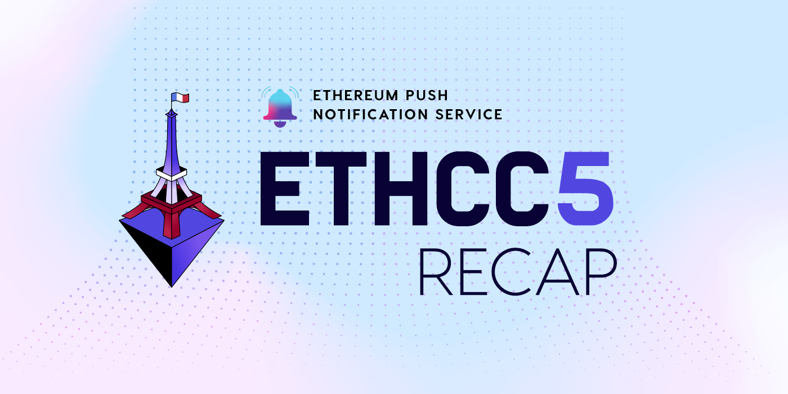

import { SubHeader, ImageText } from '@site/src/components/SharedStylingV2';

<!--truncate-->

While the sweltering heat was the talk of the town, we donned our cool collective hats and focused on being part of one of the largest Ethereum events focused on tech and community, with three intense days of conferences, networking and learning.

And then of course, we had a few talks, panel discussions and media interactions ourselves.

It was an event we couldn’t miss —we had to be there.

Before we dive into the blog, check out this awesome EthCC recap video :-)

<iframe width="100%" height="382" src="https://www.youtube.com/embed/VcA8ohIlzEU" title="EPNS at #EthCC2022 - Paris 🇫🇷" frameborder="0" allow="accelerometer; autoplay; clipboard-write; encrypted-media; gyroscope; picture-in-picture; web-share" allowfullscreen></iframe>

This video is a testament to the awesome gathering EthCC was! And we’re certain those who were there and for those who couldn’t be there, let’s deep dive into what we did there.

### How web3 changed and evolved over the past years
Our first day of EthCC and what better way to kickstart than our very own Co-founder 
Richa, taking the stage to share her experience in the past few years as to how web3 has changed, evolved and progressed over the years!

Right from showcasing how web1 and web2 evolved into web3, to its need and how and what you can do to take advantage of the fact that it’s still early and BUIDL and grow!

<iframe src="https://cdn.embedly.com/widgets/media.html?type=text%2Fhtml&amp;key=a19fcc184b9711e1b4764040d3dc5c07&amp;schema=twitter&amp;url=https%3A//twitter.com/riijo/status/1549328107324293120&amp;image=https%3A//i.embed.ly/1/image%3Furl%3Dhttps%253A%252F%252Fabs.twimg.com%252Ferrors%252Flogo46x38.png%26key%3Da19fcc184b9711e1b4764040d3dc5c07" allowfullscreen="" frameborder="0" height="753" width="100%" title="Richa 🦇🔊🔔 EPNS on Twitter: &quot;Going live at ETHCC, speaking on Evolution of Web3 pic.twitter.com/upwbr4iKLg / Twitter&quot;" class="ek n fc dx bg" scrolling="no"></iframe>

### The Benzinga Chat
An awesome conversation usually means some great stories, amazing interactions and some truly amazing people.

Harsh, our Founder and project lead, had the chance to interact with Reid McCrabb of Benzinga and we guess, profoundness was a lot in store that day.

How many of you agree? Ethereum is definitely the clubhouse of innovation.

<iframe src="https://cdn.embedly.com/widgets/media.html?type=text%2Fhtml&amp;key=a19fcc184b9711e1b4764040d3dc5c07&amp;schema=twitter&amp;url=https%3A//twitter.com/epnsproject/status/1549756321574301696&amp;image=https%3A//i.embed.ly/1/image%3Furl%3Dhttps%253A%252F%252Fabs.twimg.com%252Ferrors%252Flogo46x38.png%26key%3Da19fcc184b9711e1b4764040d3dc5c07" allowfullscreen="" frameborder="0" height="802" width="680" title="EPNS | $PUSH on Twitter: &quot;Our founder @harshrajat in a media interaction with @ReidMcCrabb of @Benzinga at @EthCC! 🎙️🇫🇷Thanks Reid for the interaction ! 💙Ohh and an interesting thought from that chat👇&quot;Ethereum is the clubhouse of innovation&quot; - Harsh RajatWhat say you? #ETHCC pic.twitter.com/rRbDXDkLcL / Twitter&quot;" class="ek n fc dx bg" scrolling="no"></iframe>

### Harsh on Why Web3 Communication Matters

<iframe width="100%" height="382" src="https://www.youtube.com/embed/y2yT8Y2jTtU" title="Harsh Rajat: How to build Web3 communication in your protocol (EPNS)" frameborder="0" allow="accelerometer; autoplay; clipboard-write; encrypted-media; gyroscope; picture-in-picture; web-share" allowfullscreen></iframe>

From meetings, to workshops, our calendar looked stacked each and every day.

Harsh had a great time delivering his workshop at the EthCC main event on the 21st July, at Maison de la Mutualité, Bievre, where he spoke about Why Web3 Communication Matters.

He showcased how the communication layer has been one of the missing pieces of Web3 and how EPNS is solving it with our decentralized communication protocol for the space and shared important use cases as well as a demo of how to notify! Followed by the user and developer journey for the folks who’d be interested in building over EPNS.

### A tête-à-tête with our good ol’ fren Sam of Journal Du Coin
One of the best things about EthCC was learning so many interesting things happening across Web3, meeting some really exciting people especially French developers and folks who’re building on top of EPNS. And that’s exactly what Harsh resonated in his interaction with the one and only the top French media personality in the blockchain space, Sam, of Journal Du Coin.

<iframe src="https://cdn.embedly.com/widgets/media.html?type=text%2Fhtml&amp;key=a19fcc184b9711e1b4764040d3dc5c07&amp;schema=twitter&amp;url=https%3A//twitter.com/epnsproject/status/1551607830204932096&amp;image=https%3A//i.embed.ly/1/image%3Furl%3Dhttps%253A%252F%252Fabs.twimg.com%252Ferrors%252Flogo46x38.png%26key%3Da19fcc184b9711e1b4764040d3dc5c07" allowfullscreen="" frameborder="0" height="696" width="680" title="EPNS | $PUSH on Twitter: &quot;&quot;During my entire journey, I met some awesome French developers backing the web3 vision! Excited about the French community &amp; the blockchain movement going on in France!&quot;EPNS founder, @harshrajat on the French community chat w/@sam_jdc of @LeJournalDuCoin @EthCC @StarknetCC🇫🇷❤️ pic.twitter.com/RI0UoxLCnt / Twitter&quot;" class="ek n fc dx bg" scrolling="no"></iframe>

### EthCC Dataverse Day with IOSG

<iframe width="680" height="382" src="https://www.youtube.com/embed/z5WrzsiSAWs" title="EPNS: Why Web3 Communication Matters" frameborder="0" allow="accelerometer; autoplay; clipboard-write; encrypted-media; gyroscope; picture-in-picture; web-share" allowfullscreen></iframe>

And finally on the 25th, Harsh took the stage again with an encore of Why Web3 communication matters, only this time at EthCC Dataverse Day with our partners IOSG Ventures.

### Panel Discussion at Dataverse Day

<iframe width="100%" height="382" src="https://www.youtube.com/embed/Hu9E1h51ctA" title="Panel ( Debank &amp; KYVE &amp; Sismo &amp; Solity Network &amp; EPNS）" frameborder="0" allow="accelerometer; autoplay; clipboard-write; encrypted-media; gyroscope; picture-in-picture; web-share" allowfullscreen></iframe>

And then of course, there was this interesting panel discussion, as part of the Dataverse Day, with the partners of that event, in which Harsh spoke at length about EPNS and how we’re trying to be the de facto, native Web3 comm protocol! He was joined by some really focused, and awesome Web3 founders and builders, such as Hongbo, Founder of Debank, Fabian Riewe, Founder of KYVE, Hadrien Charlanes, Founder of Sismo, Marijo Radman, Cofounder of Solity Network

### Meeting some Frens Old & New

And last but not least, what’s the future of France without meeting a ton of frens from the web3 space, old and new!

### About Push Protocol

Push is the communication protocol of web3. Push protocol enables cross-chain notifications and messaging for dapps, wallets, and services tied to wallet addresses in an open, gasless, and platform-agnostic fashion. The open communication layer allows any crypto wallet /frontend to tap into the network and get the communication across.

To keep up-to-date with Push Protocol: [Website](https://push.org/), [Twitter](https://twitter.com/pushprotocol), [Telegram](https://t.me/epnsproject), [Discord](https://discord.gg/pushprotocol), [YouTube](https://www.youtube.com/c/EthereumPushNotificationService), and [Linktree](https://linktr.ee/pushprotocol).

