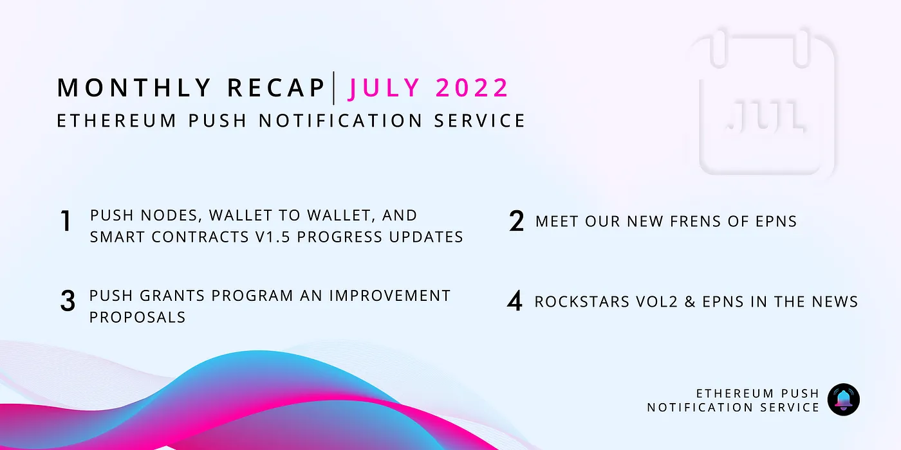

import { SubHeader, ImageText } from '@site/src/components/SharedStylingV2';

<!--truncate-->

<SubHeader>July 2022</SubHeader>

July flew by in the blink of an eye, and as we go deeper into Q3 more things are coming together nicely. This second half of the year is looking to be loaded with many new features and so many great news.

Let’s do our thing and recap briefly all the happenings during July.

## Development 🏗️
This month the Development team have made tons of progress in all fronts. Preparing backend tooling for monitoring, working on the PUSH Nodes, improvements to our dApp & SDKs, and of course one of out most awaited features — Wallet to Wallet communication.

- The <b>Analytics Dashboard</b> have been in development to provide services with insights about notifications and their channels. The entire backend Integration is done, and the Dashboard will be released very soon.
- With <b>PUSH Nodes</b> being a central piece in the EPNS ecosystem, optimization together with the standardization of payloads plays a critical role to ensure its optimal functionality. As we start making it publicly available anyone will be able to submit an improvement proposals for it.
- On the decentralizing of PUSH Nnodes side, we are segregating nodes into modules. So, participants can spin up their own node and provide the service to the network to send notifications
- The <b>EPNS Smart Contract v1.5 Audit</b> is coming to its last stage. Many new features will come together as we deploy this new version of the smart contracts. More details will be provided soon!
- Content markdown standards for frontend SDK are in the works.
- <b>Wallet to Wallet</b> code reviews are done. Currently going over extensive testing and also working with design team to provide a great UI ready for launch.
- <b>EPNS dApp UI/UX improvements</b> for a better experience for channel creators and users. Also working on getting the sending notifications ready for multi-chain support.

With so many development efforts happening concurrently, there is so much room for conversation and discussion. We encourage everyone to join us on our Discord to participate and brainstorm ideas. We highly appreciate our community involvement to ensure every release is rock solid.

## Frens of EPNS 🎎
No month recap would be complete without briefly mentioning the Frens we made this month, and what we are building together with them:

- [Pine Protocol](https://twitter.com/epnsproject/status/1542553551901278211?s=20&t=GXkfWyIHO3c6E6AObcN6ag): with their platform providing permissionless instant loan transactions that evade the need for negotiations, providing also loan liquidation and expiration alerts helps users be on top of their operations at all times.
- [Sturdy](https://twitter.com/epnsproject/status/1544728385733070854?s=20&t=ig7MxT6oSokwEmRJit6vSw): bringing timely notifications to users when their assets are in risk, but also notifying them about high APY opportunities available on the platform.
- [Quest3](https://twitter.com/epnsproject/status/1546543616570433537?s=20&t=bjnec1ShgYxUwKg9uy5oQQ&utm_source=substack&utm_medium=email): providing users with opportunities at their fingertips and keeping them informed when a new quest starts or is about to end.
- [Wonderverse](https://twitter.com/epnsproject/status/1546902851976175616?s=20&t=5PBQj1Yka209QE2QTi620w): implementing into their Project Management offering notifications to users when anew task is assigned, or if the due dates for a task are approaching/reached.
- [Polychain Monsters](https://twitter.com/epnsproject/status/1550163713013186560?s=20&t=XZHLvLfunThtEKeKS5naPA): this collaboration aims to to notify users about important events such as when rewards are sent, and even if you pulled a rare Polymon.
- [Cryptocurrency Jobs](https://twitter.com/epnsproject/status/1552701299942367232?s=20&t=cd-LeFcxmiN7NQnZd9slqw): nothing beats getting new job opportunities delivered directly to you in a timely fashion so you are the first to act on it. Also delivering the weekly newsletter when published.
- [DxDao](https://twitter.com/epnsproject/status/1551979364711297024?s=20&t=E9URHHGWvFiYypn1o-2b8A): through one of its star products Swapr, DXdao will notify users when campaigns in Swapr are expired or when they are starting.
Together with these awesome new frens, we have also been working together with many more teams doing their own implementations of EPNS notifications.

As usual, we take every collaboration opportunity as a learning experience to improve our product offering and be up to speed with the web3 needs.

### Governance 🗳
As we enter into new phases of our DAOfication process, the Governance front has been getting much more action. Not only with our Push Grants Program (PGP), but also with Push Improvement Proposals (PIPs).

Don’t miss checking out our [Push Grants Program Guide sheet](https://twitter.com/epnsproject/status/1547989393776201728?s=20&t=AshoMd9O2JlvYJesW5pl4A&utm_source=substack&utm_medium=email). On this sheet we summarize the information and process to participate in the program.

- [Push Improvement Proposal PIP-07](https://snapshot.org/?utm_source=substack&utm_medium=email#/epns.eth/proposal/0x7ea992d02c29f19de6f95d9889e6643de52d0ffb0421ded86b52b47129998120) voting has ended and is approved, changing the quorum for a proposal to be approved on Snapshot is now reduced to 1%
- [Push Improvement Proposal (PIP-08)](https://gov.epns.io/t/pip-08-fast-tracking-of-pip-s-that-get-immediate-traction-into-snapshot/707/3?utm_source=substack&utm_medium=email) to implement a fast track for proposals that get immediate traction is in discussion in our Governance forum
- [Push Improvement Proposal (PIP-09)](https://gov.epns.io/t/pip-09-contributor-rewards-for-push-community-with-coordinape/725) this proposal is currently in discussion in the Governance forum, and it marks the start of more opportunities for contributors in EPNS.
- The [Tollan Worlds Push Grants Proposal](https://snapshot.org/?utm_source=substack&utm_medium=email#/epns.eth/proposal/0x91342f0578fec0dcecb29714802ccca24b59e6836665aba6542484bfd422d064) was approved.
- [Inshaan Push Grant Proposal](https://snapshot.org/?utm_source=substack&utm_medium=email#/epns.eth/proposal/0x806ef0fb1da52e0ea3dcad52ad6e0dcf255d4a6294fbdd7ad08f06c51b6266a0) up for voting in Snapshot!
We invite all our community members to join us in Office hours, and come ready with your questions. We also use this space for teams looking to submit their grants to talk about their project and get validation.

Additionally, keep an eye on our communications as we will be sharing more information on how to start getting involved as a contributor in EPNS.

### Community 🎪
- <b><a href='https://twitter.com/epnsproject/status/1541421138172977159?s=20&t=im07nJLlpEmhWljYo73dHA&utm_source=substack&utm_medium=email'>Rockstars of EPNS</a> is back</b> 🎸!! Volume 2 of our Rockstars of EPNS is ongoing, and we have our first three winners already. You know the rules! Don’t miss your opportunity to enter the EPNS Hall of Fame this time.

- We had an awesome <b>Friday PUSH</b> with the Hackers from ETH NYC. They shared their experiences and funny stories that happens during these events. We are thrilled to know that many of them are continuing their projects and taking them to the next level. Congratz!
- Our own Jaf joined the [AMA with the H2O community](https://twitter.com/epnsproject/status/1547196646122868737?s=20&t=bjnec1ShgYxUwKg9uy5oQQ&utm_source=substack&utm_medium=email), and the AMA with the [Fabwelt Community](https://twitter.com/epnsproject/status/1548668845417693184?s=20&t=C1Iy_jXu3Euw3_EjuEUQ1Q).

## EPNS in the news 📺
- Our founder Harsh joined the panel to discuss DeFi during [Fintech Summit 2022 by Inc42](https://twitter.com/Inc42/status/1543136047097597952?s=20&t=Yokbod9s7xOsrWW-ecZaaA)
- Our co-founder Richa gave a talk on [the Evolution of Web3 and Why Web3](https://twitter.com/epnsproject/status/1549288145627144192?s=20&t=AshoMd9O2JlvYJesW5pl4A&utm_source=substack&utm_medium=email).
- Harsh had the opportunity to talk on [How to Build Web3 Communication in your Protocol](https://twitter.com/epnsproject/status/1550012700876574720?s=20&t=AshoMd9O2JlvYJesW5pl4A&utm_source=substack&utm_medium=email) during EthCC. Also had an [interaction with Benzinga News Media](https://twitter.com/epnsproject/status/1549756321574301696?s=20&t=AshoMd9O2JlvYJesW5pl4A&utm_source=substack&utm_medium=email) and took the opportunity to [address the French community](https://twitter.com/epnsproject/status/1551607830204932096?s=20&t=OtXprhXNd8rhw4AlXjfWeA&utm_source=substack&utm_medium=email) during the [Dataverse Day interview](https://twitter.com/epnsproject/status/1552348507063058433?s=20&t=OtXprhXNd8rhw4AlXjfWeA&utm_source=substack&utm_medium=email) podcast.

No one said building the communication layer for the web3 was going to be an easy task, however counting with the support of such an engaged community and team are making it a reality. It’s time to put pedal to the metal and get ready for an exciting second half of 2022.

Let’s keep PUSHing! 💪

— The EPNS team

### About Push Protocol

Push is the communication protocol of web3. Push protocol enables cross-chain notifications and messaging for dapps, wallets, and services tied to wallet addresses in an open, gasless, and platform-agnostic fashion. The open communication layer allows any crypto wallet /frontend to tap into the network and get the communication across.

To keep up-to-date with Push Protocol: [Website](https://push.org/), [Twitter](https://twitter.com/pushprotocol), [Telegram](https://t.me/epnsproject), [Discord](https://discord.gg/pushprotocol), [YouTube](https://www.youtube.com/c/EthereumPushNotificationService), and [Linktree](https://linktr.ee/pushprotocol).

