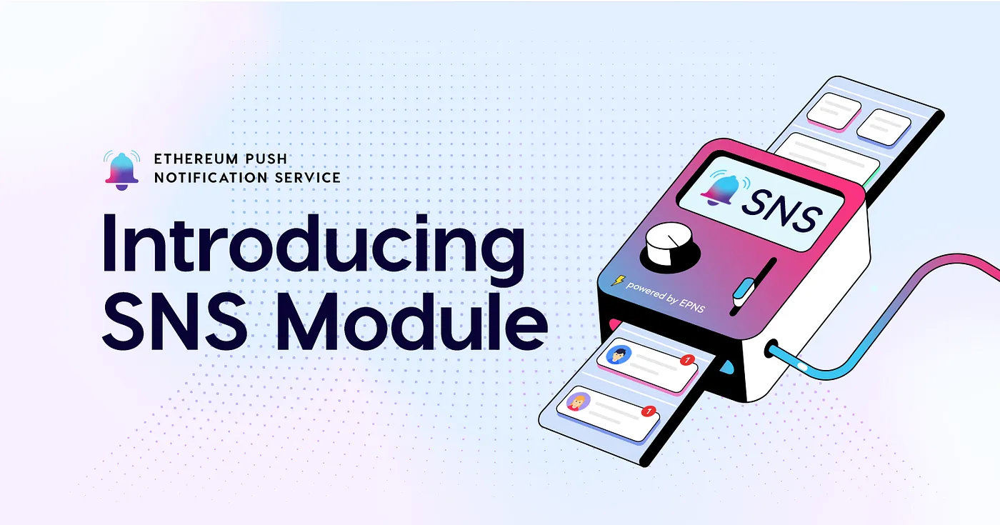
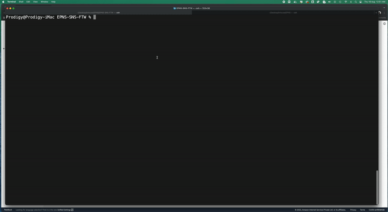

import { ImageText } from '@site/src/css/SharedStyling';

<!--truncate-->

Today, we are excited to unveil the next step towards integrating notifications (and communication as a whole) for developers with the launch of the SNS module for Push Delivery Nodes.

SNS module allows any developer to receive notifications, chats, or any other form of web3 communication directly to the platform they are building with the help of webhooks.

But before deep diving into what it is and how it works, let’s take a step back and understand the delivery nodes of EPNS.

### What Are Push Delivery Nodes
<i>
It all starts with a notification… but where should the notification go 🤔
</i>

Push delivery nodes are a decentralized solution to enable web3 to web2 bridging. They allow any platform (whether centralized or decentralized) to receive communication from Push storage nodes, i.e., the nodes validating and indexing all communications and tying them to your wallet address (and multi-chain identity).

As a developer, you run them on your backend, and they ensure that you can connect your web2 infra to web3 communication, for example, when you want to extend communication a step further to web2 platform users apart from web3 wallet addresses. In essence, they enable:

1. Mapping any device token or platform username of web2 that you want to relay to a specific web3 wallet address.
2. Utilize those mapping to send alerts to web2 or web2.5 platforms, extending push nodes' communication outreach to any service running on any solution, whether centralized or decentralized.

Here’s an example, crypto wallet mobile apps, crypto wallet browser extensions, Telegram and Discord bots, email alerts, or anything in between.

<blockquote><i>Listening to Push storage nodes or using their RPC endpoints / SDK is still the best solution for a pure web3 experience. But if you are a developer and want to extend these communications experience and bring it to a centralized platform, then Push delivery nodes are the way to go.</i></blockquote>

The delivery node solution is ideal for building the web3 stack (like running your own node). While delivering a node solution on our platform, we realized that there is another mid-solution, albeit a hosted one, that might eliminate most of the developers’ effort and still give them the ability to achieve the desired result, aka Hosted SNS Module.

#### Introducing Hosted SNS Module

<ImageText>Hosted SNS Module architecture</ImageText>

Hosted SNS Module is a mid-level solution that eliminates all the heavy load of running a node or syncing information and gives you webhooks that you implement to start receiving notifications, chats, or any other web3 communication in your software.

It works by writing all the user web3 wallet communication into Amazon SNS as a topic. You, as a developer, only need to subscribe to the topic to start receiving those notifications. This eliminates the majority of infra building on the developer side when they are trying to create a PoC out and ensures instant integration to web3 notifications.

<blockquote><i>We understand that most developers want an ideal web3 solution from us, which is what the push delivery node will deliver. However, speaking with some of the devs and observing hosted solutions from The Graph and Lens Protocol made it clear that a web2.5 way needs to exist to ease a developer’s burden while enabling web3 infra.</i></blockquote>

### 3 Steps for Getting Started With Hosted SNS Module
Integrating the SNS module into your code takes less than 10 mins and contains just 3 steps:

<b>Step 1</b>: Implement a webhook to listen to AWS SNS. Here’s a boilerplate along with specs to get you npm installed and running: https://github.com/push-protocol/push-sns-boilerplate

<b>Step 2</b>: You will need to open an endpoint either at a dedicated IP that listens to SNS or, if you are testing locally, have to expose the public endpoint for which tons of software is available.

<b>Hint</b>: For testing locally, You can also use [ngrok](https://ngrok.com/download) to expose the public endpoint. Using this with the boilerplate, then the port needs to be 6,000. The ngrok URL can is now the SNS endpoint required in step 3.

<b>Step 3</b>: Once you set up this, you need to contact us by either shouting / tagging us on [Discord](https://discord.com/invite/YVPB99F9W5) — SNS channel or reaching out via the [contact form](https://epns.io/#contact). We need this step as the SNS module requires whitelisting.

Here’s a time-lapse of how everything works… see you on the other side 😃

<ImageText>How the SNS module works behind the scene, powered by EPNS</ImageText>

#### Useful links:
- EPNS SNS boilerplate specs
https://github.com/push-protocol/push-sns-boilerplate
- Documentation: https://docs.epns.io/developers/developer-zone/receiving-notifications