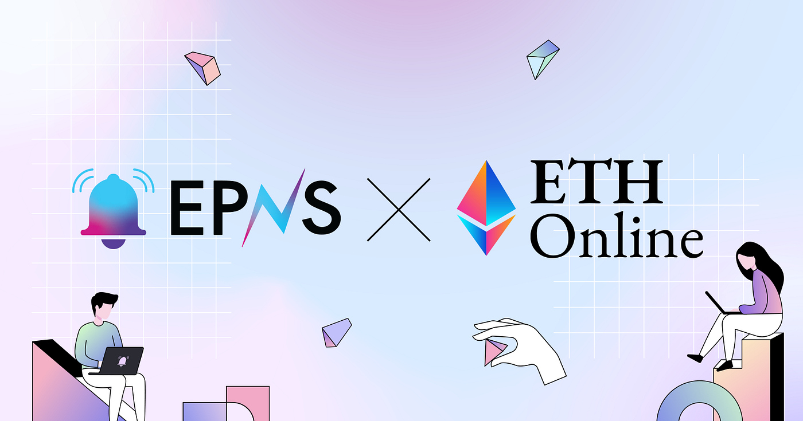

import { ImageText, VideoContainer } from '@site/src/css/SharedStyling';

<!--truncate-->

<!--customheaderpoint-->

# Get your creative juices flowing and create something new with EPNS at ETHGlobal’s ETHOnline 2022 hackathon.

## 🏗 BUILD with EPNS — Make Web3 Communication Seamless

One of the best things about web3 and hackathons is how unique ideas transform into something tangible and solve web3 challenges and problems.

We’ve had this experience in our previous hackathons, and we take pride in being involved with builders who take some time out and build and code with some intensity to make great products in the web3 ecosystem.

<ImageText>Builders at ETHAmsterdam hackathon</ImageText>

The last hackathon at ETHNYC was <b>38 hours</b> of intense hacking and <b>22 builders</b> building some amazing web3 protocols on top of EPNS! We gave away sponsorships of <b>$5,000</b> and gave away <b>eight</b> prizes!

Here’s a glimpse of some of the exceptional teams that built with us at [ETHAmsterdam](https://twitter.com/epnsproject/status/1518558686498594816), [HackMoney 2022](https://twitter.com/epnsproject/status/1530157366229860353), and [ETHNewYork](https://twitter.com/epnsproject/status/1541466249825091584).

And here, we are, working with ETHGlobal again for the [ETHOnline 2022](https://online.ethglobal.com/) hackathon to encourage all types of builders, hackers, and creators to participate and build the future of web3 communication with EPNS.

So let us give you guys a quick breakdown to help you BUIDL at the ETHOnline 2022 Hackathon!

### 🔔 About Ethereum Push Notification Service (EPNS)

If you are unfamiliar with what we do, [EPNS](https://epns.io/) is a decentralized communication protocol for web3. Any dapps, smart contracts, backends, or protocols can send comm (starting with on-chain / off-chain / gasless notifications) tied to the user wallet in an open, gasless, multichain, and platform agnostic fashion. The open communication layer allows any crypto wallet or front end to tap into the network and get the comm across.

### 🔗 Important Reference links for Developers

- [ETHOnline 2022 — Checklist](https://www.notion.so/epns/ETHOnline-Hackathon-Doc-List-cd9d0fc69f0d4e4691c60c772b03d48a)  
  If you are new to EPNS, don’t worry! We curated a list of resources that will be handy all throughout your journey during this hackathon.
- [EPNS Documentation Hub](https://docs.epns.io/)
- [EPNS Discord](https://discord.gg/n4EYGyPJcF)  
  If you have any questions or want to chat about where or even how to begin, please reach out to us on the [EPNS-hackathon](https://discord.gg/rEhxYtxa) Discord channel!

## 💡Ideas to BUIDL to Help You Think Outside the Box

The first challenge regarding hackathons, apart from getting your team together, is some ideas to make for an excellent protocol that solves web3 problems.

From some of our past experiences with developers, what we’ve learned is that most award-winning ideas think of smaller and simpler problems that can be easily solved by application, and considering the future is web3, communication among web3 protocols or users is something that is a challenge that needs to be fixed in today’s day and age.

We’ve put together a Notion page with the [use cases](https://www.notion.so/epns/EPNS-Use-Case-cb6864a814f64f9486d34c2ec12940d0) that we think might come in handy before you start hacking.

## 💰Prizes

And of course, what’s a great hackathon without some amazing prizes to win? We’re offering:

- Grand Prize — $4,000
- 2nd Prize — $2,500
- 3rd Prize — $ 1,500
- Runner Ups x 5 — $400

Also, we have <b>1 million PUSH grants</b> for all the builders — apply for grants on [gov.epns.io](https://gov.epns.io/) to keep building the next wave of innovation.

## 🎫 What’s Next and Important Dates and Times

1. Apply to hack on [ETHOnline](https://ethglobal.com/events/ethonline2022/apply) today.

2. EPNS workshop: <i>How to add web3 push notifications to your app by
   Harsh Rajat</i>

- Saturday, September 2nd, at 5:30 PM ET / 9:30 PM UTC

<VideoContainer>
<iframe width="100%" height="100%" style={{ borderRadius: "32px" }} src="https://www.youtube.com/embed/OeZmrsF3tFQ" title="EPNS  How to add web3 push notifications to your app - Harsh Rajat" frameborder="0" allow="accelerometer; autoplay; clipboard-write; encrypted-media; gyroscope; picture-in-picture; web-share" allowfullscreen></iframe>
</VideoContainer>

3. <b>EPNS weekly workshop</b>

We will be hosting a weekly workshop — we will share the details very soon.

4. <b>EPNS office hours</b>

- Everyday at 12:30 PM ET / 10:00 PM IST / 4:30 PM UTC
- Venue: [EPNS ETHOnline voice channel](https://discord.com/channels/717089384838594695/1011269519915896873)
  👋 Get involved in the conversation.
  We’ve created a space for all the builders to discuss their ideas, ask questions and share their progress with others participating in ETHOnline 2022.

- [ETHGlobal Discord](https://discord.gg/ethglobal-554623348622098432): You can reach out to us on #sponsor-epns on the ETHGlobal Discord.
- [EPNS Discord](https://discord.com/invite/YVPB99F9W5): Find us our own Discord Channel.
  Happy building!
