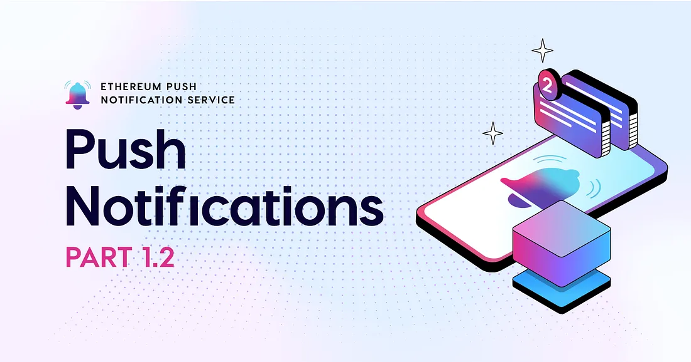

import { SubHeader } from '@site/src/components/SharedStylingV2';

<!--truncate-->

<SubHeader>An Introduction to Push Notification: Part 1.2</SubHeader> 

In [Part 1.1](https://medium.com/ethereum-push-notification-service/my-app-would-like-to-send-you-push-notifications-4b591a68f803), we introduced modern push technology, which consists of these primary components: an app publisher who publishes information by notifications, a client who is the receiver of notifications based on a subscription, and the push notification provider who acts as middleware between these two actors.

Middleware is software that acts as an intermediary between two applications or services. Middleware also provides services that are not present in the operating system. The push notification service provider is an example of this, known as an operating system push notification service (OSPNS). For instance, the Apple Push Notification Service (APNS) lives on iPhone devices as an OSPNS middleware software.

## Taking the Push Notification Provider Away From the Notifications
Web3 moves away from the traditional client-server model and alleviates today’s power concentration over the control and truth of information and data. Web3 attempts to take service providers away from services, where middleware becomes trustless software (but can still be trustful) that offers security guarantees and robust communication through decentralization. Web3 also attempts to reconfigure how we monetize things in society and redirect incentives to where they should go, users, participants, communities, and those generating value.

Addressing the limitations of push technology while utilizing its features in the next iteration of the web requires an OSPNS-like piece of middleware. There needs to be a similar layer of abstraction and push technology primitives that allow notifications to create a web3-based OSPNS.

## Enter Web3 Push Notifications
[The Ethereum Push Notification Service (EPNS)](https://epns.io/): a decentralized OSPNS for push notifications; the open communication layer for web3.

EPNS addresses the user experience problem in web3 by providing push notifications for wallets and dapps. EPNS allows any dapp, smart contract, backend, protocol, or, in principle, any distributed technology to send communication directly to user wallet addresses in an open, feeless, and platform-agnostic way. Being an open and permissionless protocol, anyone can create dedicated channels to distribute information directly to user wallets without needing to rely on centralized service providers. The protocol serves many communication primitives beyond simple push notifications, such as peer-to-peer chatting, communication channel creation, and on-chain governance. In addition, EPNS addresses information and content censorship as the protocol allows users and applications to control the content they’d like to push.

Web3 users:

- don’t need to trust or rely on a centralized OSPNS for information.
- don’t need to interact with applications unnecessarily and manually stay on stand-by for any activities they would like.
- can opt-in to information and alerts they find useful.
- can communicate with other accounts instead of operating in isolation.
- can automate messages that users and dapps care about.
- can expect a much better onboarding experience.

EPNS enables open and direct peer-to-peer communication through an incentivization scheme without compromising communication or anonymity. Instead of app-to-client messaging, EPNS allows for wallet-to-wallet or service-to-wallet messaging both for on and off-chain events. As a result, end users have end-to-end visibility of transactions and on-chain events to generate awareness while increasing trust.

For example:

Governance mechanisms in web3 often lack good user experience as users must constantly check on and off-chain activity for recent updates and proposals. Or, users depend on the news efforts from individuals on the latest governance activity.

If, for instance, a user wants to keep informed and engaged with Uniswap’s governance proposals, they have the overhead of constant engagement to not miss out on any activity.

<i>With EPNS, that changes.</i>  

Integrating EPNS with Uniswap allows users to receive notifications directly to their wallets whenever a new governance proposal is submitted, such as the recent governance proposal to [create the Uniswap Foundation](https://app.uniswap.org/#/vote/2/24?chain=mainnet), allowing users to stay up-to-date and never miss a vote.

This is what EPNS had the pleasure of doing in early 2021 — integrating with Uniswap to accelerate DeFi and the web3 experience. Learn more about the collaboration in [this blog post](https://medium.com/ethereum-push-notification-service/accelerating-defi-with-epns-f2cbfaa33c91).

The information required to notify users about different web3 events is complex and requires massive infrastructure efforts, which is another reason EPNS started. EPNS is also a demonstration of how to scale services and implement solutions in a modular way, as developers can easily build dapps with EPNS. Before diving into the communication layer itself, including how communication channels and messaging work with EPNS, how the publish/subscribe model fits into web3, and understanding EPNS under the hood, we will attempt to make the case by using web3 push notifications for different use cases and the need for a web3 communication layer in Part 2.

<i>By Danny Salman</i>

### About Push Protocol

Push is the communication protocol of web3. Push protocol enables cross-chain notifications and messaging for dapps, wallets, and services tied to wallet addresses in an open, gasless, and platform-agnostic fashion. The open communication layer allows any crypto wallet /frontend to tap into the network and get the communication across.

To keep up-to-date with Push Protocol: [Website](https://push.org/), [Twitter](https://twitter.com/pushprotocol), [Telegram](https://t.me/epnsproject), [Discord](https://discord.gg/pushprotocol), [YouTube](https://www.youtube.com/c/EthereumPushNotificationService), and [Linktree](https://linktr.ee/pushprotocol).
