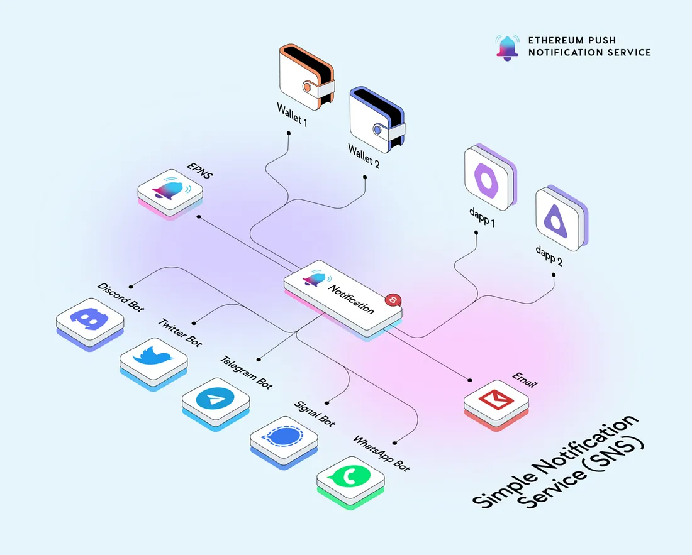

import { SubHeader } from '@site/src/components/SharedStylingV2';

<!--truncate-->

<SubHeader>August 2022</SubHeader> 

This August was definitely a wild ride and we couldn’t have had more fun.🎢 Let’s take a look at all the happenings this month!

## Development 🏗️
The Development team had a very busy and successful month. New features, improvements & optimizations, and lots of progress on all fronts.

One of the biggest news we released this month is the official launch of the <a href="https://twitter.com/epnsproject/status/1560271342255030272?s=20&t=2TfqW862B366mF0cWxBDWQ&utm_source=substack&utm_medium=email"><b>SNS Module for Push Delivery Nodes</b></a>. A decentralized solution for devs to receive web3 communication directly to the platform they are building.

Watch the video on how the <a href="https://twitter.com/epnsproject/status/1562817085172076544?s=20&t=zL2LIRWfK0dnv9KeXrOHfA&utm_source=substack&utm_medium=email"><b>Simple Notifications Service (SNS)</b></a> module works.

Now, let’s go over the other cool features and optimizations that have been in the works:

- Analytics Dashboard backend integration is in progress and soon to go Live!
- Delivery Nodes work in progress to enable frictionless delivery of the notification and chat to wallets
- Push Node optimization and standardization are in the final stages of QA.
- Wallet to Wallet finished UI and UX fine-tuning and now the team is working on integration testing.
- The UI of Send Notification page of the EPNS dapp is being enhanced to improve user experience.
- Working on <b>Push Improvement </b> through which users can submit proposals in EPNS Protocol!
- The EPNS SDKs are moving to monorepo structure and all Developer docs for mono-repo SDK and SNS are being added to the EPNS Docs hub.

We greatly appreciate all the feedback and suggestions received from all buidlers. It has been instrumental in shaping our tooling to ensure implementing solutions on top of EPNS is a breeze!

Keep BUIDLing! 

<b>.  .  .</b>

## Collaborations 🎎
- Thrilled to announce our collaboration with <a href="https://twitter.com/epnsproject/status/1557773985554632704?s=20&t=PVAqZUWRAc1av5x49Il0eQ&utm_source=substack&utm_medium=email"><b>Socket</b></a> to enable users to receive a notification once their assets are bridged from one chain to another!
- <a href="https://twitter.com/epnsproject/status/1555191864198070276?s=20&t=36Isc08JB9n7jfI0E9bzlg&utm_source=substack&utm_medium=email"><b>Pine Protocol</b></a> channel went LIVE! Now users can get notified when their loans are approaching liquidation, or when one of their loans is about to expire.
- <a href="https://twitter.com/epnsproject/status/1554527559865745408?s=20&t=36Isc08JB9n7jfI0E9bzlg&utm_source=substack&utm_medium=email"><b>Li.Fi Protocol</b></a> channel also made it Live! Users can now opt-in to get notified once their bridge transactions get confirmed!

<b>.  .  .</b>

## PUSH DAO 🏛️
As we are gearing towards the next step in our DAOfication process, lots of pieces need to be orchestrated to ensure we have a solid foundation that allows us to scale and grow as we need.

A proposal to implement <a href="https://twitter.com/epnsproject/status/1560003393850056704?s=20&t=2TfqW862B366mF0cWxBDWQ&utm_source=substack&utm_medium=email"><b>Fast-tracking of Proposals</b></a> was approved by the vast majority. This will give the DAO the tools to react faster on proposals that see immediate traction in the discussion forum, allowing them to take quick action on opportunities or react faster in case of unexpected situations.

Another important proposal that was approved this month is the <a href="https://snapshot.org/?utm_source=substack&utm_medium=email#/epns.eth/proposal/0xf9256481d3869d9d4ceb5596dc618cbf51be6585c1b6fcd03733eafa14240756"><b>proposal to allocate funds for contributor rewards</b></a>. This represents a great step forward towards the structuring of the PUSH DAO and the opportunity for members of the community to become active project contributors.

Now, progress also comes with adjustments! <a href="https://snapshot.org/?utm_source=substack&utm_medium=email#/epns.eth/proposal/0x8c44b949f2b3d9963a82991e0f8e98afb1e3d4df241683ed53c925dad62b222e"><b>PIP-10 to change the naming convention of proposals</b></a> was approved by Push Governance via Fast-Tracking route ⚡. Now PIP —<b>P</b>ush <b>I</b>mprovement <b>P</b>roposal — will be used to describe the technical standards/improvements of the EPNS protocol; and PGIP — <b>P</b>ush <b>G</b>overnance <b>I</b>mprovement <b>P</b>roposal — will be used to describe Governance specific proposals.

There was also tons of action with Push Grants! The community has been very active in submitting Grants Proposals, participating during Office hours, and even demoing their projects to the community!

<a href="https://snapshot.org/?utm_source=substack&utm_medium=email#/epns.eth/proposal/0x6ce6aa2e2b358503fdc79d8d7449f5785d2778ad53ae1156c3fbc8b0b2a8ff73"><b>PGIP-06: Codemire</b></a> made it to the voting phase in Snapshot. Other Push Grants currently active are <a href="https://substack.com/redirect/64343fc9-12de-44d1-93f1-826329741afd?r=3rawm"><b>Sporos DAO</b></a>, <a href="https://substack.com/redirect/e0012b79-d7c4-4f7e-8107-23fa4276a516?r=3rawm"><b>Intract</b></a>, <a href="https://substack.com/redirect/3fa8f241-cac4-4a03-9e60-af3a20721f6c?r=3rawm"><b>Kontour</b></a>, <a href="https://substack.com/redirect/d6b1d067-786c-4a2b-89fa-6a3c888a43ae?r=3rawm"><b>DZap</b></a>, <a href="https://substack.com/redirect/3eb3daa5-715e-4a0f-86ec-a59c1ba5bc9a?r=3rawm"><b>Age of Nakamoto</b></a>.

It’s truly amazing to see the community getting more engaged and participating in conversations. The quality of the conversations has also been getting to new higher levels, and that tells us we are making strides in the right direction.

## Community 🎪
A beautiful month with lots of opportunities for our team to get closer to our community!

- EPNS Team attended <a href="https://twitter.com/epnsproject/status/1557810225524121603?s=20&t=PVAqZUWRAc1av5x49Il0eQ&utm_source=substack&utm_medium=email"><b>EthLatam & Web3Conf India</b></a> Conferences.
- We participated in <a href="https://twitter.com/epnsproject/status/1561639275048800256?s=20&t=zL2LIRWfK0dnv9KeXrOHfA&utm_source=substack&utm_medium=email"><b>CoinDCX’s Unfold 2022</b></a> hackathon — $5000 in PUSH prizes up for grabs!
- EPNS is a sponsor at <a href="https://twitter.com/epnsproject/status/1562865894854107142?s=20&t=zL2LIRWfK0dnv9KeXrOHfA&utm_source=substack&utm_medium=email"><b>ETHOnline hackathon</b></a> with $10,000 worth of prizes for hackers building with EPNS!

And of course, Congratulations! to our Rockstar of EPNS winners of the month: <a href="https://twitter.com/epnsproject/status/1557003868630040576?s=20&t=PVAqZUWRAc1av5x49Il0eQ&utm_source=substack&utm_medium=email"><b>@synsation6</b></a>, <a href="https://twitter.com/epnsproject/status/1554391809937543169?s=20&t=36Isc08JB9n7jfI0E9bzlg&utm_source=substack&utm_medium=email"><b>@cryptonewshindi</b></a>, <a href="https://twitter.com/epnsproject/status/1559593521073758208?s=20&t=2TfqW862B366mF0cWxBDWQ&utm_source=substack&utm_medium=email"><b>@butterfliesinsp</b></a>, <a href="https://twitter.com/epnsproject/status/1562078279779385345?s=20&t=zL2LIRWfK0dnv9KeXrOHfA&utm_source=substack&utm_medium=email"><b>@websidyn</b></a>.

Months like this give us the boost of energy needed to finish the year strong, and get ready for all the great things to come!

Let’s keep PUSHing! 💪🏼

The EPNS team

### About Push Protocol

Push is the communication protocol of web3. Push protocol enables cross-chain notifications and messaging for dapps, wallets, and services tied to wallet addresses in an open, gasless, and platform-agnostic fashion. The open communication layer allows any crypto wallet /frontend to tap into the network and get the communication across.

To keep up-to-date with Push Protocol: [Website](https://push.org/), [Twitter](https://twitter.com/pushprotocol), [Telegram](https://t.me/epnsproject), [Discord](https://discord.gg/pushprotocol), [YouTube](https://www.youtube.com/c/EthereumPushNotificationService), and [Linktree](https://linktr.ee/pushprotocol).
