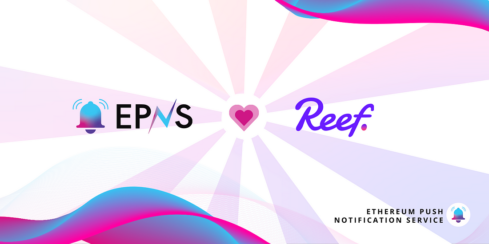

import { SubHeader } from '@site/src/components/SharedStylingV2';

<!--truncate-->

<SubHeader>The emergent blockchain network Reef Chain and EPNS collaborate to bring decentralized push notifications to the platform.</SubHeader> 

Reef Chain is a fast, scalable, efficient, and affordable Layer-1 network that aims to integrate all the best aspects of popular blockchains into one platform to offer a world-class experience to users and developers. It is designed to power the next generation of DeFi, NFT, GameFi, and metaverse projects.

The high scalability, instantaneous transactions, and low gas fees are enabled by the novel nominated proof-of-stake (NPoS) consensus that evades wasteful mining. Reef Chain is EVM-compatible and allows developers to easily integrate their existing dapps and protocols without changing the base code.

This novel blockchain network also supports wrapped ERC-20 tokens, allowing users to transfer liquidity and take advantage of its speed, affordability, and efficiency. The chain is self-upgradable and completely evades the need for hard forks.

As such, this next-generation blockchain can benefit from a decentralized communication mechanism that allows the network to directly communicate with its users. And, we at EPNS are proud to announce our strategic collaboration with [Reef](https://medium.com/u/4f1649b3658b?source=post_page-----f5e80bb632ff--------------------------------).

## How Reef Chain Integrates EPNS
This collaboration between EPNS and Reef Chain will allow the network to directly communicate and deliver platform updates to users through decentralized push notifications. These timely push notifications will allow users to take required action and grab various opportunities on the network with ease. It also reduces their dependency on centralized communication platforms and saves them the hassle of manually checking for updates. The best part is that users can receive these push notifications on any device of their choice.

In the first stage of this integration, users are poised to receive notifications whenever their assets are successfully bridged from the mainnet. Later on, we expect to deliver push notifications for various other activities on the chain including governance updates, and loan liquidation alerts.

We are enthralled by the possibilities of this association with Reef Chain and hope to continue the alliance into the future.

<b>.  .  .</b>

### About Reef
Reef is an EVM-first blockchain designed to make Web3 accessible for the next billion users. Reef offers high scalability, and affordable transactions, and utilizes Nominated Proof of Stake, extensible EVM, and on-chain upgradability. Reef is the future blockchain for NFTs, DeFi, and gaming. It can easily accommodate the needs of the future of Web3 development. Reef is an ideal blend of old and new, a trait that makes it eternal and timeless.

🌎 Website: https://reef.io

🐦 Twitter: https://twitter.com/Reef_Chain

🗣 Discord: https://discord.gg/reefchain

💬 Telegram: https://t.me/reefchain

📸 Instagram: https://www.instagram.com/reef.io

🤖 Reddit: https://www.reddit.com/r/ReefDeFi/

### About Push Protocol

Push is the communication protocol of web3. Push protocol enables cross-chain notifications and messaging for dapps, wallets, and services tied to wallet addresses in an open, gasless, and platform-agnostic fashion. The open communication layer allows any crypto wallet /frontend to tap into the network and get the communication across.

To keep up-to-date with Push Protocol: [Website](https://push.org/), [Twitter](https://twitter.com/pushprotocol), [Telegram](https://t.me/epnsproject), [Discord](https://discord.gg/pushprotocol), [YouTube](https://www.youtube.com/c/EthereumPushNotificationService), and [Linktree](https://linktr.ee/pushprotocol).
