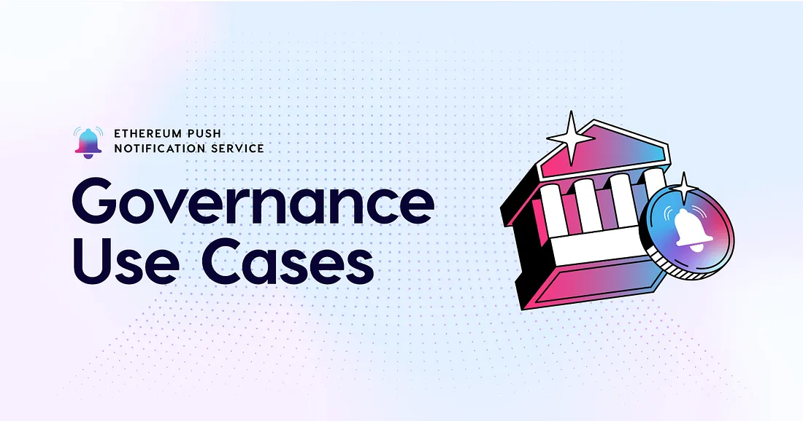
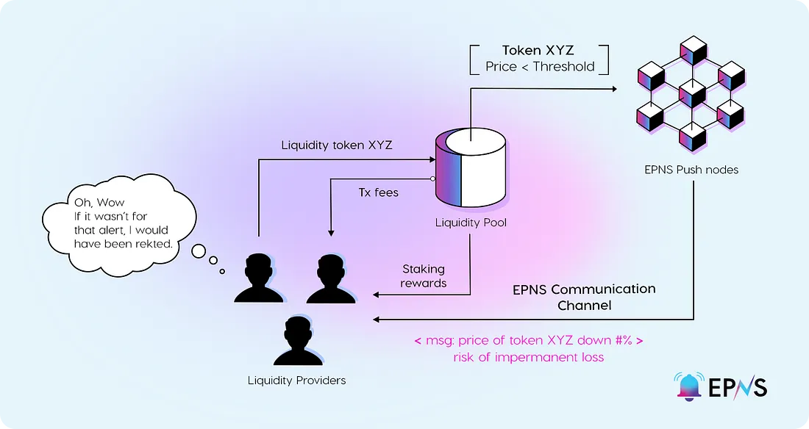

import { ImageText, SubHeader } from '@site/src/components/SharedStylingV2';

<!--truncate-->

<SubHeader>“A proposal to decrease the unbounding period, is passing with 2% in favor with two days left to vote.”</SubHeader> 

Effective decentralized governance requires massive coordination efforts and requires adaptable communication methods. Many on-chain governance systems have low voter turnout, which is a result of many things, one being poor user experience.

What if you’re a core contributor to the DAO, trusted by the DAO to uphold specific responsibilities and keep the community informed? Updates to the DAO can be transmitted over a communication channel to tell community members about the latest updates and what to look out for directly on their accounts.

Web3 communities must start to limit their dependence on platforms like Discord for their communication and use [EPNS’ communication channels](https://app.epns.io/) to serve information to the community directly.

As a core contributor to a DAO, who the members trust to uphold specific responsibilities, you can keep members informed in real time. Some fallbacks can be implemented, as dapps can immediately notify users of potentially malicious behavior of a core contributor or representative of the DAO based on that individual’s on-chain events. Imagine how many incidents EPNS can prevent with a simple communication channel integration.

## A Communication Layer Empowers Decentralized Creativity
We’ve heard it a few times — web3 needs push notifications; end users and developers need communication and a way to create awareness about important information: EPNS? We hope EPNS can serve as a public good for messaging, but a communication layer for web3 sparks more innovation and solves a significant user experience problem.

A creator economy with poor user experience is unsustainable, and creators should not operate in isolation; they should be able to communicate with other creators and build an ecosystem where everyone can push important information directly to the creator’s interface.

Governance in web3 is not meant to operate on Discord, Telegram, Slack, or depend on social channels outside. In many ways, this seems counter-intuitive. Imagine if a project runs an ambassador program but only depends on Discord. The project can integrate EPNS and create program-specific channels for program members to push messages over, like an ambassador communication channel that allows ambassadors to curate communication efforts to end-users and other ambassadors. DAO updates can also benefit, as the EPNS communication layer addresses many coordination issues in generating awareness and supporting end-users.

## What Happened Around Me Today?
Most of us may be surprised to learn about the amount of new policies (including policy changes) introduced in our governance systems. Beyond news outlets (including journalist activities), the reality of governance systems in the real world is that there isn’t a standard or format for notifying the general public about changes directly from the information source unless citizens manually look for them.

Still, governance workers (like politicians) may keep their constituents up-to-date with push notifications via email, SMS, or even social media channels, but this depends on the politician and the medium they choose for communication. The news tends to focus on significant changes, but the risk is that they could be censoring information and likely have a bias. We are establishing a piece of software that addresses these pitfalls.

What happened in web3? Well, DeFi solutions across web3 continue to integrate with EPNS to alleviate the friction with their end-users and fill the communication gap. An example of this is 
[Bancor](https://medium.com/u/2bd55d9e5fb5?source=post_page-----1ea1e0a58ce1--------------------------------), which we mentioned in [Part 2.1](https://medium.com/ethereum-push-notification-service/loan-update-high-utilization-or-low-liquidity-please-check-your-position-fe917fe7c193?postPublishedType=repub). DeFi proposals to the Bancor protocol can be game-changing, and users should have a mechanism to know about them!

Another earlier integration with EPNS was done by [MakerDAO](https://medium.com/u/743224aba00c?source=post_page-----1ea1e0a58ce1--------------------------------), which has an active governance process maintained by a set of smart contracts and a vibrant community. However, users need to constantly watch the MakerDAO governance portal or depend on social channels to know about new polls and the state of current ones. Imagine there were communication channels to send notifications about polling information directly to users.

<i>With EPNS, MakerDAO generates awareness, encourages participation, and brings the community together.</i>

For example, if the DS-Chief contract in Maker elects a new rule across the protocol, users should know as soon as a rule takes effect. Suppose the rule is up for review and available to vote on. In that case, it only hurts the overall progression and strength of the protocol when users are unaware or need to check for changes, creating a constant overhead of missed updates.

While we named a few use cases in this article that relate to governance, there are plenty more, and we encourage you to start building yourself!

Stay up-to-date with EPNS through [Twitter](https://twitter.com/epnsproject), [Telegram](https://t.me/epnsproject), [Discord](https://discord.gg/epns), [Forum](https://gov.epns.io/), [Docs](https://docs.epns.io/), and [YouTube](https://www.youtube.com/c/EthereumPushNotificationService).

And stay tuned for the subsequent use case article on NFTs and the Metaverse!

<i>By Danny Salman</i>

### About Push Protocol

Push is the communication protocol of web3. Push protocol enables cross-chain notifications and messaging for dapps, wallets, and services tied to wallet addresses in an open, gasless, and platform-agnostic fashion. The open communication layer allows any crypto wallet /frontend to tap into the network and get the communication across.

To keep up-to-date with Push Protocol: [Website](https://push.org/), [Twitter](https://twitter.com/pushprotocol), [Telegram](https://t.me/epnsproject), [Discord](https://discord.gg/pushprotocol), [YouTube](https://www.youtube.com/c/EthereumPushNotificationService), and [Linktree](https://linktr.ee/pushprotocol).
