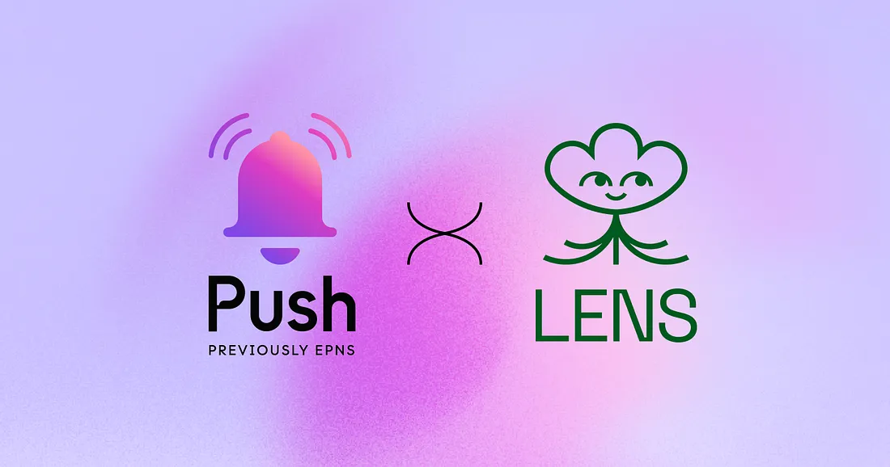

import { ImageText, SubHeader } from '@site/src/components/SharedStylingV2';

<!--truncate-->

<SubHeader>Lens Protocol has joined the Push fam to bring web3 social media to the next level.</SubHeader> 

We’re excited to announce the <b>first protocol to use Push on the Polygon mainnet: Lens Protocol!</b> Since its launch in January 2022, Push has powered over 17 million decentralized notifications to over 60,000 subscribers, becoming the de facto communication layer for web3. Our recent announcement of support for the Polygon network marks a new phase for Push and the world of multi-chain communication. We could not be more thrilled for the incredible team at Lens to be the first to integrate Push and power push notifications for their users.

## Lens and Push: Communication for Web3 Social Media
Censorship-resistant dapps are steadily replacing centralized social platforms like Twitter, Instagram, and TikTok. Every day, we see an increased demand for social apps that allow content ownership and free speech.

[Lens Protocol](https://lens.xyz/) is the building block of web3 social. It enables the development of decentralized social applications that can be used to create, own, and monetize their content without the risk of censorship. Launched in May 2022 by Aave Companies, Lens Protocol’s tech stack for building decentralized social apps is live on Polygon and is already powering over 100 decentralized social media dapps. Those include: [Lenster](https://lenster.xyz/), a decentralized Twitter; [Lenstube](https://lenstube.xyz/), a decentralized video-sharing, think TikTok and YouTube; [Refract](https://refract.withlens.app/), a decentralized link forum think [Hacker News](https://news.ycombinator.com/), and others. Since its mainnet launch, the Lens API has had almost [3 million](https://twitter.com/lensprotocol/status/1565062620310372353?s=21) transactions, and over 70 thousand Lens profiles have been created.

In the world of social media, apps use notifications to keep us connected to our friends, work, and more. Today, Push is happy to work with Lens Protocol to let you stay on top of what is most important to you in your digital life!

With this collaboration, Push will power web3 notifications in the Lens ecosystem and create the best and most user-centric social experience. In version 1 of the Push integration, Lens can enable notifications to be sent to Lens profiles to better ensure communication and engagement around an event occurring with their profile, such as comments. Users can [opt-in](http://app.push.org/#/channels?channel=0xef6426D522CfE5B7Ae5dB05623aB0Ef78023dBe0) to the channel now, and start receiving notifications soon.

## Building the Best Web3 Experience Layer With Lens
We are excited to be working with the Lens team to build out the best web3 native “Experience Layer.” Among those possible notifications, we anticipate building customizable notifications (likes, follow, etc) for Lens profile holders in future versions of this integration. Users have the ability to opt-in and out of the types of notifications they would like to receive and create customized notifications on top of Push that are tailored towards their own needs.

“The Aave Companies is excited to be at the forefront of innovation having Lens Protocol be the first integration on to the Push Protocol,” said <b>Stani Kulechov, Founder of Lens and CEO of the Aave Companies</b>. “Communication is crucial to social networking and bringing easy-to-use tools for engagement as well as allowing for further notification customization capabilities will make the Web3 experience on Polygon more accessible and user-friendly.”

Lens is quickly becoming the go-to solution for building web3 social media. By using Push, dapps building on top of Lens are able to target the right users, increase user retention, boost adoption, and increase dapp engagement. All these benefits also translate to better UX. Such a key piece of infrastructure has been lacking in web3, and Push is proud to solve that piece of the puzzle and help better the user experience for the crypto community.

“While Lens allows users to create their own social graph and get complete control of their data, content, and community, Push Protocol provides a decentralized and chain-agnostic communication bridge for the entire web3 world,” said <b>Harsh Rajat, Founder of Push Protocol</b>.

Aave’s team built one of the leading DeFi dapps with over [$6.6 billion in TVL](https://defillama.com/protocol/aave). Now, the future of social media is here, and it is decentralized. We’re excited to grow with Lens Protocol innovating web3 social, and looking forward to working with Lens to innovate web3 social and improve the way that blockchain technology can serve society.

In web3 social media, we Push together.

<b>.  .  .</b>

### About Lens Protocol
The Lens Protocol is a Web3 social graph on the Polygon Proof-of-Stake blockchain designed to empower creators to own the links between themselves and their community, forming a fully composable, user-owned social graph. The protocol is built from the ground up with modularity in mind, allowing new features and fixes to be added while ensuring immutable user-owned content and social relationships. Lens currently has over 100 applications built on top of it.

Learn more at https://lens.xyz, [Twitter](https://twitter.com/LensProtocol), [Discord](https://discord.com/invite/lensprotocol)

### About Push Protocol

Push is the communication protocol of web3. Push protocol enables cross-chain notifications and messaging for dapps, wallets, and services tied to wallet addresses in an open, gasless, and platform-agnostic fashion. The open communication layer allows any crypto wallet /frontend to tap into the network and get the communication across.

To keep up-to-date with Push Protocol: [Website](https://push.org/), [Twitter](https://twitter.com/pushprotocol), [Telegram](https://t.me/epnsproject), [Discord](https://discord.gg/pushprotocol), [YouTube](https://www.youtube.com/c/EthereumPushNotificationService), and [Linktree](https://linktr.ee/pushprotocol).
