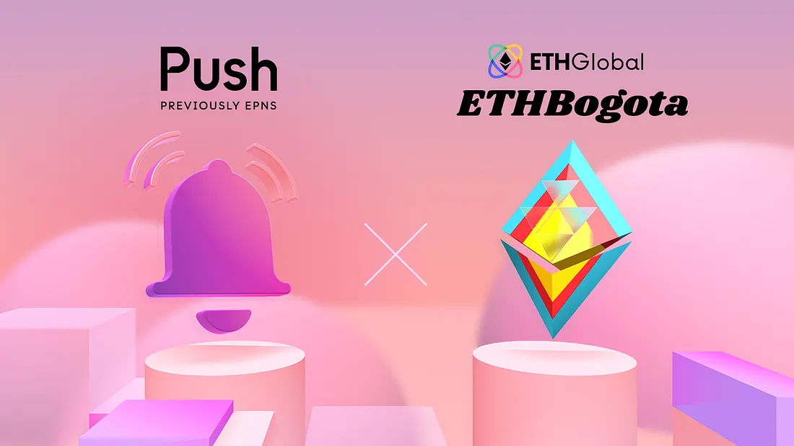

<!--truncate-->

<!--customheaderpoint-->

# We’re partnering up with the wonderful ETHGlobal team (again!) to bring you a new hackathon — ETHBogotá, and let’s build something cool with Push over Devcon week! 

A few weeks ago, we teamed up with our frens at [ETHGlobal](https://medium.com/u/3d1733b8e86a?source=post_page-----96801a44ee64--------------------------------) for a month-long ETHOnline hackathon with thousands of builders hacking from across the world. As expected, all the hackers delivered impressive [work](https://x.com/PushChain/status/1575838134251626496).

Now, it’s [ETHBogotá](https://ethglobal.com/events/ethbogota/prizes#push-protocol) time! This Friday, we’re challenging you to surprise and inspire the community with your projects — at the largest web3 hackathon in LATAM’s history and pushing new boundaries in web3 communication!

## Prizes and Ideas 💡

We’ll be awarding multiple prizes totaling $10k for the best and most creative use cases using Push:

- 🥇1st Prize — $3,500
- 🥈2nd Prize — $2,500
- 🥉3rd Prize — $1,500
- ✨Runner up x5 — $500 each

Since Push mainnet went live earlier this year, we’ve seen builders from the web3 ecosystem, such as [ENS](https://app.push.org/#/channels?channel=0x983110309620D911731Ac0932219af06091b6744), [dYdX](https://medium.com/push-protocol/app.push.org/#/channels?channel=0x23c6b8fB0557FD5e6696BceF3fD4855E0d7018C0), [EarniFi](https://app.push.org/#/channels?channel=0xeEECa1449a75c96d2B34722AE7eE64121be42111), [Oasis](http://app.push.org/#/channels?channel=0x12b3eE60Df8ea26D03b8035Ec90434a38A82C4C7), [Lens Protocol](http://app.push.org/#/channels?channel=0xef6426D522CfE5B7Ae5dB05623aB0Ef78023dBe0), and more, build a variety of creative and useful use cases with Push. For more inspiration, here’re some product requests and sample use cases to get your wheels turning:

- 💰 DeFi: Provide transactional updates with push notifications.
- 🏦 DAO: Increase voting turnout using notification alerts.
- 🎨 NFT and GameFi: Enable direct communications between players and platforms with simple notifications.
- 🔧 Tooling: Offer a smooth user journey with push notifications.

## Getting Started 🚀

We know getting started with building a new project can involve a lot of boilerplate code. That’s why we’ve put together some simple steps you can follow and create a channel — as the first step for sending notifications via Push Protocol, and get everything up and running in no time.

1. Go to http://staging.push.org and connect your wallet.
2. Once Connected, go to the Developer > Create Channel.
3. Fill in the Channel Name, Network, and Channel Website URL details.
4. Approve the transaction for 50 DAI (note: 50 test DAI and some test ETH are required for channel creation).
5. After that’s approved, approve the second transaction call.
6. Congratulations — your channel has been successfully created, and you are all set to send or receive notifications.

### Useful links:

- [Use case](https://www.notion.so/pushprotocol/Push-Protocol-Use-Cases-c0fe5e17bc634502817bdc60c29221e3)
- [Monorepo SDK](https://medium.com/push-protocol/here-comes-the-all-new-epns-sdk-monorepo-framework-8447b486a801)
- [Developer docs](https://comms.push.org/docs/ 'Push Developer docs')

### Hackathon survival guide — if it’s your first hackathon:

- Join ETHGlobal [Discord](https://ethglobal.com/discord) to find a team before the hackathon gets started, but it’s totally okay to hack alone.
- Go through the [use cases](https://www.notion.so/pushprotocol/Push-Protocol-Use-Cases-c0fe5e17bc634502817bdc60c29221e3) to get some inspo.
- Join workshops during the hackathon, i.e., <a href="https://youtu.be/_tJGwyJBclY"><i>How to Add Web3 Notifications to Your Project</i></a>.
- Clean and easy-to-read documentation to win (and wow) the judges.
- Explain what problem you are solving and why your project matters to your users in a short and sweet demo video.
- Find the Push crew if you need any help — from brainstorming to user testing to feedback — we will be there for you.
- One $ tip: the more protocols you are integrating with your hack, the more $ you are more likely to get if you do win.

## Let’s Push for Web3 Communication Together 🔔

<b>A little fun fact:</b> We started building Push (EPNS) in 2020 at the ETHGlobal hackathon, and the feedback we got from the early hackathon community convinced us that it could be so much more. So please remember, you can get pretty far in just a 3-day hackathon, and ETHBogotá is exactly your opportunity to make something happen!

The Push crew will be around to answer questions and offer our support. If something is missing that you want access to — find our crew members on site or let us know [online](https://x.com/PushChain). And don’t hesitate to get in touch on our [Discord](https://discord.gg/pushprotocol).

Good luck and have fun! We can’t wait to see what you build!
