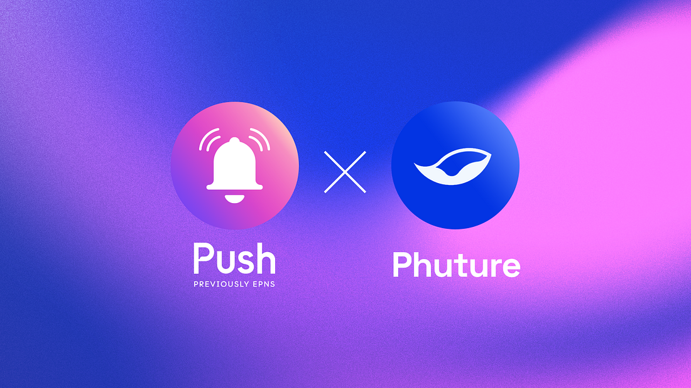

<!--truncate-->

In the past couple of years, the rise in popularity of cryptocurrencies and DeFi opened a multitude of new investment opportunities for people across the globe. When compared to traditional finance, these investment opportunities were not only easily accessible but also far more profitable. Yield farming on DEXs alone gave investors an average [APR of 20–50% with some even going as high as 250%](https://www.benzinga.com/money/best-yield-farms).

However, there is a caveat here. These opportunities, though profitable, are highly risky. So, average investors looking for steady growth of income with minimum risks, are left out of the DeFi revolution. This is where financial products like index funds could make a huge difference. By bringing together a portfolio of top stocks or bonds in a market, index funds let users benefit from the growth of the market without risk exposure.

As such, Phuture Finance is a DeFi protocol that is bringing index funds to the DeFi realm to cater to every day, risk-averse investors. And we at Push are thrilled to announce our strategic partnership with Phuture Finance.

## How Phuture Integrates Push
As a crypto index platform, Phuture is designed to simplify investments through themed index funds. For instance, with its product Phuture DeFi Index (PDI), the platform brings together top DeFi assets (by market cap) on Ethereum. This allows users to capitalize on the overall growth of DeFi while minimizing the risks that come with each of these products individually. Along with PDI, the platform plans to build a whole host of other indexes that let users capitalize on various DeFi trends.

Now, on a platform like Phuture where users invest in a financial product, they regularly check for updates on their investment. But Phuture Finance through its partnership with Push aims to directly deliver these updates to users. This not only improves the user experience on the platform but also allows users to take the required action on time.

To receive these updates, users of Phuture can simply subscribe to its channel on the Push platform. By doing so, they receive notifications whenever:

- An index they’ve invested in has been rebalanced
- An index they’ve invested in does +x% in a week
In the near future, we expect to integrate more use cases, bringing updates on all events to the Phuture platform. The best part is that users can receive these notifications on any device of their choosing. And these decentralized push notifications allow users to stay on top of their investments at all times.

As Phuture works towards making DeFi more accessible with index funds, we’re enthralled to partner with them and hope to continue this alliance into the future.

<b>.  .  .</b>

### About Phuture Finance
[Phuture](https://www.phuture.finance/) (PHTR) is a decentralized crypto index platform that simplifies investments through automated, themed index funds on Ethereum. Accessible by anyone with an internet connection, Phuture is perfect for investors looking to upgrade their crypto investment strategy. Founded in 2019, Phuture has raised USD 3.75 million from VCs, crypto funds, and investors such as the CEO of Bitcoin.com.

Follow Phuture on [Twitter](https://twitter.com/phuture_finance) and [subscribe to their announcements](http://phuture.finance/contact) to be the first to hear updates!

### About Push Protocol

Push is the communication protocol of web3. Push protocol enables cross-chain notifications and messaging for dapps, wallets, and services tied to wallet addresses in an open, gasless, and platform-agnostic fashion. The open communication layer allows any crypto wallet /frontend to tap into the network and get the communication across.

To keep up-to-date with Push Protocol: [Website](https://push.org/), [Twitter](https://twitter.com/pushprotocol), [Telegram](https://t.me/epnsproject), [Discord](https://discord.gg/pushprotocol), [YouTube](https://www.youtube.com/c/EthereumPushNotificationService), and [Linktree](https://linktr.ee/pushprotocol).
