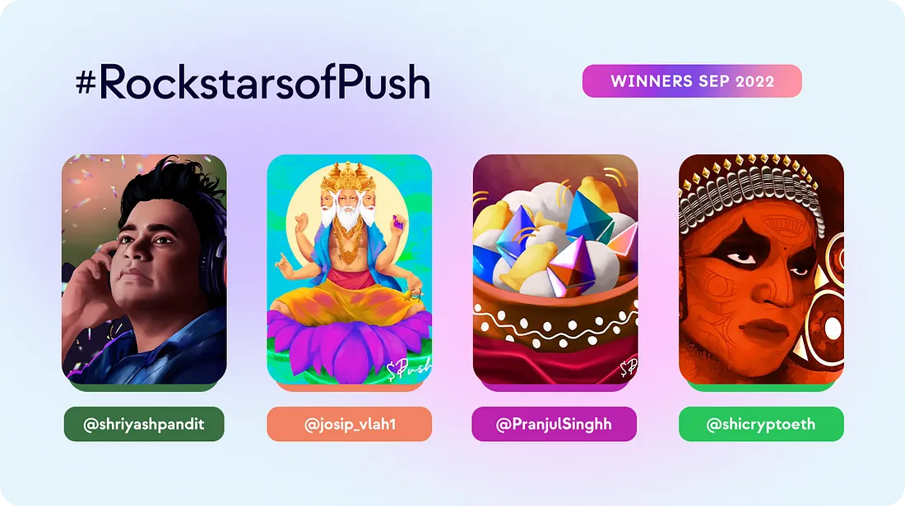

<!--truncate-->

<!--customheaderpoint-->

# September 2022 

Hi <b>Push</b> frens!✨ This one is a very special Monthly Blocks edition as it is the first Push Protocol edition. Let’s take time to recap briefly all the happenings this month!

## Development 🏗️

Let’s jump into the good stuff immediately. The development team have been making strides in all areas in preparation for many good news to come very soon!

- Wallet-to-Wallet integration tests & design in progress
- Developer docs for mono-repo SDK and SNS have been added to [Push Documentation](https://comms.push.org/docs) hub along with a starter kit for Devs to build on top of Push SDK
- UI enhancements to the Push dApp is in progress and soon to be ready!
- Configuration of push nodes to receive and process w2w based notifications in progress.
- Optimization and standardization of Push Node is in the works as well.
- Smart Contract v2 development activities started!
- Working on implementing CAIP to standardise and enable multichain functionality on Push nodes
- New standard of notifications was launched this month! by which a channel can send notifications in many different ways. It can be anything from a minimal payload to a well-defined payload.

Aside from all the cool stuff happening in the Development shop, our team also had the opportunity to participate in the <b>ETHOnline Hackathon</b> which gave us the opportunity to brainstorm with teams, run workshops, provide dev assistance, give projects feedback, and lots of interactions with all the awesome participating hackers!

ICYMI 👀: Take a look at Harsh’s workshop on <a href="https://x.com/PushChain/status/1565361098899202048?utm_source=substack&utm_medium=email"><b>how to add Web3 Push Notifications to your app</b></a>

As seen above, so many of the efforts going on with the development team are intertwined — which makes things so much interesting to work on. We are super excited to see many of these projects releasing soon. Stay tuned!

<b>.  .  .</b>

## Frens of Push 🎎

As usual, every month we make new collaborations along the way. Which reinforce us that we are on the right track and more teams are looking to implement web3 communications into their projects.

These are our new frens this month:

- <a href="https://x.com/PushChain/status/1567166432508809216?s=20&t=bVdFtbZ1MD1SqPugY_HEKA&utm_source=substack&utm_medium=email"><b>Reef Chain</b></a> to alert users when their assets have been bridged, and also communicate Governance related activities.
- <a href="https://x.com/PushChain/status/1572273028159148033?s=20&t=poWPFv7Y52GztOceiRq2wg&utm_source=substack&utm_medium=email"><b>Commonwealth</b></a> to help build better communication mechanisms to improve Governance in the web3.
- The Official <a href="https://x.com/PushChain/status/1570095680613675008?s=20&t=Li4qgjpP-EFnTPoExA2Tzg&utm_source=substack&utm_medium=email"><b>Sturdy Finance Channel</b></a> is now live on Push

New use cases means new challenges and improvement opportunities for Push, and gives us the opportunity to receive first hand feedback and get our protocol even more battle-tested.

<b>.  .  .</b>

## Community 🎡

1. Hosted our [Twitter Space: Buidlers & Hackathons](https://twitter.com/i/spaces/1MYGNgZNyLVJw?utm_source=substack&utm_medium=email) with our frens from <b>SuperFluid</b> and <b>EarniFi</b>
2. Don’t miss reading our article: [Come buidl the Future of Web3 Communication With EPNS at ETHOnline 2022!](https://medium.com/push-protocol/buidling-the-future-of-web3-communication-with-epns-at-ethonline-2022-ec720bf1bc82)
3. Push very own Pranshu, spoke during <a href="https://twitter.com/epnsproject/status/1573172723173707776?s=20&t=poWPFv7Y52GztOceiRq2wg&utm_source=substack&utm_medium=email"><b>Buidl Asia 2022</b></a> about ‘Building the communication layer of web3 with EPNS’.

And of course, we couldn’t end this section without a shout out to our community Rockstars! Congratz!

<b>.  .  .</b>
 

We are entering into a very exciting phase for the project where many things that we have been working on are finally coming Live! This motivates us to continue working hard to ensure we keep taking web3 communication to new heights.

Keep <b>Pushing</b> 💪

— The Push Team
