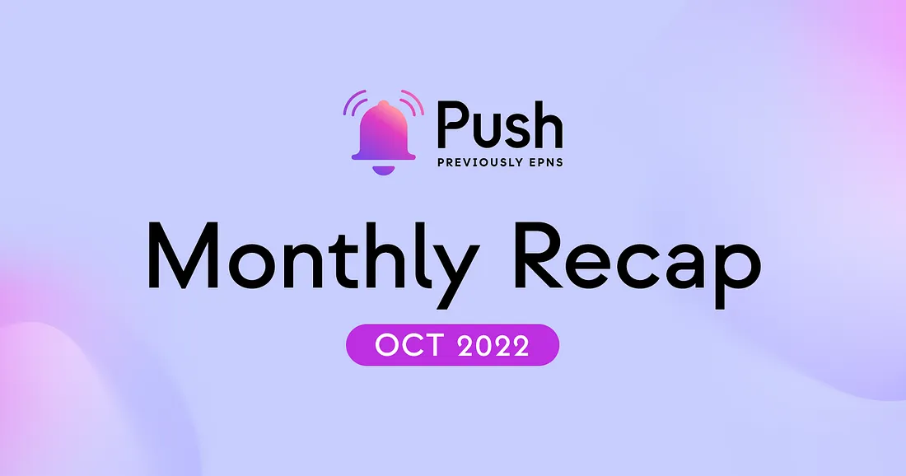
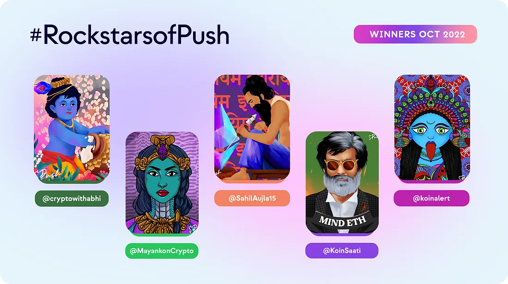

import { ImageText, VideoContainer } from '@site/src/css/SharedStyling';

<!--truncate-->

<!--customheaderpoint-->

# October 2022 

Hello <b>Push</b> fam 🎎. Get comfortable and relax. We have so much to talk about this month! After our rebrand to Push Protocol many things followed up and it’s time we go over them.

## Development 🏗️

The fun in the development team never ends. As we mentioned last month, many initiatives were coming together and this month they made it live!

### Push Protocol in Polygon Mainnet

October started strong with our announcement of Push Protocol deployed in Polygon Mainnet to bring world-class communication infrastructure to the Polygon ecosystem.

You can [read more here](https://x.com/PushChain/status/1575485566065381377?s=20&t=TdVmvodS54VtGSPTMr-Ovw&utm_source=substack&utm_medium=email) in case you missed it!

### Push Chat (Alpha)

A wallet-to-wallet communication protocol! We started development activities some time ago and Push Chat made it Live at the Polygon Connect event in Bogota. <b>Wanna give it a try?</b> Ping us on Discord!  

<VideoContainer>
<iframe width="100%" height="100%" style={{ borderRadius: "32px" }} src="https://www.youtube.com/embed/n-5wsuRIS3s" title="PushChat Product Launch" frameborder="0" allow="accelerometer; autoplay; clipboard-write; encrypted-media; gyroscope; picture-in-picture; web-share" allowfullscreen></iframe></VideoContainer>
  

And it doesn’t end there. We are working to launch very soon the Push Chat SDK, which will enable hackers and development teams to implement wallet to wallet communication in your solutions!

Now, there are many other things that the dev team have been working on this month:

- The new browser extension of PUSH Protocol is now live on Staging & Prod. With this extension now consuming the new SDK for fetching notifications.
- The Push Protocol dApp is made it live on Staging and Prod with enhanced UI/UX and better performance
- Push Staging environment was migrated to Goerli Network 🙏🏽
- CAIP implementation is in steady progress
- The analytics Dashboard is coming together nicely. The team is working on also integrating Governance key points to make it more complete to everyone.
- Our ever-green documentation was improved after all the great feedback provided by hackers during ETH Bogota.

And last, but not least… Push Smart Contracts v2 is now in development. More news to come soon!

<b>. . .</b>

## The Push circle of Frens gets bigger 🤗

Always exciting to see more projects trusting their Web3 communication on Push Protocol!

This month we started with amazing news of many projects joining us to celebrate Push Protocol coming to Polygon. We announced our partnerships with <a href="https://x.com/PushChain/status/1576959192761438209?s=20&t=PVga-t-8zgBi6Vw5A6EWqA&utm_source=substack&utm_medium=email"><b>Lens Protocol</b></a>, <a href="https://x.com/PushChain/status/1577328098047332358?s=20&t=PVga-t-8zgBi6Vw5A6EWqA&utm_source=substack&utm_medium=email"><b>PoolTogether</b></a>, <a href="https://x.com/PushChain/status/1577328098047332358?s=20&t=PVga-t-8zgBi6Vw5A6EWqA&utm_source=substack&utm_medium=email"><b>Qi Dao</b></a>, <a href="https://x.com/PushChain/status/1577328098047332358?s=20&t=PVga-t-8zgBi6Vw5A6EWqA&utm_source=substack&utm_medium=email"><b>Mean Finance</b></a>, <a href="https://x.com/PushChain/status/1577328098047332358?s=20&t=PVga-t-8zgBi6Vw5A6EWqA&utm_source=substack&utm_medium=email"><b>GoodGhosting</b></a>, <a href="https://x.com/PushChain/status/1577328098047332358?s=20&t=PVga-t-8zgBi6Vw5A6EWqA&utm_source=substack&utm_medium=email"><b></b>MahaDAO</a>, <a href="https://x.com/PushChain/status/1577328098047332358?s=20&t=PVga-t-8zgBi6Vw5A6EWqA&utm_source=substack&utm_medium=email"><b>EthSign</b></a>, <a href="https://x.com/PushChain/status/1577328098047332358?s=20&t=PVga-t-8zgBi6Vw5A6EWqA&utm_source=substack&utm_medium=email"><b>Polychain Monsters</b></a> on Polygon Mainnet.

We also announced our collaboration with <a href="https://x.com/PushChain/status/1580563883823022080?s=20&t=8Uce2YW1VuHsKVjqMAhKQQ&utm_source=substack&utm_medium=email"><b>BeInCrypto</b></a> to deliver news directly to readers’ web3 wallets.

And closer to the end of month we also announced our collaboration with <a href="https://x.com/PushChain/status/1584907724504305664?s=20&t=WLH5_GW8954-niduUfDuNg&utm_source=substack&utm_medium=email"><b>Phuture Finance</b></a> to notify users about rebalances and index changes over the week.

We love how all our frens help make Push notifications a battle tested use case for the Web3. We are looking forward to start seeing more Push Chat integrations as we make progress.

<b>.  .  .</b>

## Community 🎡

This was a very intense & beautiful month for the Push Team to interact with our community thanks to all the virtual and IRL events that happened this month.

1. We received an overwhelming response with 55+ projects building on top of <a href="https://x.com/PushChain/status/1575838134251626496?s=20&t=9cwhxiIYke5lIs7SM5f8Hg&utm_source=substack&utm_medium=email"><b>Push at EthGlobal’s ETHOnline2022 Hackathon!</b></a> Lots and lots of very creative projects by awesome hackers.
2. Push Team had the opportunity to participate in in ETHGlobal’s <a href="https://x.com/PushChain/status/1577698820632084489?s=20&t=PVga-t-8zgBi6Vw5A6EWqA&utm_source=substack&utm_medium=email"><b>ETHBogota hackathon</b></a>. Which again gave us the chance to interact IRL with hackers and receive first-hand feedback from them to improve our Protocol. Thanks for that hackers! And congratulations to all <a href="https://x.com/PushChain/status/1580196671266246656?s=20&t=8Uce2YW1VuHsKVjqMAhKQQ&utm_source=substack&utm_medium=email"><b>EthBogota Hackathon Winners</b></a>.
3. Right after ETHBogota, DevCon came in! And the <a href="https://x.com/PushChain/status/1578782319430623232?s=20&t=PVga-t-8zgBi6Vw5A6EWqA&utm_source=substack&utm_medium=email"><b>Push Crew</b></a> was there ready to mingle with all our old and new frens! We couldn’t have had more fun.

During DevCon week the Push Crew also participated in talks, workshops , and panels:

1. Harsh talked about <a href="https://www.youtube.com/watch?v=Diln2WBL7a0&list=PLvTrX8LNPbPkQ3qDNpQDRZQClhUl_BJQp"><b>Why Communication is a Public Good?</b></a> during Schelling Point in Bogota.
2. Richa joined the <a href="https://x.com/PushChain/status/1578782336103038977?s=20&t=f2WEtOkUpYSQcSSqB1JvjQ"><b>Social Media Reimagined</b></a> panel during Polygon Connect to talk about how to build Forward-Thinking platforms
3. Jaf joined ETH Latam Bogota day to talk about <b>Why Communication matters in the Web3?</b>
4. Fabio gave a workshop on<a href="https://www.youtube.com/watch?v=h0I7QrRHKzs"><b> How to add Web3 Notifications to your project using Push Protocol</b></a>.

<b>.  .  .</b>

## Push in the news 📺

- <a href="https://twitter.com/Blockworks_/status/1575495817368338433?s=20&t=TdVmvodS54VtGSPTMr-Ovw&utm_source=substack&utm_medium=email"><b>Blockworks</b></a> featured Push Protocol rebranding and Polygon launch
- Push is now tracked on <a href="https://twitter.com/DeBankDeFi/status/1583245429139013634?s=20&t=HNE_pPg4jdJB31S47M_zuQ&utm_source=substack&utm_medium=email"><b>DeBank</b></a>
- Subscribe to Push Protocol channels directly from <a href="https://twitter.com/meetwithwallet/status/1585588116294758400?s=20&t=WLH5_GW8954-niduUfDuNg&utm_source=substack&utm_medium=email"><b>Meet with Wallet</b></a>
- <a href="https://twitter.com/meetwithwallet/status/1585588116294758400?s=20&t=WLH5_GW8954-niduUfDuNg&utm_source=substack&utm_medium=email"><b>Featured by Bankless</b></a> — never miss a thing on-chain with Push protocol!

<b>.  .  .</b>
 

And we finish with our usual shoutout to everyone participating in our <b>Rockstars of Push</b> program. These are this month’s winners

<b>.  .  .</b>
 

After such an incredible month our motivation is to the top to continue delivering the world-class communication infrastructure the Web3 needs. Many more things are in the making, and more opportunities to actively get involved in the project will come.

Let’s keep <b>Pushing</b> 💪

— The Push Team
