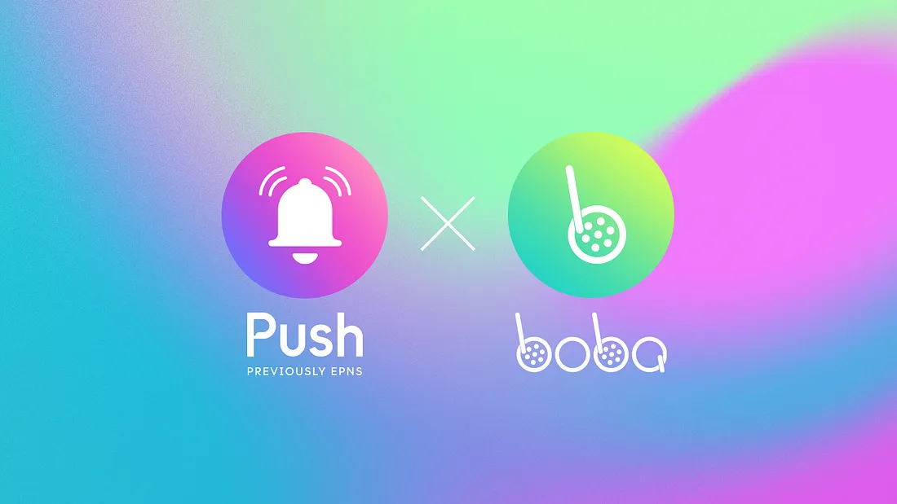

---

slug: push-protocol-allies-with-boba-network-to-enable-decentralized-communication
title: Push Protocol Allies With Boba Network to Enable Decentralized Communication
authors: [push]
tags: [ Web3, Announcements, Push Notification, Boba Network]

---

import { ImageText, SubHeader } from '@site/src/components/SharedStylingV2';

<!--truncate-->

<SubHeader>Push Protocol and Boba Network integrate to bring decentralized push notifications for users.</SubHeader> 

Boba, the Ethereum Layer-2 network joins forces with Push Protocol to achieve direct communication with users of the platform. As such, users of Boba Network can receive decentralized push notifications pertaining to asset bridging.

## Boba Network: Ethereum Layer2 for the Masses
Boba Network is touted to be the people’s layer-2 for Ethereum that prioritizes developers and users. At its core, it is an L2 Ethereum scaling and augmenting solution. It features extensible smart contracts that allow developers to build the next generation of DApps that invoke the web-scale infrastructure. Boba offers community-driven liquidity pools while facilitating fast exits and giving LPs incentivized yield farming opportunities.

Moreover, the Boba Network allows faster transactions, hybrid computing, lower gas fees, and Ethereum-level security for users. Users can also seamlessly move digital assets, including NFTs from Ethereum L1 to L2. As such, this novel network can benefit from a decentralized communication channel that allows direct communication with its users to keep them updated about the various activities on the network. This is where the collaboration with Push Protocol comes into play.

## What Does the Integration Entail?
Through our integration with Boba Network, we envision the creation of a decentralized communication channel that allows the platform to directly interact with its users. This channel will be housed on the Push platform and users of Boba Network can subscribe to it to receive decentralized push notifications on their devices. They can expect to receive notifications whenever:

- Their assets are bridged into the Boba Chain
- Governance proposals are up for voting
- The results of the voting are declared

This allows users to grab the governance and investment opportunities on Boba Network at the right time. Push has a Chrome extension, a dapp, and a mobile application to ensure that users do not miss out on notifications on any device.

We’re pleased to collaborate with Boba Network on their journey and Stay tuned for more announcements in the coming week!

<b>.  .  .</b>

## About Boba Network
Boba is a “Multichain “ L2 Ethereum scaling & augmenting solution built by the Enya team as core contributors to the OMG Foundation. It leverages Optimistic roll-up technology and allows developers to build the next generation of DApps and DeFi protocols.

Stay in touch: [Website](https://boba.network/) and [docs](https://docs.boba.network/).

### About Push Protocol

Push is the communication protocol of web3. Push protocol enables cross-chain notifications and messaging for dapps, wallets, and services tied to wallet addresses in an open, gasless, and platform-agnostic fashion. The open communication layer allows any crypto wallet /frontend to tap into the network and get the communication across.

To keep up-to-date with Push Protocol: [Website](https://push.org/), [Twitter](https://twitter.com/pushprotocol), [Telegram](https://t.me/epnsproject), [Discord](https://discord.gg/pushprotocol), [YouTube](https://www.youtube.com/c/EthereumPushNotificationService), and [Linktree](https://linktr.ee/pushprotocol).
