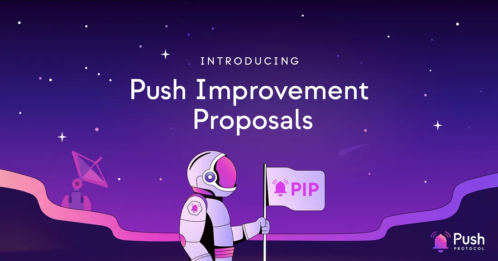
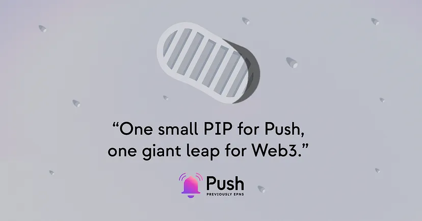

import { ImageText, SubHeader } from '@site/src/components/SharedStylingV2';

<!--truncate-->

TLDR;

- The Push community can now submit proposals for standardized, community-driven improvements, specs, and standards or improvements to the Push ecosystem via Push Improvement Proposal (PIP).
- There is now a standardized and transparent process that allows the community to review and contribute to every PIP to ensure each PIP is in the best interest of the Push ecosystem.
- This will allow users to submit PIPs in a well-defined cycle, through which moderators and the community can take decisions on the proposal.

<b>.  .  .</b>

Push (previously known as EPNS) has grown to become the leading communication layer for all Web3 actors including protocols, dapps, smart contracts, wallets, backend, and users. But, to service such a large ecosystem, there needs to be a streamlined process for improving and developing the ecosystem to meet every actor’s needs. Introducing — Push Improvement Proposals (PIP).

PIP is a new standard for proposing improvements, specs, and standards to the Push ecosystem. The goal of PIPs is to provide a standardized, community-driven improvements, specs, and standards for improving the Push ecosystem. In this way, PIPs is going to become an integral part of how the Push ecosystem grows and evolves to best serve the needs of its users.

Curious to know more about what PIPs are, how they’re processed, and why they matter? Read on to find out.

## What is a PIP?
PIP stands for Push Improvement Proposal. It is a standardized process that enables developers and community members alike to collaborate and make changes to the Push ecosystem. Inspired by the [EIP](https://eips.ethereum.org/EIPS/eip-1) (Ethereum Improvement Proposal), PIP is a step towards broadening the scope of community participation in innovating the Push ecosystem.

There are three types of PIPs:

1. <b>Standard</b> PIP describes any change that affects most or all Push ecosystem implementations, such as changes in core, interface, networking, or application level standards.
2. <b>Meta</b> PIP describes a process surrounding Push or proposes a change to (or an event in) a process. Process PIPs are like Standards Track PIPs but apply to areas other than the Push protocol itself. Examples include procedures, guidelines, changes to the decision-making process, and changes to the tools or environment used in Push development. Any <b>meta-PIP</b> is also considered a Process PIP.
3. <b>Informational</b> PIP provides general guidelines or information to the Push community but does not propose a new feature. Informational PIPs do not necessarily represent a Push community consensus or recommendation, so users and implementers are free to ignore Informational PIPs or follow their advice.

## Why do PIPs matter?
PIPs play a central role in how changes happen and are documented in the Push ecosystem. They are the way for people to propose, debate, and adopt changes. There are [different types of PIPs](https://github.com/ethereum-push-notification-service/PIPs/tree/main/definitions#type) including core PIPs for low-level protocol changes that affect consensus and improvements in API/RPC as well as PRCs for application standards. For example, [Verification Proof](https://github.com/ethereum-push-notification-service/PIPs/tree/main/definitions/Standard/PRC/Notification/Verification) or [Identity](https://github.com/ethereum-push-notification-service/PIPs/tree/main/definitions/Standard/PRC/Notification/Identity) for Notifications is described in PRC to create a standard.

## What is the lifecycle of a PIP?
Just like passing a new law, the approval process of a PIP involves various stages of discussion, editing, and review. Variations in this process are based on the type of proposal we have at hand and the timeline for discussion which might be set by the editor. In broad terms, all PIPs follow a standard process that includes the following steps:

1. <b>Ideation:</b> Any ideas for new changes or development of the Push ecosystem are presented and discussed over the <a href="https://gov.push.org/c/pip/29">Push’s governance forum</a> or discord. If members find this idea worth pursuing, it is presented as a documented PIP to the larger community of Push developers.
2. <b>Drafting:</b> This is the first formal step in proposal development where the authors of a new idea create a technical draft of their vision. To submit a draft, authors should submit a Pull Request (PR) against an issue in the PIPs repository.
3. <b>Reviewing:</b> After the preliminary vetting process, a new draft is open for feedback from editors, reviewers, and any interested parties. This stage involves a large-scale audit of a given proposal where authors invite insights on their development plan from the Web3 community.
4. <b>Last call:</b> This is the final window for the reviewing stage after which the PIP gets finalized. The editor provides a deadline (typically two weeks), after which a given proposal will not accept any new suggestions. In case any significant changes are needed, the proposal goes back to the reviewing stage.
5. <b>Final:</b> After passing the last call stage, a proposal is accepted as a final or implementable standard. The only modifications at this point can be made to correct errata or add non-normative clarifications.

In certain cases, the lifecycle of a PIP can undergo special stages such as:

<b>Stagnant:</b> Any proposal which remains inactive for a period of 4 months or more in the Draft/Review/Last Call state is considered stale. Such a proposal may be resurrected from this state by Authors or Editors who can move it back to an earlier status. If not resurrected, the proposal stays stagnant forever.

<b>Withdrawn:</b> If the authors of a proposal withdraw their submission, it is considered a finality that cannot be retracted. If the same idea is to be pursued at a later stage, it is launched as a new proposal.

<b>Living:</b> This is a special status designated to PIPs which are expected to undergo continued updates. Such proposals never reach a state of finality and remain in an editing loop for their whole lifecycle. An example of such a proposal is PIP-1.

## How can builders contribute towards improving Push?
The Push ecosystem is addressing a gap in critical blockchain infrastructure by enabling native communication between protocols, dapps, and wallets. Push is live on Ethereum and Polygon to power real-time uncensorable connectivity for over 100 Web3 apps and service providers.

Developers can contribute to the Push ecosystem in the capacity of their interest, which includes Push protocol implementations, such as changes in core, interface, networking, or application-level standards. Also, if you’re aligned towards the meta-PIP it opens up a contribution channel for procedures, guidelines, changes to the decision-making process, and changes to the tools or environment used in Push development.

## Come contribute to grow the Push ecosystem!
If you’re interested to read more about PIPs, check out the [PIPs Github](https://github.com/ethereum-push-notification-service/PIPs) repository where you can find additional information, including:

- [PIP template for submission](https://github.com/ethereum-push-notification-service/PIPs/blob/main/pip-template.md)
- [PIP forum](https://gov.push.org/c/pip/29)
- [PIP-1 — Purpose and Guidelines](https://gov.push.org/c/pip/29)
- [Definitions of Types, and categories of PIPs](https://github.com/ethereum-push-notification-service/PIPs/tree/main/definitions)

We invite all members interested in contributing to the future of native communication in Web3 to check out the [Push Discord](https://discord.gg/pushprotocol) and [PIP forum](https://gov.push.org/c/pip/29) and come meet the pioneers behind Push.

Who knows, you just might be the author of the next chapter of Push and native communication in Web3.

### About Push Protocol

Push is the communication protocol of web3. Push protocol enables cross-chain notifications and messaging for dapps, wallets, and services tied to wallet addresses in an open, gasless, and platform-agnostic fashion. The open communication layer allows any crypto wallet /frontend to tap into the network and get the communication across.

To keep up-to-date with Push Protocol: [Website](https://push.org/), [Twitter](https://twitter.com/pushprotocol), [Telegram](https://t.me/epnsproject), [Discord](https://discord.gg/pushprotocol), [YouTube](https://www.youtube.com/c/EthereumPushNotificationService), and [Linktree](https://linktr.ee/pushprotocol).
