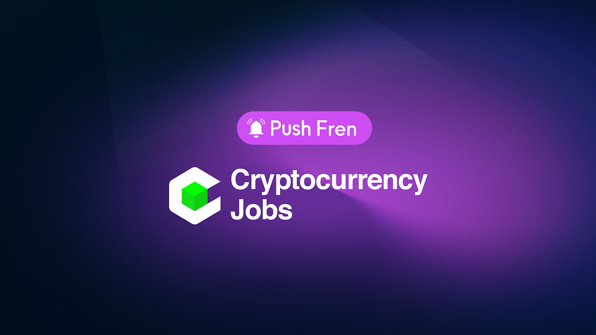

---

slug: cryptocurrency-jobs-stay-notified-of-the-best-web3-opportunities-out-there
title: Cryptocurrency Jobs — Stay Notified of the Best Web3 Opportunities Out There
authors: [push]
tags: [ Web3, Cryptocurrency, Jobs, Frensofpush, Push Notification]

---

import { SubHeader } from '@site/src/components/SharedStylingV2';

<!--truncate-->

<SubHeader>Frens of Push #2</SubHeader> 

<i> “Frens of Push” is our weekly content series to spotlight outstanding projects that are building with Push. If you want to be featured, reach out to us and you could be our next Fren in the series.</i>  

<a href="https://cryptocurrencyjobs.co/"><b>Cryptocurrency Jobs</b></a>, the leading job board for blockchain jobs, has teamed up with Push to enhance how users are notified and alerted of exciting new Web3 job opportunities!

Web3 has quickly become synonymous with innovation and provided a doorway to the development of many projects with vast potential. Many of these projects are expanding rapidly and looking to hire new talent. This is where Cryptocurrency Jobs enters the picture. By connecting Web3 professionals with leading blockchain-based companies from around the world, Cryptocurrency Jobs is helping bridge the hiring gap in Web3.

Through the collaboration with Push, the platform is bringing new job opportunities and updates to Web3 professionals directly. All this is made possible through decentralized Push notifications that users can opt-in to receive on their devices.

In the second episode of “Frens of Push”, we are in conversation with Daniel — the founder of Cryptocurrency Jobs, to talk about how Push is enabling a people-centric approach to hiring.

## How did you become involved in building the blockchain space? What are you working on now?
<b>Daniel:</b> Hi, I’m Daniel, the founder of Cryptocurrency Jobs. I began my journey in this space through the Bitcoin and Cryptocurrency Technologies course on Coursera. Fun fact: it’s taught by the founders of Arbitrum. Falling down the rabbit hole, I wanted to get involved and contribute to the community so I launched Cryptocurrency Jobs in October 2017. <b>Since then, I’ve featured over 10,000 jobs at 1,000+ companies and startups and published 406 newsletter issues</b>. All for free and accessible to all. Since then Cryptocurrency Jobs has become the leading job board for blockchain and cryptocurrency jobs — entirely independent, bootstrapped, and run by me.

## What’s your future plan for Cryptocurrency Jobs?
<b>Daniel:</b> Cryptocurrency Jobs recently <a href="https://cryptocurrencyjobs.co/blog/five-years-of-cryptocurrency-jobs-and-a-new-partnership/">turned five</a>. As part of the milestone, I announced the newest partner to Cryptocurrency Jobs: Pantera Capital. Since 2013, Pantera Capital has invested in digital assets and blockchain companies. I’m excited to work with the team, support their portfolio companies, and help you find more opportunities to grow in this space. As I continue to build Cryptocurrency Jobs, I remain committed to making this a friendly place for people everywhere. That’s why all content will remain open and accessible to all. There will be no gatekeeping. Everyone is welcome, and you all have a place in crypto.

## How is Cryptocurrency Jobs using Push’s Web3 communication layer?
<b>Daniel:</b> Since 2021, I have been working with Push Protocol to help them find talented humans for their team. I recently started using Push’s Web3 communication layer to create a decentralized communication channel that allows direct interaction with the Cryptocurrency Jobs community. The <a href="https://medium.com/push-protocol/app.push.org/#/channels?channel=0xde3e447E125FA2391DC9BCbfA0B821424422FEAF">Cryptocurrency Jobs channel</a> is live on the Push Protocol platform, and you can subscribe to receive decentralized notifications about new job opportunities, the weekly newsletter, and more.

## How would you describe your experience using Push Protocol? What benefits have you seen?
<b>Daniel:</b> The onboarding and setup process has been seamless. The Push Protocol team are true rock stars. Special shout-out to Jaf and Muktanshu for their help guiding me through the process.  

<blockquote>Using Push Protocol has opened up a new communication channel with my community and helped onboard new users to the crypto space.</blockquote> 

We want to thank Daniel for taking the time to speak with us! We look forward to building Cryptocurrency Jobs and facilitating thousands of Web3 professionals to land their dream jobs.

Stay tuned for more exciting developments from both Push and Cryptocurrency Jobs!

<b>.  .  .</b>

### About Cryptocurrency Jobs
Cryptocurrency Jobs curates the best new blockchain jobs at leading companies and startups that use blockchain technology. For protocols, this means greater exposure to a wider talent pool and for users, this means more access to a range of open positions in web3!

Check out more about Cryptocurrency Jobs: [Website](https://cryptocurrencyjobs.co/), [Twitter](https://twitter.com/jobsincrypto).

### About Push Protocol

Push is the communication protocol of web3. Push protocol enables cross-chain notifications and messaging for dapps, wallets, and services tied to wallet addresses in an open, gasless, and platform-agnostic fashion. The open communication layer allows any crypto wallet /frontend to tap into the network and get the communication across.

To keep up-to-date with Push Protocol: [Website](https://push.org/), [Twitter](https://twitter.com/pushprotocol), [Telegram](https://t.me/epnsproject), [Discord](https://discord.gg/pushprotocol), [YouTube](https://www.youtube.com/c/EthereumPushNotificationService), and [Linktree](https://linktr.ee/pushprotocol).
