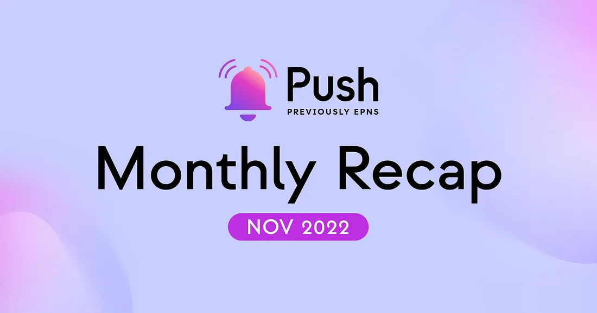

<!--truncate-->

What a month for the Push project and community! From making many new frens to launching our very own Improvement Proposals, much has happened and we cannot wait to share everything with you. 🤩

Let’s unpack everything that happened this month!

1. [Developments](https://medium.com/push-protocol/november-monthly-recap-95e0e53c65f9#44c6)
2. [Partnerships & Collaborations (Frens of Push)](https://medium.com/push-protocol/november-monthly-recap-95e0e53c65f9#f221)
3. [Governance & Community](https://medium.com/push-protocol/november-monthly-recap-95e0e53c65f9#0d6b)
4. [Push in The News](https://medium.com/push-protocol/november-monthly-recap-95e0e53c65f9#1569)

## 🏗️ Developments 🏗️

Starting with the introduction of the <b>Push Improvement Proposal (PIP).</b>

Push community members can now submit proposals for standardized, community-driven improvements, specs, and standards or improvements to the Push ecosystem via PIPs.

We’re inviting all our community members to now come and contribute to the Push Ecosystem! Read about it in more detail 👉 [here](https://medium.com/push-protocol/introducing-push-improvement-proposal-pip-702c44fc24f6).

Beyond just the introduction of PIPs though, there have been a host of improvements made including:

- The analytics dashboard backend API has been completed, and a new UI is in the works. This will provide platforms with insights about notifications and their channels.
- The wallet-to-wallet SDK continues to advance at a rapid pace.
- Push smart contracts v2 is taking strides this month.
- Frontend for Push chat is being refined as you read this.
- Governance Analytics API is in progress.
- Delivery nodes are undergoing extensive quality assurance to make them foolproof and battle-ready.
- New mobile app features will go live soon and bug fixes are being made in the app.

With so much happening on the development front and with the launch of PIP, we invite you all to join us and have a chat with our team on [Push Discord](https://discord.gg/pushprotocol). All the good conversations are happening there!

## 🤝 Frens of Push 🤝

We’re delighted to have grown our ecosystem with some very meaningful collaborations including:

- <a href="https://indexcoop.com/"><b>Index Coop:</b></a> to enable decentralized, seamless communication on their platform. <a href="https://x.com/PushChain/status/1588177926633435136?s=20&t=f1y9i26iSB4u0d9htusCNA">Read more</a>.
- <a href="https://medium.com/u/21d77751f5db?source=post_page-----95e0e53c65f9--------------------------------"><b>Boba Network :</b></a> to enable push notifications pertaining to asset bridging. <a href="https://medium.com/push-protocol/push-protocol-allies-with-boba-network-to-enable-decentralized-communication-356cbae1cd82">Read more</a>.
- <a href="https://www.encode.club/"><b>Encode Club:</b></a> to host workshops and provide hackathon bounties for communities. <a href="https://x.com/PushChain/status/1588155949788831744?s=20&t=f1y9i26iSB4u0d9htusCNA">Read more</a>.

We welcome these new frens and look forward to supporting one another growth. Let’s BUIDL together!

## 🗳️ Governance and Community 🗳️

With the launch of PIP, we’ve taken a significant step in enabling changes and improvements in the Push ecosystem.

A number of Push Grant Proposals were also discussed in the [Push Gov Forum](https://gov.push.org/) this month and we want to congratulate SPECT for making it to the finish line and getting their proposal approved. Other PGPs are open for voting and we wish them lots of luck.

The proposal to introduce [Push Notifications to Element Finance](https://x.com/PushChain/status/1594699505701879808?s=20&t=HrRpWmCJh6RTEWV8-2Qk0Q) has also passed and we look forward to enhancing governance on
ElementFi
.

There was tons of action with our community:

- Hosted amazing Friday Push calls. One with our fren
  [Phuture](https://medium.com/u/bd0c8ba3658d?source=post_page-----95e0e53c65f9--------------------------------) and another with two of the top protocols from [ETHGlobal’s](https://medium.com/u/3d1733b8e86a?source=post_page-----95e0e53c65f9--------------------------------) ETHSanFrancisco <a href="https://x.com/PushChain/status/1593580530364203008"><b>Pepperstake and CoverFi</b></a>.
- Kicked off #FrensofPush, a weekly content series to spotlight projects that are building with Push. We sat down with <a href="https://x.com/PushChain/status/1593231543048499202?s=20&t=eKqRdKyLPXiE9xu-s5KS6Q"><b>Earnifi</b></a> and <a href="https://x.com/PushChain/status/1595779712374153218?cxt=HHwWhICx_bHMrKUsAAAA"><b>Cryptocurrency Jobs</b></a> and explored how Push is helping enhance their user experience through decentralized communication.

And while we’re talking about community, we cannot go without a huge shoutout to all the Rockstars of Push who created a host of fantastic content about Push.

You guys are amazing! 🎉

## 📰 Push in the News 📰

A beautiful month for Push as we were featured on some of the best crypto publications and podcasts out there:

- Our founder, Harsh Rajat, took a session on “Communication is a public good” at Schelling Point in Bogota. [Check it out!](https://x.com/PushChain/status/1586358935178526726?s=20&t=f1y9i26iSB4u0d9htusCNA)
- <a href="https://twitter.com/BanklessHQ/status/1587172721770774531?s=20&t=f1y9i26iSB4u0d9htusCNA"><b>Bankless</b></a> featured Push with early access passes for Push Chat. Harsh was also featured in a <a href="https://x.com/PushChain/status/1594659038691840001?s=20&t=HrRpWmCJh6RTEWV8-2Qk0Q">podcast conversation</a> to talk about how Web3-native communication will be a game-changer.
- <a href="https://twitter.com/0xPolygon/status/1588218853414281222?s=20&t=f1y9i26iSB4u0d9htusCNA"><b>Polygon’</b></a>s weekly briefing featured Push as an enabler in upgrading usability in the Web3 space.
- Harsh was invited to share his perspective on the impact of the FTX scandal by <b>DailyCoin</b>. Read more about his thoughts on the scandal [here](https://x.com/PushChain/status/1595097674461872128?s=20&t=HrRpWmCJh6RTEWV8-2Qk0Q).
- Last but not the least, our very own Richa’s article about tax reforms in the crypto space was published in <a href="https://twitter.com/CoinDesk/status/1593254972027973632?s=20&t=eKqRdKyLPXiE9xu-s5KS6Q"><b>CoinDesk</b></a>.

<b>.  .  .</b>
 

With such an exciting month behind us, we’re all geared up for December and have some exciting updates to release! Stay tuned!

— The Push Team
