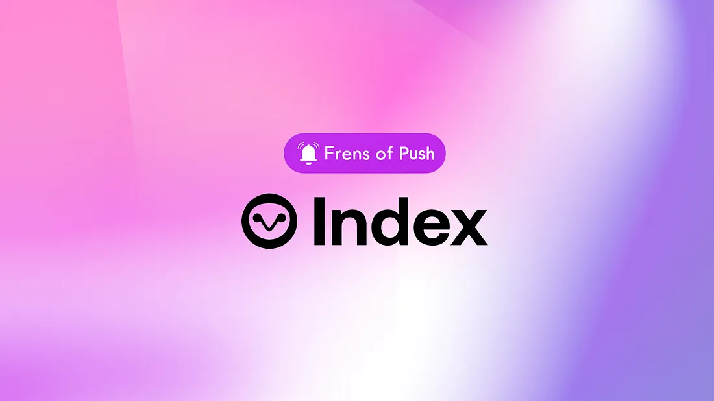

import { SubHeader } from '@site/src/components/SharedStylingV2';

<!--truncate-->

<SubHeader>Frens of Push #3</SubHeader> 

<i><a href="https://medium.com/push-protocol/cryptocurrency-jobs-stay-notified-of-the-best-web3-opportunities-out-there-342908de0797">“Frens of Push”</a> is our weekly content series to spotlight outstanding projects that are building with Push. If you want to be featured, reach out to us and you could be our next Fren in the series.</i>  

<a href="https://indexcoop.com/"><b>Index Coop</b></a>, the leading on-chain index products provider, has integrated Push to enable a seamless communication channel with its community.

The adoption of DeFi has come a long way in the past few years and led to an influx of people who want uninterrupted access to digital assets. Index Coop is working to improve access to these digital assets via index products that democratize the way web3 users access complex crypto strategies. Index Coop works towards this mission by operating as a cooperative community of crypto natives, finance professionals, engineers, and other expert methodologists.

By collaborating with Push, Index Coop has created a direct communication channel to notify their community about important product announcements and updates.

In the third episode of “Frens of Push”, we sat down with [Brad Morris](https://twitter.com/bradwmorris) to talk about the possibilities created by on-chain communication with token holders.

<b>.  .  .</b>

## Tell us about Indexcoop — what problem does Index Coop solve?
<b>Brad:</b> Accessing DeFi is difficult. At the Coop, we tokenize sophisticated DeFi strategies while maintaining decentralization and empowering individuals to enter the world of DeFi. Traditionally, we might be recognized as a provider of Index products, enabling diversification across multiple crypto assets.

<a href="https://indexcoop.com/blog/index-coop-the-next-chapter?source=post_page-----a72fc7be86e8--------------------------------"><b>Meet Our Upcoming Products</b></a>

## How do people use Index Coop?
<b>Brad:</b> Pending compliance with all local jurisdictions and regulations, people can access Index Coop products directly through popular dApps and exchanges like Uniswap and Sushi. We’re also listed through Coinbase and the amazing Argent wallet.

Or directly through our own website app: https://app.indexcoop.com/

If anyone has more questions, they can jump into our [Discord](https://discord.com/invite/indexcoop) and meet with our community and community managers.

## What’s your future plan for Index Coop?
<b>Brad:</b> Directly from: https://indexcoop.com/blog/index-coop-the-next-chapter

Since launching over two years ago, the Index Coop has established itself as the leader in on-chain structured products. With over 80% of the market share of on-chain index products, we’ve experienced first-hand the many trends and cycles of DeFi. <b>During this period, our thesis has remained the same: on-chain products are the future and it’s up to us to make sure it includes everyone</b>. To that end, we’ve remained committed to building products that are accessible, secure, and simple to use.

As this industry has grown, the definitions of “simple” and “secure” have become ambiguous. Is DeFi simple when it takes ten steps to complete a transaction or must be monitored daily? Is it secure when promised yields disappear or when pegs falter? The next wave of DeFi will not look like the days of old. Traditional retail buyers and institutional capital will not behave like the degens of the past. Crypto must be held to a higher standard in order to onboard the next wave of users. Veteran DeFi users and traditional buyers alike expect performance. So, we must build for both performances and for sustainability.

The question then becomes: how does our industry deliver on the advancements and efficiencies of the on-chain world while still being simple and safe enough for the average user? Index Coop bridges this gap, allowing anyone to access sophisticated strategies. Our upcoming roadmap of products and enhancements captures the best advantages of DeFi while being secure and easy to use.

## How is Index Coop using Push’s web3 communication layer?
<b>Brad:</b> We plan to leverage the Push communication layer to provide a more seamless communication channel with our community and customer base.

First, by providing high-level insights, notifications, and updates to our customers on the community on major product and new product updates.

We then intend to evolve our use of Push to provide more nuanced communication to our audience around specific product updates, rebalancing, etc.

## How would you describe your experience using Push? What benefits have you seen?
<b>Brad:</b> We’re only new to the Push ecosystem! But we’ve already received positive feedback from customers who are grateful for the exploration of additional on-chain communication channels.

## What cool use cases do you see Push being used for in the future?
<b>Brad:</b> Endless! <b>We see these on-chain, wallet-integrated communication channels as playing a huge role in the future of DeFi</b>. For an organization like ours, aggressively product-focused and always looking for ways to innovate and create infrastructure to improve DeFi access for a wider audience, on-chain communication and notifications will be extremely important and helpful.

## What haven’t we asked you about that you wish we had?
<b>Brad:</b> I’m sure we’ll catch up again soon with some additional updates!

We want to thank [Brad](https://twitter.com/bradwmorris) for speaking with us! We look forward to building with Index and cultivating better communication with their awesome coop. Stay tuned for more exciting developments from both Push and Index Coop!

<b>.  .  .</b>

### About Index Coop
Index Coop is a collective that provides broad exposure to DeFi, making the purchase of digital assets simpler and cost-effective. The coop is aimed at creating structured products that provide access to sophisticated crypto strategies. Their flagship product, the DeFi Pulse Index, being one such example.

Check out more about Index Coop: [Website](https://indexcoop.com/) and [Twitter](https://indexcoop.com/).

### About Push Protocol

Push is the communication protocol of web3. Push protocol enables cross-chain notifications and messaging for dapps, wallets, and services tied to wallet addresses in an open, gasless, and platform-agnostic fashion. The open communication layer allows any crypto wallet /frontend to tap into the network and get the communication across.

To keep up-to-date with Push Protocol: [Website](https://push.org/), [Twitter](https://twitter.com/pushprotocol), [Telegram](https://t.me/epnsproject), [Discord](https://discord.gg/pushprotocol), [YouTube](https://www.youtube.com/c/EthereumPushNotificationService), and [Linktree](https://linktr.ee/pushprotocol).
