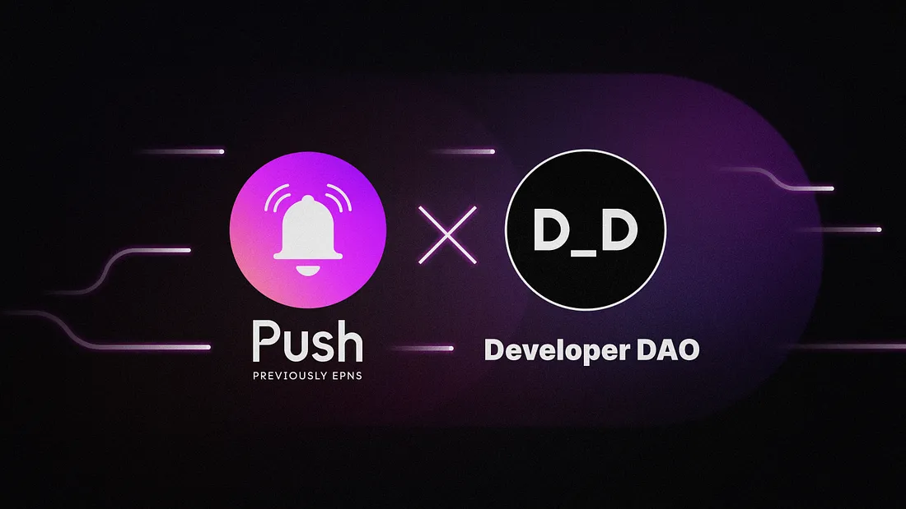

---

slug: developer-dao-x-push-enhancing-ux-through-web3-communication-tools
title: Developer DAO x Push — Enhancing UX Through Web3 Communication Tools
authors: [push]
tags: [ Web3, Push Notification, Giveaway, Workshop, Developer]

---

<!--truncate-->

TLDR;

1. Push will begin enabling notifications for Developer DAO members to be notified of new proposals, voting end periods, and relevant announcements and content.
2. The [official push notifications channel](https://app.push.org/) for D_D will go live on Dec 13th.
3. Push will be conducting [a workshop](https://lu.ma/d-d-push-protocol-workshop) on Dec 14th at 5:00 PM UTC to showcase how you can integrate notifications and chat functionality into your dapps
4. There will be a surprise for all D_D members (if you join the workshop, you’ll be the first to know :)

<b>.  .  .</b>

If you’re a Web3 enthusiast who envisions an internet that is free and collectively owned, <a href="https://www.developerdao.com/"><b>Developer DAO</b></a> is the community for you. With over 5000 members from around the world, D_D continues to accelerate its mission of empowering a new wave of Web3 builders through constant innovations and educational efforts.

We are excited to have Developer DAO as a part of the Push ecosystem and look forward to enhancing the community experience via decentralized communication. This is only the start of an amazing journey with D_D!

## Developer DAO X Push: What to expect
Facilitating a culture of “learning and growing together” is a cornerstone mission of D_D. With this in mind, the importance of streamlined community participation and governance is critical to the community’s success. This is where Push comes in.

Push Protocol addresses this user experience problem by providing a communication layer for wallets and dapps. Push allows any dapp, smart contract, backend, protocol, or, in principle, any distributed technology to send communication directly to user wallet addresses in an open and decentralized way. Being an open and permissionless protocol, anyone can create dedicated channels to distribute information directly to user wallets without needing to rely on centralized service providers.

### Push x D_D channel soon!
By creating a communication channel for D_D members, Push aims to encourage maximum participation by DAO members. Push will notify:

- When there is a new proposal on [Snapshot](https://snapshot.org/#/devdao.eth)
- 24 hrs before the proposal voting ends
- When there is a new Proposal topic created on the [D_D forum](https://forum.developerdao.com/c/proposals/5)
- When a Substack newsletter or blog post is live

D_D official channel will be live on [Push](https://app.push.org/) on Dec 13th. Members can simply opt-in and stay up-to-date with all the latest updates from Developer DAO.

Keep an eye out for all the surprises and exclusive events we have for the D_D community.

### Push workshop: Power your Web3 app with Push
We’re pulling together an awesome <b>1-hour workshop</b> for the D_D community with our founder [Harsh](https://twitter.com/harshrajat) and core dev [Fabio](https://twitter.com/learn4life6).

Whether you are just entering the space, an experienced developer, or an indie hacker, we will help you understand our tech and learn how to use Push Protocol to power your web3 app through a hands-on workshop. This includes sending out decentralized notifications and integrating chat functionality for the Web3 applications you’re building.

📅 Date: December 14th, 2022

🕐 Time: 5:00 PM UTC = 10:30 PM IST

🎫 Register for the event here.

📍 Location: [Developer DAO Discord](https://discord.com/invite/qzbGkGNR?event=1044770824135114823)

[Doveloper DAO x Push Protocol](https://twitter.com/developer_dao/status/1600576379145306114?ref_src=twsrc%5Etfw%7Ctwcamp%5Etweetembed%7Ctwterm%5E1600576379145306114%7Ctwgr%5Eb13769eb1bdf2a6c38faf9ec5ada9c60b0d4dd72%7Ctwcon%5Es1_&ref_url=https%3A%2F%2Fcdn.embedly.com%2Fwidgets%2Fmedia.html%3Ftype%3Dtext2Fhtmlkey%3Da19fcc184b9711e1b4764040d3dc5c07schema%3Dtwitterurl%3Dhttps3A%2F%2Ftwitter.com%2Fdeveloper_dao%2Fstatus%2F1600576379145306114image%3Dhttps3A%2F%2Fi.embed.ly%2F1%2Fimage3Furl3Dhttps253A252F252Fabs.twimg.com252Ferrors252Flogo46x38.png26key3Da19fcc184b9711e1b4764040d3dc5c07)

### Surprise giveaway 👀
Push will be offering an exclusive surprise to all D_D members— details of the surprise will be released via the [D_D Discord](https://discord.com/invite/qzbGkGNR?event=1044770824135114823) 1 day before the workshop, so stay tuned.

Be sure to join the workshop and drop any questions you might have in the #pushprotocol channel in the D_D Discord (under “technical discussion”).

See you at the workshop!

### About Push Protocol

Push is the communication protocol of web3. Push protocol enables cross-chain notifications and messaging for dapps, wallets, and services tied to wallet addresses in an open, gasless, and platform-agnostic fashion. The open communication layer allows any crypto wallet /frontend to tap into the network and get the communication across.

To keep up-to-date with Push Protocol: [Website](https://push.org/), [Twitter](https://twitter.com/pushprotocol), [Telegram](https://t.me/epnsproject), [Discord](https://discord.gg/pushprotocol), [YouTube](https://www.youtube.com/c/EthereumPushNotificationService), and [Linktree](https://linktr.ee/pushprotocol).
