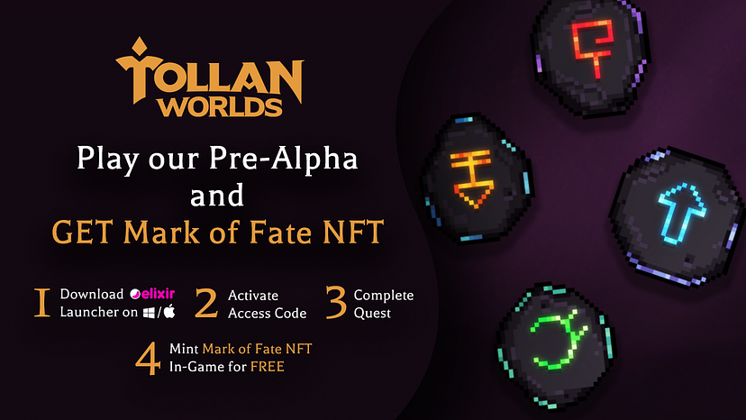

import { ImageText, SubHeader } from '@site/src/components/SharedStylingV2';

<!--truncate-->

<SubHeader>Frens of Push #4 a little holiday giveaway brought to you by the Tollan Worlds team</SubHeader>

<i><a href="https://medium.com/push-protocol/tagged/frensofpush">“Frens of Push”</a> is our weekly content series to spotlight outstanding projects that are building with Push. If you want to be featured, reach out to us and you could be our next Fren in the series.</i>

[Tollan Worlds](https://medium.com/u/5afd7b03aba2?source=post_page-----ba3f9697523--------------------------------), a web3 gaming platform, has joined forces with Push to power communication on their platform.

Blockchain gaming is leading the growth of the gaming industry. To enable more transparency in the gaming ecosystem, Tollan Worlds is bringing decentralized communication to its platform.

By integrating Push, Tollan Worlds is able to regularly announce development updates, new partnerships, community events, and giveaways to the gamer community directly.

In the fourth segment of ‘Frens of Push,’ we are in conversation with <a href="https://twitter.com/im_mkx"><b>Michael Kuvshynov</b></a>, co-founder and CEO of Tollan Worlds, to talk about how Push is enabling communication on the gaming platform. For all the gamers — if you’d like to play Tollan Worlds and here’s the good news, the Tollan Worlds team is giving away <b>exclusive 30 access codes</b>. How to get the code? Keep reading!

## Hi Michael, what’s your story? How did you become involved in building in the blockchain space? What are you working on now?
<b>Michael:</b> My blockchain journey started a few years ago. Coming from computer science and game design backgrounds as well as creating various content as a hobby, I saw the tremendous potential Web3 can bring to each of these directions. Kernel from Gitcoin has been my gateway into the decentralized world and taught me a lot about the values of the new web, most importantly about the sense of community and the power of decentralization on an ethical level. I believe whoever wants to start building in Web3 should stop asking what Web3 could do for them and instead ask what they could do for Web3.  

<blockquote>Gaming was always my passion, and I’ve seen it as one of the biggest use cases for blockchain and especially NFT technologies. And here we are, building a pixel art MMO we call Tollan Worlds.</blockquote>

## Tell us about Tollan Worlds — what’s it about, and what problem does Tollan Words solve?
<b>Michael:</b> Tollan Worlds is an online role-playing game where you play as an escapee from an authoritarian city with an imperial mentality called <i>The Mainland</i>. Finding your way through endless Darklands and finally stumbling upon a hidden developing society in the middle of nowhere. That’s where your journey finally begins.

Players will shape their own path through the main story as well as go to dungeons with their friends and join forces with many other players for massive boss fights. They can explore the vast world where each new place brings new creatures, stories, and unforgettable experiences while being determined to the main objective of defending their new home from the ubiquitous forces of The Mainland.

Our main goal is not only to create great gameplay with a deep story but also to create a fair and transparent monetization model while also putting players in charge of their game world, and blockchain allows us to achieve that.

Tollan Worlds “solves the problem” of both traditional and blockchain gaming worlds. Transparent monetization allows us to be closer to our player base and develop trust and long-term retention of our community. Focusing on the gameplay and story, and escaping Ponzi play2earn schemes allows us to create a game that doesn’t depend on market conditions and where money does not interfere with the core gameplay.

<iframe width="567" height="319" src="https://www.youtube.com/embed/MOJ4hSdbiD0" title="Tollan Worlds: The First Adventure Teaser" frameborder="0" allow="accelerometer; autoplay; clipboard-write; encrypted-media; gyroscope; picture-in-picture; web-share" allowfullscreen></iframe>

## How do people play Tollan Worlds?
<b>Michael:</b> Our pre-alpha is currently live for a limited amount of users, with only 6,000 spots available. Everyone who plays it can mint our Mark of Fate NFT in-game for FREE.

1. Download Elixir Launcher: https://www.elixir.app/
2. Get an access code by participating in a giveaway on our [Twitter](https://twitter.com/TollanWorlds) or [Discord](https://twitter.com/TollanWorlds).
3. Activate Code on Elixir at: https://launcher.elixir.app/games/tollan-worlds
4. Get your Mark of Fate NFT after completion!

## What’s your future plan for Tollan?
<b>Michael:</b> We are planning our next demo for Spring 2023, which will be focused on cooperative PVE fighting! Marks of Fate NFTs that were mentioned earlier will have a use case during it!

## How is Tollan using Push’s web3 communication layer?
<b>Michael:</b> So far, Push has been a great tool for our community management. We regularly announced development updates, new partnerships, community events, and giveaways there. Now that we are planning a multiplayer experience, we are looking forward to integrating push even deeper into Tollan Worlds.

## How would you describe your experience using Push? What benefits have you seen?
<b>Michael:</b> Push was easy to use and a great way to communicate with our community in a decentralized and secure way. It is extremely easy to integrate and has so many benefits that are definitely worth the time.

## What cool use cases do you see Push being used for in the future?
<b>Michael: We believe Push has tremendous potential across a diverse array of applications, especially games.</b> Imagine having a secure and decentralized in-game chat or being able to receive in-game notifications about clan invitations or trade proposals to your wallet address.

## 🎁 Tollan Worlds Pre-alpha Codes Giveaway 🎁
From December 15th to December 20th, please follow three simple rules:

1. Follow [Tollan Worlds](https://twitter.com/TollanWorlds) and [Push](https://twitter.com/TollanWorlds) on Twitter
3. Like and retweet/share the Frens of Push post and tag 2 friends
3. Comment what’s your favorite part of playing MMOs

The Tollan Worlds team will randomly choose 30 lucky winners after December 20th!

We thank Michael for taking the time to speak with us. We’re excited to keep enhancing communication on Tollan Worlds and empower a new generation of gamers together.

<b>.  .  .</b>

### About Tollan Worlds
[Tollan Worlds](https://tollanworlds.com/) is a role-playing metaverse platform that aims at making the play-to-earn experience more accessible to the masses. Make friends, fight, build, and defend your home. Follow Tollan Worlds on [Twitter](https://twitter.com/TollanWorlds) and join [Discord](https://discord.com/invite/tollan).

### About Push Protocol

Push is the communication protocol of web3. Push protocol enables cross-chain notifications and messaging for dapps, wallets, and services tied to wallet addresses in an open, gasless, and platform-agnostic fashion. The open communication layer allows any crypto wallet /frontend to tap into the network and get the communication across.

To keep up-to-date with Push Protocol: [Website](https://push.org/), [Twitter](https://twitter.com/pushprotocol), [Telegram](https://t.me/epnsproject), [Discord](https://discord.gg/pushprotocol), [YouTube](https://www.youtube.com/c/EthereumPushNotificationService), and [Linktree](https://linktr.ee/pushprotocol).
