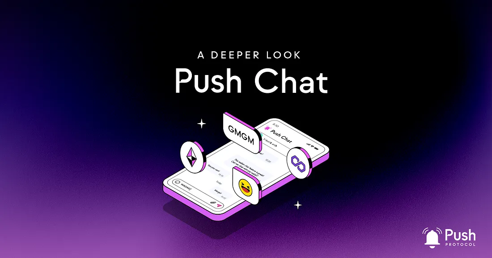
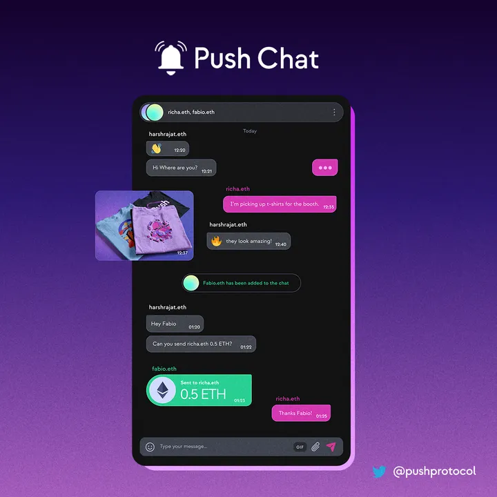

<!--truncate-->

Launched in early October, [Push Chat](https://app.push.org/#/chat) is providing secure and instant communication for all by connecting users and dapps across web3.

import { ImageText } from '@site/src/css/SharedStyling';

In this article, we deep dive into how Push Chat works and its use case.

Push Chat is still in alpha and we’re gradually rolling out early access to all of you. If you want to skip the line and become one of the first builders to try out Push Chat — keep reading 👀

## What Is Push Chat?

[Push Chat](https://app.push.org/#/chat) is a secure messaging protocol built by Push Protocol. Messages are encrypted, signed, and stored on IPFS and they are sent through Push Nodes.

<i>Note: The team is continuing to develop the Push Protocol including notification and chat for wallets regardless of any chain in web3 in a multichain, platform-agnostic, and gasless way. Push Chat is the next offering of the protocol after push notifications and is currently available on Ethereum and Polygon with other chain support to follow soon.</i>

## Why Push Chat now?

Push Chat and video were imagined by us in 2020 but we knew that before notifications become a reality, doing chat or video will just become a novelty as everything we do in our virtual lives starts out with a notification.

For example, you don’t chat on WhatsApp as much as you chat via notifications on WhatsApp, the same is the case with Facetime. Owing to this, Push created notifications for web3 first which paved the way for real-time communication mediums to become a possibility.

Push Protocol’s vision has remained to be the de-facto layer of communication for the entire web3 and Push Chat (with native push notification support) helps in wrapping another milestone to bring the UX of web3 on par with web2.

## How Push Chat works?

Push Chat uses IPFS, encryption, and pinning of the messages on Push Nodes to enable a seamless, no-message drop experience for the user. Each message (and notification) carries a verification proof which the front-end can use to determine that the message content and sender are actually the ones that sent these messages out. You can read about notification verification proofs and the various supported formats here:

[PIPs/definitions/Standard/PRC/Notification at main · ethereum-push-notification-service/PIPs](https://github.com/push-protocol/PIPs/tree/main/definitions/Standard/PRC/Notification?source=post_page-----90fdea8d9e8e--------------------------------)

## What are Push Nodes?

<i><b>Push Nodes</b></i> are a network of nodes, where each node can have a different role in the network that is responsible for validating and dispatching each notification and chat message between addresses.

Their main task is to validate that:

- the payload is following the corresponding payload standard,
- the sender can actually send the message, and signature validation,
- if the payload is valid, the Push Nodes will store the message on IPFS and then send a notification to the receiver of the message.
  <i>Note: Push Nodes are in alpha right now and are currently run by the push protocol team with an alpha version of these nodes scheduled to come out around Q1 / Q2 of 2023.</i>

## Who is currently running Push Nodes?

The Push team currently runs the Push Nodes for Push Chat. The team is working towards decentralizing the network every day by making progress in establishing the underlying primitives for the Push Protocol. This is only until the team fully bootstraps the Push Protocol and the protocol and Push Chat are production ready.

Once the network becomes fully decentralized, Push Nodes will be incentivized to maintain the network, be readily addressable, and provide message content through $PUSH tokens which are native tokens of the protocol.

<i>Read about Push Economics here:</i>  

[Push Token Economics](https://comms.push.org/docs/tokenomics/deepdive/$push/)

## How Does a User Send a Message Using Their Account Address?

A user of Push Chat has two sections: <i><b>Chats and Requests.</b></i>

Users sending a message to another address for the first time will be the first subject to the Request type until the receiving address accepts the message. Then, messages and notifications from that address will appear in the receiving addresses chats section. Eventually, users will be able to block addresses. Receiving addresses aren’t notified about messages in the Request box. This prevents users from receiving messages from any random address that sends them a message and general spam.

If a message is sent to an address that hasn’t been authenticated yet on the Push Protocol, those messages will be in plain text until the receiving address authenticates itself.

<ImageText>Push Chat: <a href="https://app.push.org/#/chat">https://app.push.org/#/chat</a></ImageText>

## Where are messages stored?

Push Nodes store all messages sent over the network. Any Push Node can expose locally stored messages to the network, which other Push Nodes can connect to and fetch. The nodes can then push these messages to a user’s public address. Each message is stored on IPFS along with its verification proof which allows the frontends to verify that the content of the message indeed originated from the sender and not from anyone else.

## Are messages safe, and is the network secure?

PGP (Pretty Good Privacy) is an encryption method that provides privacy and authentication for data communication. PGP encryption keys are generated for every address on the network. Learn more about P2P encryption here.

The PGP public key is used to encrypt the content sent using asymmetric encryption. This ensures that the encrypted message payload can only be decrypted by the receiver and no other third party can decrypt or see the content of the message.

Note: The encryption method used here is future-proof, as other methods can encrypt the keys and adapt to newer cryptography.

## Does this apply to notifications? How do notifications fit into all this?

Chat while an integral part of any application works best when notifications are integrated into it natively. Most of the time, whenever we are chatting either on Discord, Telegram, WhatsApp, or anywhere else, we usually don’t have the application open. Instead, we reply to a message and then go on doing other activities until the other person replies which we receive as a notification.

Push Chat uses this exact web2 UX to ensure that the web3 user finally gets the same experience as that of a web2 user by utilizing the native push notifications capabilities of Push Protocol to send a notification out to the wallet address if the wallet address has approved the request of the sender wallet.

## Push Working Towards Decentralization

Applications need to protect users and their data and remove censorship. The Push team is privileged to tackle a fundamental problem in the new web (such as the poor user experience and a subliminal communication layer).

To achieve decentralization, the Push team has broken that into two phases, one is content can’t be changed and the other one is content can’t be censored.

### 1) Content can’t be changed

With verification proof, the immutability of the content is always ensured (1), read more here:

[PIPs/definitions/Standard/PRC/Notification at main · ethereum-push-notification-service/PIPs](https://github.com/push-protocol/PIPs/tree/main/definitions/Standard/PRC/Notification?source=post_page-----90fdea8d9e8e--------------------------------)

### 2) Content can’t be censored

This is achieved by developing Push Nodes that enables anyone to run the node in a permissionless way with PoS to incentivize and penalize behavior. Alpha Push Nodes are scheduled to happen somewhere between Q1 / Q2 of 2023.

## Push-ing Real Solutions for Web3

Yes, the user experience in web3 needs much work, and to be frank, it is likely years out from where it should be. That is why the Push team is focusing on a protocol that tackles the problem from the ground up, a grassroots solution, and a primary reason why web3 is the next iteration of the web — improving how we interact.

When a sufficient number of dapps and services in web3 implement Push chat, it enables a new wave of use cases and scales coordination because now messaging and notifications are web-wide and not in isolation to dapps and their users.

Dapps can use event-driven computation to communicate off-chain or on-chain with one another and enable fully-scaled coordination. Dapps also don’t have to worry about maintaining the underlying infrastructure to push messages which takes the load off developers, and the network guarantees message integrity.

### We mean it — let’s scale communication

We previously described how you could use Push Protocol for various use cases in web3, such as in [governance](https://medium.com/push-protocol/an-introduction-to-push-notification-part-2-2-governance-use-cases-1ea1e0a58ce1). While Push allows for these great capabilities, the truth is that many web3 governance systems lack participation. Many DAOs depend on a few contributors and have a central source of truth, and there is still a disconnect between DeFi and the user. User coordination generates high-value sources of truth. We can see this with the effectiveness of crowdfunding, the pooling of knowledge, funds, and resources, novel voting methods, petitions, and even zero-knowledge primitives. An easily adaptable communication stack and an ambitious outlook are a step in the right direction.

Imagine a web-wide poll about a major topic that anyone around the world can participate in. The poll is guaranteed to be censorship-resistant and verifiable, all while properly incentivizing those who participated and curated the poll with their resources. This scratches the surface of the coordination capabilities of a web3-native messaging protocol.

### Push your dapp

Your application and the users of web3 deserve robust communication. Push Chat can help. Here is a summary of its key features:

- <b>Push Chat is permissionless:</b> the production-ready version will allow any address on any platform to use their account (address) to chat with any other account across web3. Users aren’t required to sign up anywhere.
- <b>Push Chat is forward-compatible:</b> Push Chat can adapt to any changes made to existing platforms or new ones that arise, as the messaging functionality will not rely on the underlying platform the messages are sent and received from.
- <b>Push Chat is user-friendly:</b> Push Chat is a friendly and familiar-facing user experience that current users appreciate.
- <b>Push Chat is developer-friendly:</b> Using the Push chat SDK, developers can add a messaging layer to their application or service. The message type is JSON, making it easy for developers to consume and interpret. Developers can integrate push chat into the development workflow and improve their CI/CD processes. Test and deployment results can be pushed as messages to user wallets.

<b>.  .  .</b>

Pssssssst 🤫

Thanks for making it this far.

If you’re interested in exploring how Push Chat can boost user engagement and benefit your project, please:

- Share this article
- Join our Discord [#push-chat-alpha channel](https://discord.gg/pushprotocol), and tell us what you’re building, we’ve got devs who can help give consultation and we’ll be sharing exclusive Push Chat access to Discord members soon!
- To get started building right away, head over to the [Push Chat developer docs](https://comms.push.org/docs/chat).

See you soon on Push Chat!
