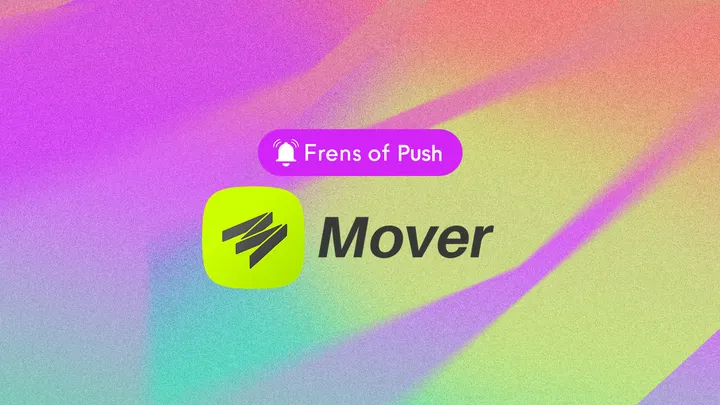

import { SubHeader } from '@site/src/components/SharedStylingV2';

<!--truncate-->

<SubHeader>Frens of Push #5</SubHeader> 

<i><a href="https://medium.com/push-protocol/tagged/frensofpush">“Frens of Push”</a> is our weekly content series to spotlight outstanding projects that are building with Push. If you want to be featured, reach out to us and you could be our next Fren in the series.</i>  

<a href="https://viamover.com/"><b>Mover</b></a> is a web3 primitives platform. Mover aims to create THE web3 card for all crypto natives and offers a suite of services, including a yield aggregator, a token swap aggregator, Smart Treasury, and a crypto debit card. Mover furthers its vision of creating a truly global decentralized ecosystem by partnering up with Push and creating a seamless user experience. Mover is able to notify users of on-chain activity in their vaults — powered by Push, and these notifications help users to get real-time updates on when they earn yields on their savings.  

In the fifth episode of “Frens of Push,” we are in conversation with <a href="https://twitter.com/niarbnotna"><b>Anton Mozgovoy</b></a>, CEO and Co-Founder of Mover, to talk about how Push is fostering decentralized communication on the platform.

<b>.  .  .</b>

## Hi Anton, how did you get into the blockchain space? What are you working on now?
<b>Anton:</b> I’ve been in the space since 2016, and I think that everyone would agree that there are human years, and there are crypto years. Down the rabbit hole, time feels different. I love this space, and I live it. What do I do here? I’m a builder. I love experimenting, I love building the tech. My passion is building simple products that solve complex problems. Mover is just that.

## Tell us about Mover — what’s it about, and what problem do you guys solve?
<b>Anton:</b> <a href="https://viamover.com/">Mover</a> is a web3 primitives platform. We created the first crypto debit card that supports web3 primitives. What’s that? Well, Push Protocol is a primitive. It is a communication layer primitive. Lending, savings, options, derivatives, NFTs — all of them are primitives. So in other words, <b>Mover allows you to use your favorite crypto network or protocol in your day-to-day finance</b>.

## What is Mover’s plan for 2023?
<b>Anton:</b> A new card, more networks, more primitives, and instant cash out! That is to name a few upcoming things.

<blockquote><i>Our goal is very simple, we want to offer one debit card for all web3. One card for all crypto natives: those who contribute to a DAO, those who trade on DEXs, those who trade decentralized options, those who collect NFTs, those who mint NFTs, those who create NFTs, and many more. We are here to create THE web3 card.</i></blockquote>

## How is Mover using Push’s web3 communication layer?
<b>Anton:</b> Currently, there are over 786 notifications sent to subscribers on our vault contracts. The notifications help users get real-time updates on when they receive their yield.

You can opt-in to the Mover channel here:

[Push App (Previously EPNS)](https://app.push.org/?source=post_page-----d1c05c90f736--------------------------------#/channels?channel=0xb754601d2C8C1389E6633b1449B84CcE57788566)

## How would you describe your experience using Push? What benefits have you seen?
<b>Anton:</b> We have been a customer and user of Push since the very beginning! Our mission has always been to push the boundaries of decentralized and permissionless system, while making everyday finance easier. <b>Push Protocol is an important part of making our mission easier.</b> Our experience has always been smooth. Only in web3 you can meet up and say “how about this?” and the other protocol is “sounds good, let’s push it”, and later that day it’s already running on-chain.  

Mover is built by engineers and active web3 users. So our first and immediate benefit was the fact that our users can be notified of on-chain activity in the vaults, bringing us closer to the ease of web2 services.

## What cool use cases do you see Push being used for in the future?
<b>Anton:</b> Web3 native customer support, debit card top-up alerts, and more!

What haven’t we asked you about that you wish we had?
Anton: Our question to the Push team: what is that one missing piece in personal finance that you wish existed today? How can Mover and Push make web3 a native place even offline?

Great questions, Anoton! Let’s talk about it on your pod in Jan :) And thank you for taking the time to speak with us. We look forward to building communication infrastructure on Mover and powering a truly global DeFi adoption.

<b>.  .  .</b>

### About Mover
Mover is a DeFi savings account that allows users to trade, store, send, and earn interest on their crypto in a simple wallet with a debit card.

To learn more about Mover: [Website](https://viamover.com/), [Twitter](https://twitter.com/viaMover), [Telegram](https://t.me/viaMover), [GitHub](https://github.com/viamover).

### About Push Protocol

Push is the communication protocol of web3. Push protocol enables cross-chain notifications and messaging for dapps, wallets, and services tied to wallet addresses in an open, gasless, and platform-agnostic fashion. The open communication layer allows any crypto wallet /frontend to tap into the network and get the communication across.

To keep up-to-date with Push Protocol: [Website](https://push.org/), [Twitter](https://twitter.com/pushprotocol), [Telegram](https://t.me/epnsproject), [Discord](https://discord.gg/pushprotocol), [YouTube](https://www.youtube.com/c/EthereumPushNotificationService), and [Linktree](https://linktr.ee/pushprotocol).