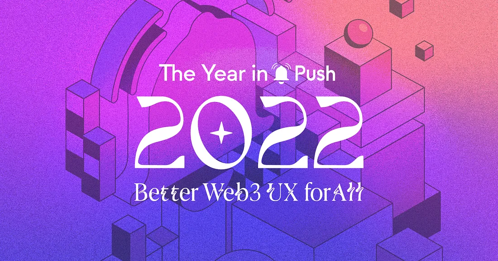
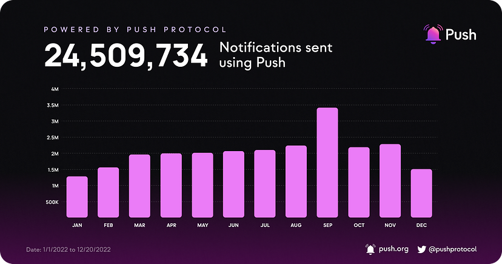
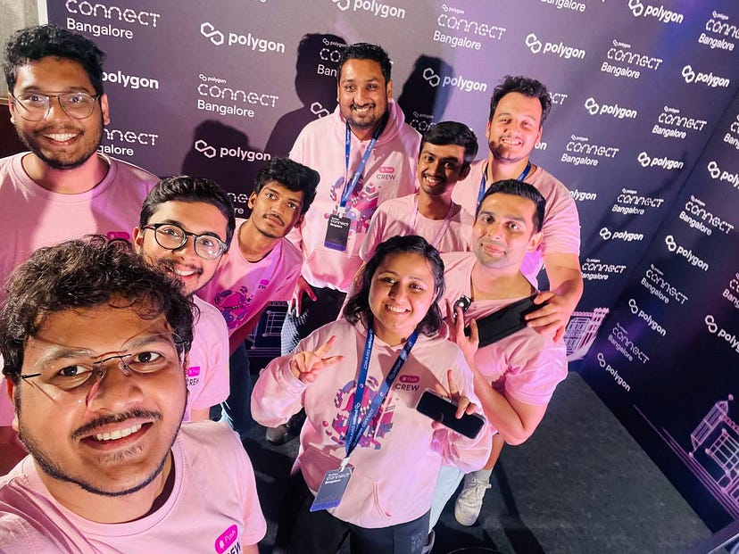
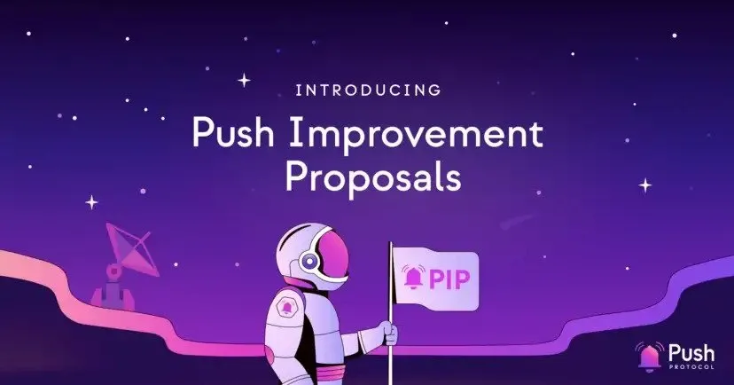
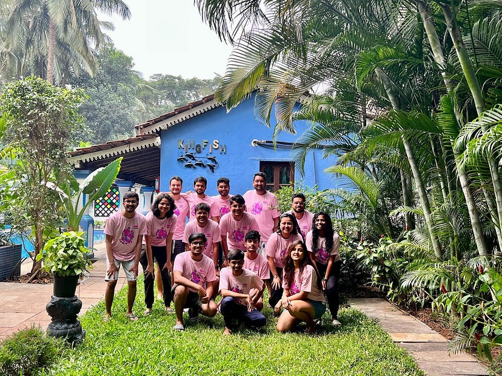

import { ImageText, VideoContainer } from '@site/src/css/SharedStyling';

<!--truncate-->

2022 was a marvelous year for Push thanks to our fantastic team and growing community of talented developers.

To everyone who has helped support the Push project — devs, community members, partners, co-sponsors, we thank you!

This year alone, Push achieved several major milestones including rebranding from EPNS to Push, raising our Series A, launching Push on Ethereum mainnet, pushing web3 communication beyond Ethereum, new product releases, several news features, and of course, collaborations with some of the best web3 projects out there.

With that, here’s a glimpse at everything we got up to in 2022.

## Rebrand complete, LIVE on Ethereum & Polygon, and more…🚀

This year, we’ve made some major strides in realizing our mission of bringing decentralized communication to web3.

To start with, we evolved from EPNS (Ethereum Push Notification Service) to [Push](https://x.com/PushChain/status/1574771582790406144). As our ambitions grew beyond just notifications, we felt we needed a brand refresh that would better accommodate our vision of becoming web3’s most widely used communication protocol.

And so far, people seem to love it.

<VideoContainer>
<iframe width="100%" height="100%" style={{ borderRadius: "32px", aspectRatio: '56.25%' }} src="https://www.youtube.com/embed/ZiC-nbg9Iuk" title="EPNS Rebrands into Push Protocol — the Communication Protocol for Web3" frameborder="0" allow="accelerometer; autoplay; clipboard-write; encrypted-media; gyroscope; picture-in-picture; web-share" allowfullscreen></iframe>
</VideoContainer>

A fantastic rebrand however needs similarly fantastic project developments behind it. This started included:

- Push going live on [Ethereum](https://medium.com/push-protocol/the-epns-mainnet-is-here-470faec0c01) mainnet in January.
- Completed our Series A round and honored to have some amazing [investors](https://x.com/PushChain/status/1514632659514798081) help us realize our vision.
- Many exciting product developments followed including the launch of the [SNS](https://medium.com/push-protocol/introducing-sns-for-push-delivery-nodes-quickest-way-to-bootstrap-your-wallet-app-or-any-c88017595e09) module for Push Delivery Nodes and the release of [SDK monorepo](https://medium.com/push-protocol/here-comes-the-all-new-epns-sdk-monorepo-framework-8447b486a801) structure. Both these developments were aimed at creating a seamless experience for developers.
- We launched on [Polygon](https://blockworks.co/news/polygon-onboards-new-web3-native-communication-network), adding it to our expanding list of supported chains.
- Our most awaited product, [Push Chat](https://medium.com/push-protocol/were-still-pushing-a-deeper-look-into-push-chat-90fdea8d9e8e) went live in alpha and with it, we took a huge step in facilitating wallet-to-wallet communication in web3.

Since going live with all these features, we’ve seen increased adoption and utility of the Push protocol.

## Push by the Numbers📈

2022 saw more notifications, live channels, and channel subscribers than we’ve ever had before.

As we’ve continued to refine, improve, and develop our communication tools, more protocols are harnessing the power of notifications than ever before — and we’re happy to be leading the way. In fact, in Q1 and Q3 Push saw more than 20%+ QoQ growth.

We went [live on Polygon in September](https://medium.com/push-protocol/push-protocol-launches-on-polygon-enabling-communication-for-thousands-of-dapps-1c49d7c996f8) and [live on Lens in October](https://medium.com/push-protocol/push-and-lens-powering-ux-with-notifications-and-aaves-lens-85828638e691), giving Push a huge boost in the way of reach and utility.

Here’s a look at the numbers:

<ImageText>Push Growth Overview</ImageText>

<ImageText>Number of Push Notifications — Powered by </ImageText>

## The Push Fam Continues to Expand 🌱

2022 was a fantastic year for making new frens and building new partnerships. Some of the most renowned projects in the web3 space joined forces with us to enable decentralized communication on their dApps.

We are thrilled to be working with some of the most ambitious projects in web3 and enabling native web3 communication for their protocols.

Here’s a look at our ecosystem today:

<ImageText>Frens of Push 2022</ImageText>

## IRL Events🛠️

2022 kept us busy with a long list of conferences and events. We were honored to be able to attend some of the most prestigious conferences and hackathons this year and get to meet a lot of our community in person.

We attended ETHDenver, Devconnect, ETHAmsterdam, ETHNewYork, EthCC, Unfold, Devcon Bogotá, ETHSF, and ETHIndia, and co-hosted [Zero-to-Dapp conference](https://www.youtube.com/playlist?list=PLyWTqFLqKt9ZJOmEsEbkrn1nPCy69INhl) along with The Graph, Arbitrum, and Router.

Needless to say, it was a busy year with tons of new projects building with Push and bounties being won.

<ImageText>Developer Adoption of Push in 2022</ImageText>

Thank you to everyone who invited us to teach, discuss, and demo our ideas, as well as everyone who showed up to the events to meet the Push team and build using Push.

Here are a few sights from hackathons this year:

## Push in the News📰

With all the progress Push had this year, publications took note. A host of our launches and collaborations were featured in a variety of prominent publications.

Some of our favorite headlines were:

- CoinDesk: [EPNS Goes Live in Bid to Bring Notifications to Web 3](https://www.coindesk.com/tech/2022/01/11/epns-goes-live-in-bid-to-bring-notifications-to-web-3/)
- CoinDesk: [Ethereum Push Notification Service Raises $10M at $131M Valuation](https://www.coindesk.com/business/2022/04/14/ethereum-push-notification-service-raises-10m-at-131m-valuation/)
- Benzinga: [Ethereum’s Communication Layer EPNS: Interview With Co-Founder Harsh Rajat At EthCC 5 Paris](https://www.benzinga.com/markets/cryptocurrency/22/07/28227776/ethereums-communication-layer-epns-interview-with-co-founder-harsh-rajat-at-ethcc-5-paris)
- Blockworks: [Polygon Onboards New Web3-native Communication Network](https://blockworks.co/news/polygon-onboards-new-web3-native-communication-network)

## Our Community, Our Strength🤝

Community is everything for Push, and 2022 would not have been such a successful year without your help. To all the devs who built using Push, all $PUSH token holders, and users who subscribe to channels — we thank you for being a part of our community!

To foster our community’s growth, we started the [Push Grants Program](https://medium.com/push-protocol/push-grants-program-its-here-f2bfba29388f) earlier this year with the goal of funding builders in the web3 space. With feedback and learnings from the first iteration of the program, [PGP v2.0](https://x.com/PushChain/status/1604867953190739973) went live later this year and we’ve seen tons of projects begin to apply.

Beyond just community growth, we also wanted to better involve the community in the improvement of Push. To streamline feature requests, we launched [Push Improvement Proposal](https://medium.com/push-protocol/introducing-push-improvement-proposal-pip-702c44fc24f6) to create an open forum to discuss proposals for standardized, community-driven improvements in the Push ecosystem.

Push now has new initiatives for fostering Push notifications and chat integration, community-led improvements to the protocol, and community growth.

We have no doubt setting these initiatives up in 2022 is going to lead to a massive year for us in 2023!

## You’re the Real Rockstars👨‍🎤

We launched the second version of Push Rockstars this year: Rockstars Of Push Vol. 2 and had 24 winners to date, 100+ submissions, and over 20M+ of $PUSH token voting!

From educational threads to YouTube demos, the Push community never failed to surprise us with fantastic Push-related content.

Thanks to all the Rockstars of Push for your love and ongoing support.

## What’s Next for Us?🚀

As always, we continue to build.

Everything we’ve done this year has been a stepping stone to prepare us for a massive 2023. We’ll be looking to set new records for Push integrations, utility, and partnerships, all while bringing exciting new developments that best serve the communication needs of web3.

Happy Holidays from the Push team, and we look forward to building with you in 2023.

