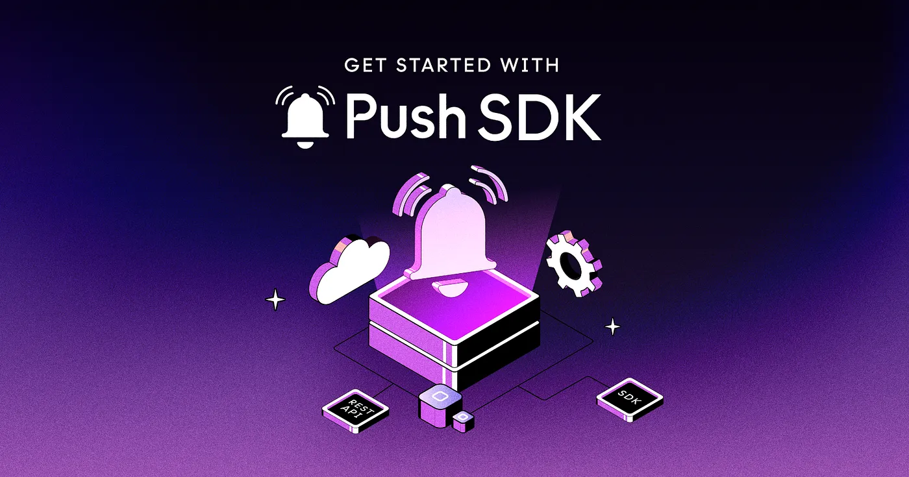

<!--truncate-->

The [PUSH-SDK](https://github.com/push-protocol/push-sdk), is a growing JavaScript-based SDK that allows developers to add push notification functionality to their dapps. Using the SDK, developers can:

- Build PUSH features into their dapps
- Get access to Push Nodes APIs
- Render Push Notifications UI

It is written in Typescript and supports React, React Native, Plain JS, and Node JS-based platforms. (We are adding support for more!) It is also built on top of standard Web3 packages like <b>ethers, @web3-react</b>.

If you’re looking for our full documentation on [Push-SDK REST API, you can find that here](https://comms.push.org/docs).

But for now, let’s walk you through the main features of the Push-SDK REST API and how to use them in your code.

## Fetching user notifications

You can use the <b>getFeeds</b> method to fetch a user's notifications. This method takes an options object as an argument, which allows you to specify the following parameters:

- <b>user</b> (mandatory, string): The user’s address in CAIP format.
- <b>page</b> (optional, number): The page index of the results. Default is 1.
- <b>limit</b> (optional, number): The number of items per page. Default is 10.
- <b>spam</b> (optional, boolean): Whether to fetch spam notifications. Default is false.
- <b>env</b> (optional, string): The API environment to use. Possible values are ‘prod’ and ‘staging’. Default is ‘prod’.
- <b>raw</b> (optional, boolean): Whether to return the raw, unformatted API response. Default is <b>false</b>.

Here’s an example of how you might use the <b>getFeeds</b> method in your code:

```js
const notifications = await PushAPI.user.getFeeds({
  user: 'eip155:11155111:0xD8634C39BBFd4033c0d3289C4515275102423681',
  env: 'staging',
});
```

In this example, we define a user address using the CAIP format. CAIP, or Chain Agnostic Improvement Proposal, is a way to describe standards for blockchain projects that are not specific to a single chain. It was developed by the Ethereum Improvement Proposal (EIP) process and is used to identify and encode information about Ethereum addresses, contract addresses, and other crypto-assets.

It is important to note that CAIP is not a standardized way of identifying and encoding information about crypto-assets; it is under development by the Ethereum community and is not yet widely adopted in the ecosystem.

CAIP addresses are composed of three parts:

- <b>The namespace:</b> This is a string designed to uniquely identify a blockchain ecosystem or set of ecosystems as a namespace.
- <b>The network ID:</b> This is an integer that identifies the Ethereum network the asset belongs to. For example, 1 is the main network, 3 is the Ropsten test network, 5 is the Goerli test network, and 11155111 is Sepolia test network.
- <b>The address:</b> This is the actual address of the asset, encoded as a hexadecimal string.

For instance:

```js
eip155:11155111:0xD8634C39BBFd4033c0d3289C4515275102423681
```

In this example, the namespace is eip155 which identifies EVM chains, the network ID is 5 (Goerli test network) and the address is <b>0xD8634C39BBFd4033c0d3289C4515275102423681</b>.

CAIP is designed to be flexible and extensible, allowing for the inclusion of additional information as needed. It is used by the Push Protocol and other Ethereum-based projects as a standardized way of identifying and encoding information about crypto-assets, and distinguishing information from different chains.

Continuing with <b>getFeeds</b>, to fetch spam notifications, set the <b>spam</b> parameter to <b>true</b>:

```js
const spams = await PushAPI.user.getFeeds({
  user: 'eip155:11155111:0xD8634C39BBFd4033c0d3289C4515275102423681',
  spam: true,
  env: 'staging',
});
```

The <b>getFeeds</b> method returns a list of notifications for the specified user.

## Fetching user subscriptions

You can use the <b>getSubscriptions</b> method to fetch a user's subscriptions. This method takes an options object as an argument, which allows you to specify the following parameters:

- <b>user</b> (mandatory, string): The user’s address in CAIP format.
- <b>env</b> (optional, string): The API environment to use. Possible values are ‘prod’ and ‘staging’. Default is ‘prod’.
  Here’s an example of how you might use the <b>getSubscriptions</b> method in your code:

```js
const subscriptions = await PushAPI.user.getSubscriptions({
  user: 'eip155:11155111:0xD8634C39BBFd4033c0d3289C4515275102423681',
  env: 'staging',
});
```

The <b>getSubscriptions</b> method returns a list of channels <b>`[{ channel: '0xaddress', ... }]`</b> subscribed by the user.

## Fetching channel details

You can use the <b>getChannel</b> method to fetch information about a specific channel. This method takes an options object as an argument, which allows you to specify the following parameters:

channel (mandatory, string): The channel’s address in CAIP format.
env (optional, string): The API environment to use. Possible values are ‘prod’ and ‘staging’. Default is ‘prod’.
Here’s an example of how you might use the getChannel method in your code:

```js
const channelData = await PushAPI.channels.getChannel({
  channel: 'eip155:11155111:0xD8634C39BBFd4033c0d3289C4515275102423681',
  env: 'staging',
});
```

The <b>getChannel</b> method returns an object with information about the channel.

## Searching for channels

You can use the <b>search</b> method to search for channels based on a specified query. It takes an options object as an argument, which allows you to specify the following parameters:

- <b>query</b> (mandatory, string): The search query.
- <b>page</b> (optional, number): The page index of the results. Default is 1.
- <b>limi</b>t (optional, number): The number of items per page. Default is 10.
- <b>env</b> (optional, string): The API environment to use. Possible values are ‘prod’ and ‘staging’. Default is ‘prod’.

Here’s an example of how you might use the <b>search</b> method in your code:

```js
await PushAPI.channels.subscribe({
  signer: _signer,
  user: 'eip155:11155111:0xD8634C39BBFd4033c0d3289C4515275102423681',
  channel: 'eip155:11155111:0xD8634C39BBFd4033c0d3289C4515275102423681',
  env: 'staging',
});
```

The <b>subscribe</b> method returns a confirmation of the subscription.

## Opting out of a channel

You can use the unsubscribe method to allow a user to opt out of a specific channel. This method takes an options object as an argument, which allows you to specify the following parameters:

- <b>signer</b> (mandatory, object): The object that signs the unsubscription transaction.
- <b>user</b> (mandatory, string): The user’s address in CAIP format.
- <b>channel</b> (mandatory, string): The channel’s address in CAIP format.
- <b>env</b> (optional, string): The API environment to use. Possible values are ‘prod’ and ‘staging’. Default is ‘prod’.
  Here’s an example of how you might use the <b>unsubscribe</b> method in your code:

## Sending a notification

You can use the <b>sendNotification</b> method from the payloads object to send a direct payload notification to a specific recipient, group of recipients, or all recipients. This method takes an options object as an argument, which allows you to specify the following parameters:

<b>signer</b> (mandatory, object): The object representing the signer for the transaction. <br />

<b>type</b> (mandatory, number): The type of recipient. Possible values are 1 (broadcast), 3 (single recipient), and 4 (group of recipients). <br />

<b>identityType</b> (mandatory, number): The identity type of the recipient. Possible values are 2 (direct payload). <br />

<b>notification</b> (mandatory, object): An object representing the notification. <br />

- <b>title</b> (mandatory, string): The title of the notification.
- <b>body</b> (mandatory, string): The body of the notification.
  <b>payload</b> (mandatory, object): An object representing the payload.

- <b>title</b> (mandatory, string): The title of the payload.
- <b>body</b> (mandatory, string): The body of the payload.
- <b>cta</b> (optional, string): The call-to-action of the payload.
- <b>img</b> (optional, string): The image of the payload. <br />

<b>recipients</b> (optional, string or array of strings): The recipient address(es) in CAIP format. Only required for type 3 (single recipient) or type 4 (group of recipients). <br />

<b>channel</b> (mandatory, string): The channel’s address in CAIP format. <br />

<b>env</b> (optional, string): The API environment to use. Possible values are ‘prod’ and ‘staging’. Default is ‘prod’. <br />

Here are examples of how you might use the <b>sendNotification</b> method in your code:

<b>Single recipient (target):</b>

```js
const apiResponse = await PushAPI.payloads.sendNotification({
  signer,
  type: 3, // target
  identityType: 2, // direct payload
  notification: {
    title: `[SDK-TEST] notification TITLE:`,
    body: `[sdk-test] notification BODY`,
  },
  payload: {
    title: `[sdk-test] payload title`,
    body: `sample msg body`,
    cta: '',
    img: '',
  },
  recipients: 'eip155:11155111:0xD8634C39BBFd4033c0d3289C4515275102423681', // recipient address
  channel: 'eip155:11155111:0xD8634C39BBFd4033c0d3289C4515275102423681', // your channel address
  env: 'staging',
});
```

<b>Group of recipients (subset):</b>

```js
const apiResponse = await PushAPI.payloads.sendNotification({
  signer,
  type: 4, // subset
  identityType: 2, // direct payload
  notification: {
    title: `[SDK-TEST] notification TITLE:`,
    body: `[sdk-test] notification BODY`,
  },
  payload: {
    title: `[sdk-test] payload title`,
    body: `sample msg body`,
    cta: '',
    img: '',
  },
  recipients: [
    'eip155:11155111:0xD8634C39BBFd4033c0d3289C4515275102423681',
    'eip155:11155111:0xCdBE6D076e05c5875D90fa35cc85694E1EAFBBd1',
  ], // recipients addresses
  channel: 'eip155:11155111:0xD8634C39BBFd4033c0d3289C4515275102423681', // your channel address
  env: 'staging',
});
```

<b>All recipients (broadcast):</b>

```js
const apiResponse = await PushAPI.payloads.sendNotification({
  signer,
  type: 1, // broadcast
  identityType: 2, // direct payload
  notification: {
    title: `[SDK-TEST] notification TITLE:`,
    body: `[sdk-test] notification BODY`,
  },
  payload: {
    title: `[sdk-test] payload title`,
    body: `sample msg body`,
    cta: '',
    img: '',
  },
  channel: 'eip155:11155111:0xD8634C39BBFd4033c0d3289C4515275102423681', // your channel address
  env: 'staging',
});
```

The <b>sendNotification</b> method returns a confirmation (apiResponse) of the notification being sent, with a status code of 204 indicating success.

That’s it! You now know how to use the main features of the Push Protocol REST API to add push notification functionality to your application🎉

We’ll cover other parts of the Push SDK in coming posts so stay tuned!

- [Push Protocol SDK documentation here](https://www.npmjs.com/package/@pushprotocol/restapi) — if you’d like more reference material to chew on.
- [Push SDK on GitHub](https://github.com/push-protocol/push-sdk)
- [Our Discord](https://discord.gg/pushprotocol) — we’ve got devs ready to give your project whatever support and consultation you need.
- [Push developer docs](https://comms.push.org/docs/) to get started on building right away!

#PoweredbyPush
