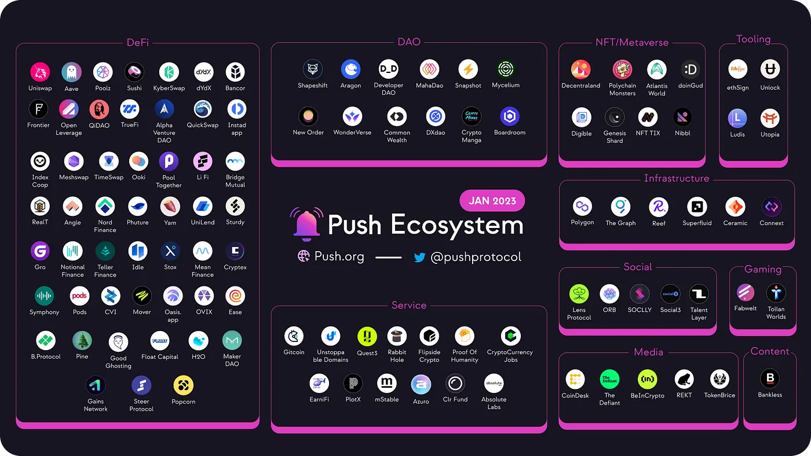

---

slug: january-monthly-recap
title: 'January Monthly Recap❄️'
authors: [push]
image: './cover-image.png'
text: "Welcome to our monthly update!
We are thrilled to share with you the numerous achievements and milestones we accomplished in the month of January — spoiler, it's a lot."
tags: [ Devtools, Web3, Blockchain, Newsletter, Push Notification]

---

<!--truncate-->

Welcome to our monthly update!

We are thrilled to share with you the numerous achievements and milestones we accomplished in the month of January — spoiler, it's a lot.

From exciting new product developments to numerous giveaways, partnerships, and hackathons, January has been a whirlwind of activity for Push and the Push DAO.

With that, here’s a look at everything that kept us busy 🤩

## Product Updates

We’re kicking off the year with one of the most significant items on our roadmap - completion of the security audit and successful upgradation to [smart contracts v1.5](https://x.com/PushChain/status/1610706705439916032). This update breaks ground for the next phase of developments at Push and we are delighted to share all the [new functionalities](https://medium.com/push-protocol/introducing-push-protocol-v1-5-80eb39b55424) as a result.

With the groundwork for Push Smart Contracts v2 in place, we’re already making strides in its development. Onwards and upwards! 🚀

Besides the upgrade to v1.5, we’ve also had a host of fantastic developments have taken place including:

- New features to the [Push Chat SDK](https://comms.push.org/docs/chat)
- The analytical dashboard undergoing extensive quality assurance

In addition to all our progress on the development front and the successful update to v1.5, we’ve got a loaded roadmap with more exciting new features to come. Stay updated with all the latest happenings on[ Push Discord](https://discord.com/invite/pushprotocol).

## Frens of Push

We welcomed many new frens to the Push ecosystem this month including:

- [TaylerLayer](https://x.com/PushChain/status/1610992421848092675): to enable on-chain messaging for platforms building on TalentLayer.
- [Hats Finance](https://x.com/PushChain/status/1613248106769834007): to deliver wallet-to-wallet notifications and ensure decentralized relay and storage.
- [EPI](https://twitter.com/0xEPI/status/1615799534105559040): to enable in-app messaging and notifications.
  We’re delighted to be teaming up with these amazing projects and look forward to enhancing the web3 space together🤝

If you haven’t already, be sure to read about how our frens Developer DAO and QiDAO are using Push to keep their users updated. Krinza from [D_D](https://medium.com/push-protocol/push-notifications-for-developer-dao-to-boost-community-participation-fd8363e8254b) shares how Push is being used to boost community participation and Benjamin from [QiDAO](https://medium.com/push-protocol/qidao-taps-push-to-update-users-on-their-debt-positions-f91ea26191e7) talks about using notifications to prevent user losses.

#PoweredByPush

## Events

Look out for all the amazing events and giveaways we’re hosting! We collaborated with a bunch of our frens this month to organize hackathons and contests for our community.

- [Livepeer x Encode Next Video Build Hackathon](https://x.com/PushChain/status/1616496305995452466): We had 25+ submissions competing to build the next-gen video app with Push and four fantastic winners made it.
- [Superfluid Wave Pool](https://x.com/PushChain/status/1610828089856249857): Superfluid Wave #5 went live and Push had $2,000 up for grabs for the best project that integrated Superfluid with Push notifications.
- [FVM Space Wrap](https://x.com/PushChain/status/1616462062753808385): Push sponsored the event and had bounties for numerous projects enhancing their UX with Push notifications and Chat.
- [Gitcoin-Push Chat](https://twitter.com/gitcoin/status/1615078161817165824): Once a grantee, now a funder, Push gave back to the Gitcoin community by giving early access to Push Chat with all their supporters from GR6 and GR7.
- [LearnWeb3 challenge](https://x.com/PushChain/status/1617506921426173956): Push is hosting a #100DaysOfCode challenge with LearnWeb3 DAO and giving away exciting prizes to the winners. (the event is still live!)

It was an incredibly fun month with the lots of momentum on the community front 🙌

Speaking of community…

## Community and News

January was packed with lots of action for Push Community and we are glad to have so many new Rockstars in the fam. A huge shoutout to all the participants and winners of our weekly #RockstarsofPush competition.

In other news, [Truffle](https://twitter.com/trufflesuite/status/1610704252304867332) hosted the first Web3 Unleashed episode of 2023 with our very own Fabio and we held an awesome workshop on “How to Power Your Web3 dApp Using Push” as a part of the #100DaysOfCode challenge.

Another challenge for the dev community came in the form of a [Builder Grant Program](https://twitter.com/Superfluid_HQ/status/1618637058079088642) we announced with Superfluid that had up to $20k in funding to support developers building with Push and Superfluid.

What’s more? [Woopay](https://twitter.com/developer_dao/status/1618705990102450176?s=20&t=XLP0cGEGeFcjTdbReN_cIw) partnered with Push as a part of their grant program to make it easier for their users to keep a track of their transactions. The Push to success is faster than ever!

Overall, we are extremely proud of all that we have achieved in the month of January and are looking forward to the exciting opportunities and challenges that lie ahead. Thank you for your continued support and we look forward to updating you on our progress in the months to come.
