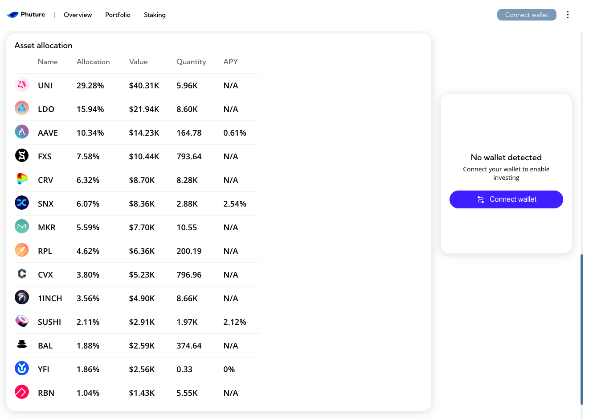
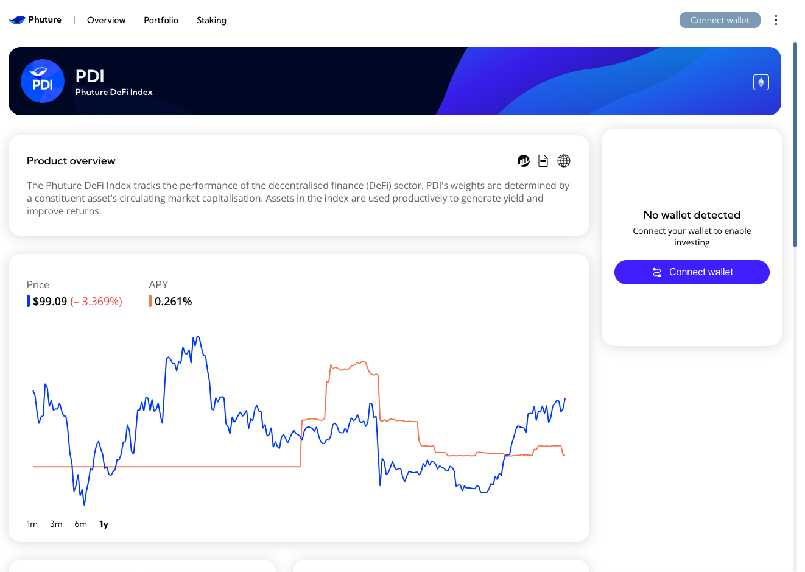

---

slug: push-and-phuture-finance-team-up-to-enhance-user-engagement
title: 'Push and Phuture Finance Team Up to Enhance User Engagement🐋'
authors: [push]
tags: [ Frensofpush, Web3, Blockchain, Blockchain Technology]

---
import { SubHeader } from '@site/src/components/SharedStylingV2';

<!--truncate-->

This week, we are glad to feature our fren and the leading crypto index platform — Phuture Finance.

Phuture Finance is an investment platform that combines passive exposure to crypto assets with transparency and lasting value. As such, the index platform is working towards making DeFi more accessible by bringing yield-generating index funds to risk-averse crypto investors.

If you’re an investor who wants to bank upon the crypto revolution without dealing with complexity or extensive tracking, Phuture Finance is your solution.

As a crypto investment platform, Phuture places a strong emphasis on creating a trustworthy environment for its investors. Communication plays a significant role in this regard and Push is glad to be the solutions provider! By collaborating with Push, Phuture delivers investment updates directly to its users, thereby enabling a culture of transparency on the platform.

For this episode of “Frens of Push”, we sat down with Oliver Mehr, co-founder of 
Phuture Finance to talk about Phuture’s mission of enabling transparency in the DeFi realm and how Push is helping further this mission.

### Hi Oliver, how did you become involved in building in the blockchain space? What’s your story?
I became involved in crypto in late 2016 when the family office that I was working for at the time started to invest in crypto. It started off with just Bitcoin and Ethereum but grew from there, participating in the ICO boom and ultimately culminating in the creation of a venture fund, SVK Crypto, to invest in early-stage blockchain-based businesses. After fully deploying the capital for that fund and realizing the potential that decentralized finance had to offer, we began building Phuture.

### Tell us about Phuture — what’s it about, and what problem does Phuture solve?
Phuture is a decentralized protocol that gives users passive exposure to crypto assets. Phuture creates on-chain index funds and structured products so anyone can get exposure to crypto without the complexity of managing each asset individually. Phuture’s products are built with best-in-class methodologies and audited to the highest standards.

Here’s how it looks:

### What’s your 2023 plan for Phuture?
In 2023, we plan to take on-chain index funds and structured products to the next level with the launch of Phuture V2 a next-generation non-custodial asset management protocol. We will be releasing more details about Phuture V2 as we get closer to the launch so make sure to stay updated through our socials.

### How is Phuture using Push’s web3 communication layer?
Phuture is leveraging the Push protocol to create a communication channel with our users that relies solely on their wallet address and no other personal information. Through our channel, we send our users weekly updates on the performance of their portfolio as well as notify them when we rebalance our index products.

<blockquote><i>Engaging with your users in web3 has been an ongoing problem and we believe that through Push we can provide our users with both general updates on our products as well as notifications tailored to their Phuture portfolio. Ultimately, we believe the integration of web3 notifications into Phuture will drastically improve the user experience over time.</i></blockquote>

### How would you describe your experience using Push? What benefits have you seen?
Push provides ample flexibility for us to utilize our subgraph data within our notifications to deliver accurate, account-tailored information the moment an on-chain event occurs, the timestamp is met or the transaction is triggered.

### What cool use cases do you see Push being used for in the future?
We are most excited about seeing Push get integrated directly into consumer wallets so that notifications can be sent straight to a person’s wallet. We believe this will massively increase the adoption rate and engagement of Web3 communications through a seamless user experience.

Thank you once again for your time Oliver!

### About Phuture
Phuture (PHTR) is a decentralized crypto index platform that simplifies investments through automated, themed index funds on Ethereum. Accessible by anyone with an internet connection, Phuture is perfect for investors looking to upgrade their crypto investment strategy.

Find more about Phuture: [Website](https://www.phuture.finance/), [Twitter](https://twitter.com/phuture_finance), [Discord](https://discord.com/invite/frRD3Ck), [Telegram](https://t.me/phuture_group),[Docs](https://docs.phuture.finance/introduction/master)

### About Push Protocol

Push is the communication protocol of web3. Push protocol enables cross-chain notifications and messaging for dapps, wallets, and services tied to wallet addresses in an open, gasless, and platform-agnostic fashion. The open communication layer allows any crypto wallet /frontend to tap into the network and get the communication across.

To keep up-to-date with Push Protocol: [Website](https://push.org/), [Twitter](https://twitter.com/pushprotocol), [Telegram](https://t.me/epnsproject), [Discord](https://discord.gg/pushprotocol), [YouTube](https://www.youtube.com/c/EthereumPushNotificationService), and [Linktree](https://linktr.ee/pushprotocol).

<i>“Push frens” is our weekly content series to spotlight outstanding projects building with Push. If you want to be featured, reach out to us, and you could be our next Fren in the series.</i>

