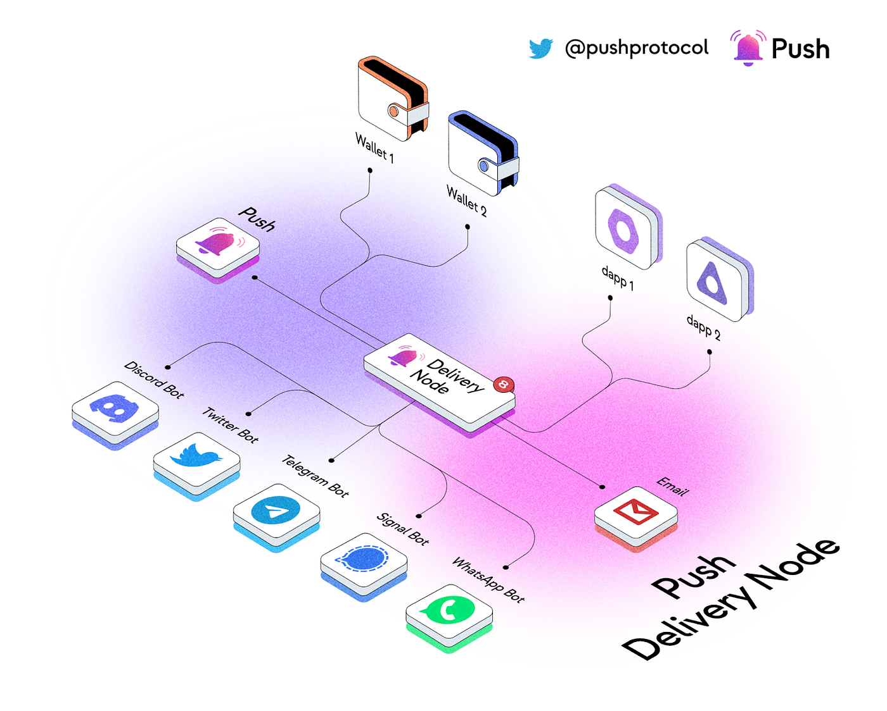

import { ImageText, VideoContainer } from '@site/src/css/SharedStyling';


<!--truncate-->

<ImageText>Simplify Web3 Notifications for Your App with Push Delivery Nodes — A One-Stop Solution for Mobile, Desktop or Extension. These Decentralized Nodes Connect Web3 and Web2, Allowing Your Platform to Receive Notifications from Validating and Indexing Storage Nodes, Tied Directly to Your Wallet Address and Multi-Chain Identity</ImageText>

<!--customheaderpoint-->

# The Swiftest Route to Web3 Notifications, Chats, and More Across Mobile, Desktop, and Extensions.

## What are the Delivery Nodes?

Push Delivery Nodes serve as a decentralized solution for connecting web3 and web2. They allow any centralized or decentralized platform to receive communications from Push Storage Nodes, which validate and index all communications and link them to a user’s wallet address and multi-chain identity.

Developers can run these nodes on their backend to connect their web2 infrastructure to web3 communication, allowing for extended communication beyond web3 wallet addresses to web2 platform users. Push Delivery Nodes enable mapping any web2 device token or platform username to a specific web3 wallet address, which can then send alerts to web2 or web2.5 platforms.

Examples of platforms that can be reached include crypto wallet apps, mobile apps, browser extensions, Telegram and Discord bots, email alerts, and more.

For a pure web3 experience, listening to Push Storage Nodes or utilizing their RPC endpoints/SDK is the best option. However, if you’re a developer looking to extend these communication experiences to centralized platforms, you need to use Push Delivery Nodes.



## 7 Steps for Getting Started With the Delivery Node Module🌱

### Prerequisites

- MYSQL (Version >= 5.7)
- Redis (Version >= 6.0)
- Docker (For local setup)
- Google FCM Account Setup

### Step 1: Clone Push delivery node repo

Git clone can be found here: https://github.com/push-protocol/push-delivery-node.git

### Step 2: Environment configuration

Refer env sample file. The MYSQL DB credentials and Redis URL needs to be updated. The remaining conf need not be edited as of now.

If you use docker-compose for the local setup MYSQL DB and Redis config can be left as it is.

```js
# REDIS
REDIS_URL=redis://localhost:6379
# DELIVERY NODE MYSQL DATABASE
DELIVERY_NODE_DB_HOST=localhost
DELIVERY_NODE_DB_NAME=dbname
DELIVERY_NODE_DB_USER=user
DELIVERY_NODE_DB_PASS=pass
DELIVERY_NODE_DB_PORT=3306
```

### Step 3. a: Infra setup: (local)

The docker-compose will bring up the MYSQL, Redis, and PHPMyAdmin containers for the Delivery Node.

```js
docker compose up
```

### Step 3. b: (Alternate) infra setup: (Production)

- Host MYSQL and Redis Separately
- Add MYSQL and Redis credentials in the .env file

### Step 4: FCM project setup

- Refer https://firebase.google.com/docs/admin/setup
- Create the firebase-adminsdk.json file in the root folder and add the FCM JSON to this file

### Step 5: Build the delivery node project

You should then be able to build the project using:

```js
cd push-delivery-node
npm install
```

### Step 6: Start the delivery node project

You should be able to start the server using:

```js
cd push-delivery-node
npm start
```

### Step 7: Device registration

- An endpoint is hosted as part of the delivery node project, which can be used for device registration.
- Below is the API to create a mapping between the wallet address and the device token for which the messages need to be delivered.
- `<delivery_node_url>` is the base URL of the Delivery node you have hosted.

Below is the curl request of this endpoint

```js
curl - location - request POST 'https://<delivery_node_url>/apis/v1/pushtokens/register' \
 - header 'Content-Type: application/json' \
 - data-raw '{
"wallet": "eip155:0x35B84d6848D16415177c64D64504663b998A6ab4",
"device_token": "device_token",
"platform": "android"
}'
```

## Useful Links

- <i>Delivery Node Repo Link:</i> <a href='https://github.com/push-protocol/push-delivery-node'>https://github.com/push-protocol/push-delivery-node</a>
- <i>Demo Mobile App Repo Link:</i> <a href='https://github.com/push-protocol/demo-push-mobile-app'>https://github.com/push-protocol/demo-push-mobile-app</a>
- <i>Delivery Node Setup Video Tutorial:</i>

<VideoContainer>
<iframe width="100%" height="100%" style={{ borderRadius: "32px" }} src="https://www.youtube.com/embed/OlRHL3qd4oY" title="Get started with Push Delivery Nodes | #web3 communication" frameborder="0" allow="accelerometer; autoplay; clipboard-write; encrypted-media; gyroscope; picture-in-picture; web-share" allowfullscreen></iframe>
</VideoContainer>

<i>PUSH Documentation:</i> <a href='https://comms.push.org/docs/notifications/tutorials/integrate-notifications-via-delivery-node/'>Integrating notifications via Push Delivery Nodes</a>

## Push Support

If at any point you find yourself needing assistance and help with getting set up, Push has a team of helpful developers ready when you need it.

Come join us in Discord where you can get assistance and meet other devs who are building with Push👉 https://discord.com/invite/pushprotocol

## Push SNS Module for Delivery Node

We have also launched the Push SNS Module for the delivery nodes, which instantly allows any developer to receive notifications, chats, or any other form of web3 communication directly to the platform they are building with the help of webhooks.

You can find more details here.

### What’s next for Push Delivery Nodes?

- Dockerization
- Analytics
- Monitoring APIs
- Support Push Chat
