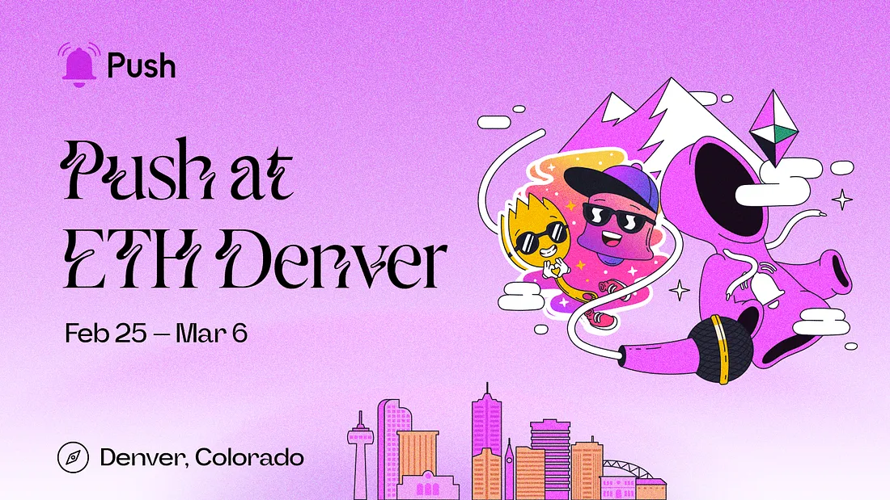

<!--truncate-->

ETHDenver is just around the corner and the Push team is going to be there!

We’re extremely excited to be joining the largest Ethereum-based conference of the year and can’t wait to meet all of you, our amazing community members in person.

We’ll be having a busy week attending several panel discussions and workshops, so if you’re going to be at ETHDenver this year and want to learn more about Push communication tools or meet the creators themselves — here’s where you can find us:

## Our full itinerary:

Feb. 25

- <a href="https://events.ethdenver.com/eden23/attendease/networking/experience/2647c21b-c958-4e87-acc5-6c1abef58dac/45081ee7-3ec7-4e7f-85af-d5e0b82e73b4">Pushing the Boundaries of Web3 UX</a><b> @ ETHDenver Main Stage—</b> a discussion with Push protocol founder Harsh Rajat <b>(12:40 PM — 1:00 PM MST)</b>

Feb. 27

- <b>Zero-to-Dapp Bootcamp w/ Push, Polygon, The Graph & Fleek @ The Pit Hacker House</b> — a joint workshop featuring Push core dev Fabio on how and what you can build using Push communication tools <b>(3:00 PM — 3:30 PM MST)</b>

Feb. 28

- <b>Next.ID Panel Discussion w/ Push, Spruce, Collab.Land & Disco —</b> a joint panel discussion on DID and applications for it, featuring Harsh and Fabio from Push <b>(2:00 PM MST)</b>

Mar. 4

- <a href="https://www.eventbrite.co.uk/e/take-back-ownership-w-safe-superfluid-gnosis-push-balancer-tickets-525458710147"><b>Take Back Ownership w/ Push, Safe, Superfluid, Gnosis& Balancer</b></a> — a talk on “Pushing the Boundaries of Web3 UX” plus a panel discussion with Push partners on the future of web3 <b>(4:00 PM — 8:00 PM MST)</b>

TBD

- <b>Filecoin Hacker Base @ ETHDenver —</b> Workshop on Why web3 communication matters <b>(Time is TBD)</b>

## Opt-in to our ETHDenver channel, there might be some alpha and merch for you! 👀

If you’re looking to get access to exclusive merch, event tickets, and stay updated on all things happening at ETHDenver this year, you can opt-in to our ETHDenver notifications channel.

🔔👉 https://app.push.org/#/channels?channel=0x8DaFfe9d1b5aDB33F53aDDC183C6b91F9cb30bc7

Who knows…we might even share some big news and alpha coming out from Push with you…

Opt-in to learn how you can earn some awesome Push hoodies.

## Come meet the team!

From the Push team, we’ll be bringing both our co-founders, Harsh and [Richa](https://medium.com/u/120218a9beea?source=post_page-----2a62d5c75a4--------------------------------)
, our core dev Fabio, our head of BD and partnerships Madeline & Garret…you get the picture.

If you’re thinking of…

- Partnering with Push
- Have an idea for something cool you want to build
- Talk about [grants](https://gov.push.org/c/grants/10)
- Or just want to say hi!

We encourage you to come meet us in person! Now’s your time to do so!

You’ll be able to find us in the pink shirts💗

If you need help getting in touch, you can also always refer to our community channels to get connected: [Twitter](https://x.com/PushChain) & [Discord](https://discord.gg/pushprotocol).

We look forward to having an amazing week at ETHDenver and we can’t wait to meet everyone!

Hello from the Push Crew!

