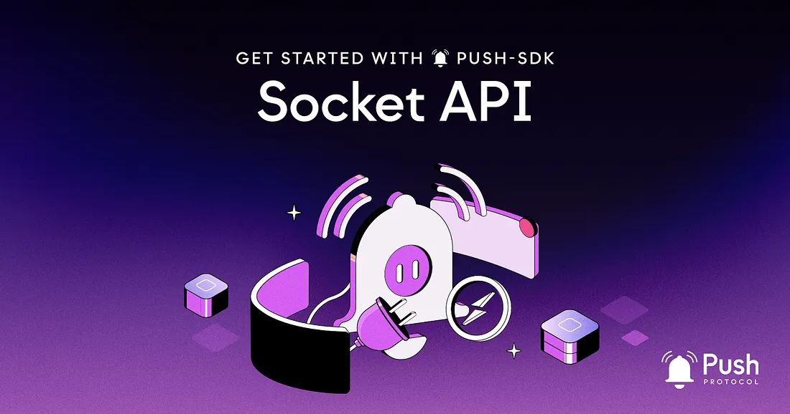

<!--truncate-->

The Socket API is a package that helps you connect to the Push backend using WebSockets, built on top of <a href="https://socket.io/docs/v4/client-api/"><b>Socket.IO</b></a>. With this API, you can easily subscribe to real-time notifications and updates from the Push network.

In this article, we’ll go over the PUSH-SDK Socket API and how to use it in your dApp.

import { ABlock } from "@site/src/css/SharedStyling";

:::caution
Socket API is deprecated. Push has revamped it's socket API into stream API which is more versatile and developer friendly, click on the link below to learn more 👇.
:::

<ABlock href="https://comms.push.org/docs/chat/stream-chat" title="Link to learn more about Push Stream API">Learn about Push Stream API</ABlock>

## Note on Addresses

In any of the specified methods (unless explicitly stated otherwise), you can use either CAIP format (specifically CAIP-10) or the ETH address format.

Recall that CAIP, or Chain Agnostic Improvement Proposal, is a way to describe standards for blockchain projects that are not specific to a single chain. It was developed by the Ethereum Improvement Proposal (EIP) process and is used to identify and encode information about Ethereum addresses, contract addresses, and other crypto-assets. For example, an ETH mainnet address would be in the form:

<b>eip155:1:0xab16a96d359ec26a11e2c2b3d8f8b8942d5bfcdb</b><br/><br/>

<blockquote>The sockets API uses CAIP-10 (but defaults to the Ethereum address format), which is a specific proposal within the CAIP specification that focuses on the identification of blockchain addresses. It defines a format for representing addresses in a way that is both chain-agnostic and human-readable.</blockquote>

The ETH address format is supported for backwards compatibility. For example, an ETH mainnet address would be in the form <b>0xab16a96d359ec26a11e</b>

## Creating a Socket Connection

To create a socket connection, you’ll need to create a socket connection object.

```js
createSocketConnection(options: SocketConnectionOptions): SocketConnection
```

You can use the <b>createSocketConnection</b> method to create a socket connection object. This method takes an options object as an argument, which allows you to specify the following parameters:

- <b>user</b> (<b>string</b>, required): The user account address, in <a href="https://github.com/ChainAgnostic/CAIPs/blob/master/CAIPs/caip-10.md#test-cases">CAIP</a> format.
- <b>env</b> (<b>string</b>, optional, default: <b>'prod'</b>): The API environment to connect to. Can be <b>'prod'</b>, <b>'staging'</b>, or <b>'dev'</b>.
- <b>socketOptions</b> (<b>object</b>, optional): Options to pass to <a href="https://socket.io/docs/v4/client-options/">SocketIO</a>.

This method returns a <b>SocketConnection</b> object that you can use to connect, disconnect, and subscribe to events.

## For Notifications

To create a socket connection for notifications, you’ll need to create a socket connection object.

```js
const pushSDKSocket = createSocketConnection({
  user: 'eip155:11155111:0xab16a96d359ec26a11e2c2b3d8f8b8942d5bfcdb', // CAIP-10 format
  env: 'staging',
  socketOptions: { autoConnect: false },
});
```

## For Push Chat

To create a socket connection for chat, you should define the socket type as “chat” when instantiating the socket client. The user address can be in any format, including non-CAIP-10 formats.

```js
const pushSDKSocket = createSocketConnection({
  user: '0xFd6C2fE69bE13d8bE379CCB6c9306e74193EC1A9',
  env: 'staging',
  apiKey:
    'jVPMCRom1B.iDRMswdehJG7NpHDiECIHwYMMv6k2KzkPJscFIDyW8TtSnk4blYnGa8DIkfuacU0',
  socketType: 'chat',
  socketOptions: { autoConnect: true, reconnectionAttempts: 3 },
});
```

This method takes an options object as an argument, which allows you to specify the following parameters:

- <b>user</b> (<b>string</b>, required): The user account address.
- <b>env</b> (<b>string</b>, optional, default: <b>'prod'</b>): The API environment to connect to. Can be <b>'prod'</b>, <b>'staging'</b>, or <b>'dev'</b>.
- <b>apiKey</b> (<b>string</b>, optional): The API key to use for authentication.
- <b>socketType</b> (<b>string</b>, optional, default: <b>'notification'</b>): The type of socket connection to create. Can be <b>'notification'</b> or <b>'chat'</b>.
- <b>socketOptions</b> (<b>object</b>, optional): Options to pass to <a href="https://socket.io/docs/v4/client-options/">SocketIO</a>.

This method returns a <b>SocketConnection</b> object that you can use to connect, disconnect, and subscribe to events.

## Connecting and Disconnecting

Once you have a <b>SocketConnection</b> object, you can use the <b>connect</b> and <b>disconnect</b> methods to establish or close the connection:

```js
SocketConnection.connect(): void
```

Use the <b>connect</b> method to establish a connection to the backend.

```js
SocketConnection.disconnect(): void
```

Use the <b>disconnect</b> method to close the connection to the backend.

## Subscribing to Events

Once you have a connection, you can subscribe to events to receive updates in real-time.

```js
SocketConnection.on(event: SocketEvent, callback: (data: any) => void):
```

Use the <b>on</b> method to subscribe to a socket event. This method takes an event name and a callback function as arguments. The callback function will be called whenever the specified event is triggered.

The following events are supported:

- <b>EVENTS.CONNECT:</b> Triggered when the socket connection is established.
- <b>EVENTS.DISCONNECT:</b> Triggered when the socket connection is closed.
- <b>EVENTS.USER_FEEDS:</b> Triggered when a new notification is received by the user after the last socket connection.
- <b>EVENTS.USER_SPAM_FEEDS:</b> Triggered when a new spam notification is received by the user after the last socket connection.
- <b>EVENTS.CHAT_RECEIVED_MESSAGE:</b> Triggered when a new chat message is received.

Example:

```js
const pushSDKSocket = createSocketConnection({
  user: 'eip155:11155111:0xab16a96d359ec26a11e2c2b3d8f8b8942d5bfcdb',
  env: 'staging',
  socketOptions: { autoConnect: false },
});
pushSDKSocket.connect();
pushSDKSocket.on(EVENTS.CONNECT, () => {
  console.log('Connected to socket!');
});
pushSDKSocket.on(EVENTS.DISCONNECT, () => {
  console.log('Disconnected from socket!');
});
pushSDKSocket.on(EVENTS.USER_FEEDS, (feedItem) => {
  console.log(`Received notification: ${feedItem.title}`);
});
pushSDKSocket.on(EVENTS.USER_SPAM_FEEDS, (feedItem) => {
  console.log(`Received spam notification: ${feedItem.title}`);
});
pushSDKSocket.on(EVENTS.CHAT_RECEIVED_MESSAGE, (message) => {
  console.log(`Received chat message: ${message.text}`);
});
```

<center><b>.   .   .</b></center>

That’s it! You now know how to use the main features of the Push Protocol Socket API to add push notification functionality to your application🎉

We’ll cover other parts of the Push SDK in coming posts so stay tuned!

- [Push Protocol SDK documentation here](https://comms.push.org/docs/) — if you’d like more reference material to chew on.
- [Push SDK on GitHub](https://github.com/push-protocol/push-sdk)
- [Our Discord](https://discord.gg/pushprotocol) — we’ve got devs ready to give your project whatever support and consultation you need.
- [Push developer docs](https://comms.push.org/docs/ 'Push developer docs') to get started on building right away!

#PoweredbyPush
