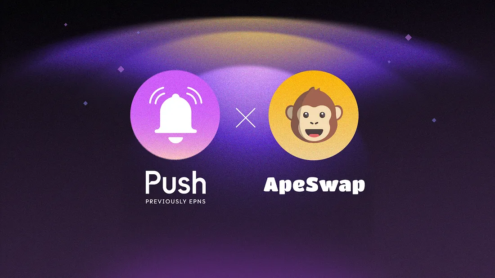

---

slug: going-bananas-push-protocol-partners-with-ape-swap-for-seamless-web3-communication
title: 'Going Bananas: Push Protocol Partners with ApeSwap for Seamless web3 Communication!🐵'
authors: [push]
tags: [ Web3, Blockchain Technology, Announcements, Crypto, BNB ]

---

<!--truncate-->

Are you ready to take your DeFi experience to the next level? We are thrilled to announce that Push Protocol is teaming up with ApeSwap, one of the most popular DEXes and Yield Farming platforms on BNB Chain, Polygon, ETH and Telos.

ApeSwap is a rapidly growing DeFi platform that has gained a significant following on BNB Chain. With over $67 million in TVL, ApeSwap is redefining DeFi for a more sustainable future. To achieve this goal, the platform is focused on Sustainable Liquidity Mining through ApeSwap’s Treasury Bills, but also is well known for their DEX, liquidity pools, staking, and farming.

From crypto newbies to Defi veterans, ApeSwap is dedicated to providing accessibility to DeFi tools to web3 users across the board.

## Push x Apeswap
At the core of any successful DeFi platform is trust, and this is something that both Push protocol and ApeSwap highly value. To enable such trust, a direct and secure communication stream between ApeSwap and its users is a must. This is precisely where Push comes in!

<blockquote><i>“Our values push the ApeSwap DAO forward. They determine who we partner with and how we build for a brighter future. Through accessibility, transparency, & security we strive to be the best protocol for our Ape family.” — Diddy, Social Media Director</i></blockquote>

This partnership brings together two leading innovators in the web3 space, with the goal of providing users with a more transparent and secure DeFi experience. As a part of this collaboration, ApeSwap users can expect to receive a number of Push notifications regarding critical events on ApeSwap, such as:

- Upcoming Pool launches and new earning opportunities
- Latest trends in the market
- When new bonds are issued and certain discounts are hit

In addition to these notifications, a marketplace group chat will enable easy communication and interaction between traders on the exchange.

Altogether, these enhancements will help ApeSwap users make better and more informed decisions about their investments. By providing timely information, Push Protocol aims to empower ApeSwap users and increase their chances of maximizing earning opportunities on ApeSwap.

<blockquote><i>“For Push to be chosen as theweb3 notifications and chat provider of ApeSwap is an extremely proud honor for us. We have no doubt our enhancements to the platform will benefit users and bring them value. We’re excited to begin our journey with ApeSwap and we look forward to seeing what other exciting developments we can introduce” — Harsh Rajat, Push Protocol CEO & Co-founder</i></blockquote>

The partnership between Push Protocol and ApeSwap is just the beginning.

We are excited to explore other use cases and solutions that can add more value to DeFi users. By combining our strengths, we believe we can make DeFi more accessible, user-friendly, and secure for all.

## About Apeswap

ApeSwap is a DeFi platform on BNB Chain, Polygon, Telos, and Ethereum. It offers DeFi tools like token swaps, Treasury Bills, staking, farming, liquidity pools, and more. It is overseen by the ApeSwap DAO and is committed to its mission to “provide accessible financial opportunities for the (crypto) masses through transparency, security, and support”.

Find out more about ApeSwap: [Website](https://apeswap.finance/), [Twitter](https://twitter.com/ape_swap), [Discord](https://discord.com/invite/ApeSwap), [Telegram](https://t.me/ape_swap), [Instagram](https://www.instagram.com/apeswap.finance/), [Docs](https://apeswap.gitbook.io/apeswap-finance/welcome/master), [Github](https://github.com/ApeSwapFinance/)

### About Push Protocol

Push is the communication protocol of web3. Push protocol enables cross-chain notifications and messaging for dapps, wallets, and services tied to wallet addresses in an open, gasless, and platform-agnostic fashion. The open communication layer allows any crypto wallet /frontend to tap into the network and get the communication across.

To keep up-to-date with Push Protocol: [Website](https://push.org/), [Twitter](https://twitter.com/pushprotocol), [Telegram](https://t.me/epnsproject), [Discord](https://discord.gg/pushprotocol), [YouTube](https://www.youtube.com/c/EthereumPushNotificationService), and [Linktree](https://linktr.ee/pushprotocol).