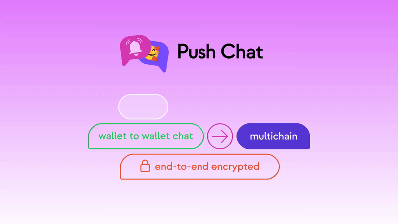

<!--truncate-->

Developers and researchers in computer networks are constantly seeking ways to improve messaging systems’ security, reliability, and scalability. Why? Because traditional centralized messaging systems have their drawbacks, including vulnerabilities to hacks, censorship and the risk of downtime.

That’s where decentralized messaging protocols come in. Decentralized protocols use blockchain technology and decentralized networks to create a more secure and resilient messaging infrastructure.

While we’ve already looked deeper into how [Push Chat](https://medium.com/push-protocol/were-still-pushing-a-deeper-look-into-push-chat-90fdea8d9e8e) works, we now want to see where it fits in the grand scheme of things. To start with, let’s take a step back and examine how traditional chat applications work.

## An Overview of Traditional Chat Applications

Most traditional chat applications use a client-server model, where the client (e.g., a mobile app or desktop software) communicates with a central server to send and receive messages. The server acts as a mediator, routing messages between clients and storing them in a database.

This model has some advantages, such as the ability to support many users and the convenience of storing messages in a centralized location. However, it also has its drawbacks. The server is a single point of failure, meaning that if it goes down, the entire chat system becomes unavailable. Additionally, the server has complete control over the messages, which means it can censor or alter them if it chooses to. Not to mention, the ethos of web3 has shown us that distributing and decentralizing methods of communication is a logical next step to drive humanity forward.

## An Example with Discord

In the traditional client-server model of chat applications, such as Discord, messages are typically stored on the central server in a database. When a user sends a message on a Discord channel, it is sent from the user’s client to the Discord server over a network connection using a transport protocol, such as HTTP or WebSocket. The server then routes the message to the intended recipient and stores it in the database.

In the case of Discord, if the recipient has enabled push notifications, the server will send a push notification to the recipient’s device when a new message is received (we explained this scenario in the <a href="https://medium.com/push-protocol/my-app-would-like-to-send-you-push-notifications-4b591a68f803"><b>’My App’ Would Like to Send You Push Notifications blog post.)</b></a> The message is delivered directly from the server to the recipient’s account when the recipient is online and has the Discord application open on their device. If the recipient is not online or has the application closed, the message is stored on the server until the recipient becomes available.

This process allows for real-time communication between users and the ability to receive notifications even when the app is not open. However, it also relies on a central server to route messages and sends notifications, which can be vulnerable to outages and censorship. It is worth noting that the specifics of how messages are stored and transmitted may vary depending on the particular chat application and implementation.

## Our Answer to These Problems? Push Chat.

PUSHing the standards of communication started with EPNS, which transformed in Push Protocol. But Push Protocol on it’s own doesn’t add value to the user nor the dApp, hence, we created a host of communication solutions to be used for real-life applications.

With an endless number of use cases, some of which high impact areas right now that Push can revolutionize are:

- Wallet &lt; &gt; dApp communication
- Wallet &lt; &gt; Wallet communication
- Off-chain or private marketplace communication
- META communication in the metaverse
- Off-chain games and gamified events communication

Push Chat’s potential doesn’t end there. It also has the potential to encourage the development of new communication primitives in the web3 space. Providing a secure and reliable messaging infrastructure opens the door for developers to create innovative solutions for messaging and communication that were not previously possible.

Come explore Push Chat and see for yourself!

👉👉👉 https://app.push.org/#/chat

## An example of Governance: Disconnected Autonomous Organizations

As the decentralized ecosystem grows, so does the need for effective communication between decentralized autonomous organizations (DAOs) and their users. Unfortunately, the current communication state in the space leaves much to be desired.

Centralized tools dominate the space, requiring users to give up some level of their privacy and personal identity to participate. This can be a significant barrier for many, especially in cryptocurrency and blockchain, where anonymity is highly valued.

Push Chat offers a solution to this problem, providing a decentralized communication layer for web3. With Push Chat, DAOs and their users can communicate with each other in a secure, anonymous, and censorship-resistant manner.

Using the power of peer-to-peer networks, Push Chat allows users to send messages directly to each other without the need for a central server. This enhances privacy and security and makes the system more resistant to censorship. But Push Chat isn’t just a messaging platform — it also enables censorship-resistant, decentralized polling and voting on proposals submitted on the blockchain. [With our generalized SDK (docs)](https://comms.push.org/docs/chat/concepts/push-chat-architecture/), you can use Push Chat for decentralization, security, and significantly lower costs in gas for you and your users.

Whether voting on proposals, collaborating on projects, or just keeping in touch with fellow community members, Push Chat provides a powerful and easy-to-use solution for decentralized communication.

Push Chat can even broadcast user transactions to a network of sequencers, where sequencers compete to include transactions, further decentralizing cryptocurrency infrastructure.

Whether you’re building a social network, a platform for collaborating on the artwork, open-source software, or any other type of dApp, Push Chat can provide a decentralized, private, censorship-resistant, and user-friendly experience for communication and collaboration. And with its ability to save gas fees through transaction aggregation, Push Chat can enhance the decentralization and ease of running your dApp or protocol, allowing users to submit their own transactions or creating a decentralized architecture that handles this for them.
