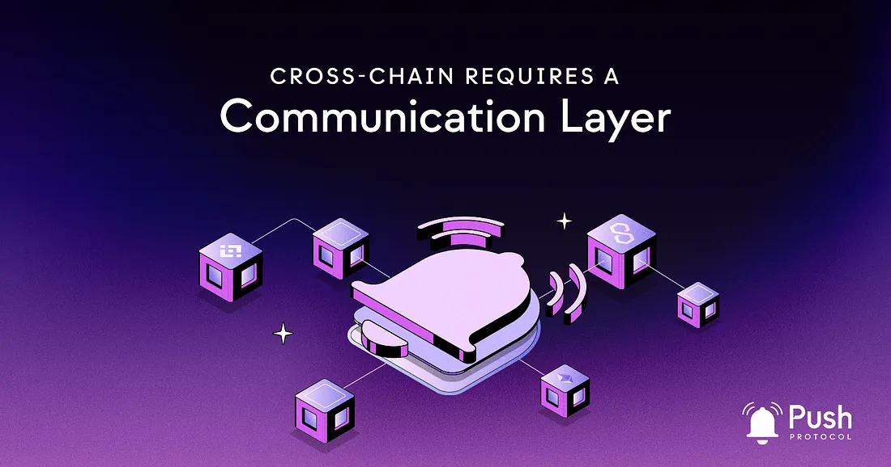

<!--truncate-->

Blockchain technology has come a long way since the advent of Bitcoin in 2009. Today, there are multiple blockchain platforms with unique features, capabilities, and ecosystems.

With that, the need for interoperability between these different platforms has been a major challenge for blockchain technology’s growth and mass adoption. As such, cross-chain solutions have become essential to enable seamless interaction between different blockchain platforms though they still lack a critical component — communication.

This is where the Push Protocol comes into play.

## What is Cross-Chain?

Cross-chain refers to the ability of different blockchain platforms to communicate and interact. In other words, cross-chain technology enables the transfer of assets, data, and additional information between different blockchain platforms.

This opens up a world of possibilities for blockchain technology, as it allows for the creation of dApps that can operate across multiple blockchain platforms without being limited by the constraints of a single platform.

## What’s the difference between Cross-Chain and Multichain?

Multichain technology refers to creating an internet of blockchains, where blockchains can communicate freely while remaining secure. This is achieved through a shared underlying security layer that connects the different blockchain platforms.

On the other hand, cross-chain technology uses smart contracts to create synthetic versions of coins that can interact with other blockchains directly. In other words, multichain is about connecting blockchains, while cross-chain is about connecting assets and data across blockchains.

## Recap on Interoperability

Interoperability is the ability of different systems to work together seamlessly. In the context of blockchain technology, interoperability refers to the ability of different blockchain platforms to communicate and interact with each other. This is critical for the growth and mass adoption of blockchain technology, as it enables the creation of dApps that can operate across multiple blockchain platforms, providing users with more options and greater flexibility.

## Push Protocol: Communication for Cross-Chain

Push Protocol is the missing piece of Web3, filling the gap in critical infrastructure that has been holding back the growth and mass adoption of blockchain technology.

Until now, there was no solution to enable native communication between wallets in response to on and off-chain data. This has created a fractured dApp ecosystem held together by antiquated and centralized communication platforms. Push Protocol is building the communication network for Web3, addressing this gap and improving the everyday experience for blockchain users.

Push Protocol adds the necessary middleware to achieve interoperability by providing a communication layer for cross-chain interoperability. This is especially important now, as the infrastructure layer is still being built and designed, not necessarily for the “ideal end product.”

## The Solution to the Problems of Cross-Chain Solutions

Imagine a future where cross-chain solutions can communicate with each other seamlessly, either autonomously or manually, sending out necessary notifications to indicate specific events. This opens up a world of possibilities and creates a more secure environment for users.

With the use of Push Protocol, cross-chain solutions can effectively communicate with each other, allowing for the implementation of fallbacks and fail-safes. This means that in the event of a security breach or other blockchain-related incident, these systems can automatically take effect, protecting users and their assets.

By having a native communication layer in the form of Push Protocol, cross-chain solutions can be made more resilient and safe, preventing terrible incidents such as hacking and the loss of funds without the ability to act.

## The Need for Cross-Chain UX in Web3

There is often talk about the idea of the “super dApp” or the “universal dApp” in the blockchain and Web3 space. But, real-time communication, which is a fundamental aspect of the internet as we know it, is often not a part of this equation. This can lead to a fragmented user experience for blockchain users who constantly shift between dApps and blockchain networks.

Push Protocol addresses this issue by revolutionizing the user experience in Web3. It brings the necessary real-time communication found in today’s internet to the decentralized and distributed world of Web3. By providing this missing piece of the puzzle, Push Protocol makes cross-chain communication possible and improves the overall user experience for blockchain users.

In conclusion, cross-chain communication is a critical component of the Web3 ecosystem, and Push Protocol provides the necessary middleware to make interoperability a reality. With its focus on improving the UX in Web3, Push Protocol is poised to play a vital role in shaping the future of the decentralized world.

If you’re curious to learn more about how Push Protocol’s interoperability works and how you can enable cross-chain communication, come read more in our documentation👉 [right here](https://comms.push.org/docs/notifications/tutorials/create-your-channel/).
