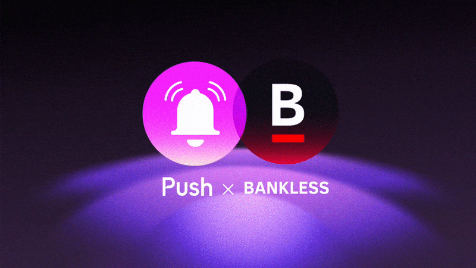

---

slug: bankless-nation-and-push-partner-to-enable-news-notifications
title: Bankless Nation and Push Partner to Enable News Notifications 🔔
authors: [push]
tags: [ Web3, Pushprotocol, Bankless]

---

<!--truncate-->

Bankless, the world’s most popular crypto email and global community, is partnering with Push to update its users with the latest crypto developments and analysis. Through this collaboration, Bankless users will be able to receive important notifications and alerts directly on their devices, ensuring they never miss an opportunity to take advantage of the latest DeFi trends.

Bankless has become one of the most popular media outlets covering the crypto and DeFi ecosystem. As a hub for news, analysis, and education on all things crypto, Bankless is at the forefront of bringing the DeFi movement to a wider audience. With its focus on open and transparent value transfer, Bankless is on a mission to educate every individual about the benefits of open and decentralized finance.

Through its partnership with Push, Bankless will be able to offer its users a more seamless experience, making it easier than ever to stay up-to-date on the latest crypto news and analysis. This collaboration will enable Bankless to lead the charge in educating the wider public about the benefits of DeFi.

## Push x Bankless

Bankless has become a go-to source for education and insights around cryptocurrency and DeFi, helping to educate and onboard millions of users into web3. Bankless continues to innovate and provide its community with the best possible resources to navigate the world of decentralized finance.

The global and ever-growing Bankless community needs to be updated about the latest crypto trends and analysis. This is where Push comes in!

<blockquote>At Bankless, we’re doubling down on Web3 with initiatives like our recent site relaunch and this new collaboration with Push Protocol,“ said Bankless editorial director Lucas Matney. “Web3 media needs its own native toolset and we’re excited by what the Push team has been building”</blockquote>

By opting in to Push notifications, Bankless users can now stay up to date on the latest podcast episodes and blog releases. Bankless will also have a verified channel on Push to send notifications to their community, enabling them to receive timely and relevant updates directly on their devices.

<blockquote>“Push is ecstatic to be the chosen notifications provider for Bankless. As a leading information source and platform for web3 degens and collaborators, we are beyond excited to now be enhancing Bankless’ UX and exploring new ways we can increase community engagement” — Harsh Rajat, Push Protocol CEO and Co-founder</blockquote>

Push is excited to empower the citizens of the Bankless nation and join the popular crypto community in its mission to onboard 1 billion users to web3!

The Bankless channel is LIVE, opt-in via Push now!

👉[app.push.org/#/channels?channel=0x4E15B14B9950A04370E36f2Ec05546ED5867ADeF](http://app.push.org/#/channels?channel=0x4E15B14B9950A04370E36f2Ec05546ED5867ADeF)

## About Bankless

Bankless is an education platform dedicated to bringing insights around crypto and DeFi to the masses. With podcasts, newsletters, blogs, and other educational resources, Bankless provides all the knowledge you need to navigate the DeFi ecosystem. The Bankless Nation is a thriving community of individuals who are passionate about creating a truly “bankless” world.

Become a citizen of the Bankless Nation: [Website](https://www.bankless.com/), [Twitter](https://twitter.com/BanklessHQ), [Youtube](https://www.youtube.com/@Bankless), [Instagram](https://www.instagram.com/bankless/), [Podcast](https://www.bankless.com/listen)

### About Push Protocol

Push is the communication protocol of web3. Push protocol enables cross-chain notifications and messaging for dapps, wallets, and services tied to wallet addresses in an open, gasless, and platform-agnostic fashion. The open communication layer allows any crypto wallet /frontend to tap into the network and get the communication across.

To keep up-to-date with Push Protocol: [Website](https://push.org/), [Twitter](https://twitter.com/pushprotocol), [Telegram](https://t.me/epnsproject), [Discord](https://discord.gg/pushprotocol), [YouTube](https://www.youtube.com/c/EthereumPushNotificationService), and [Linktree](https://linktr.ee/pushprotocol).