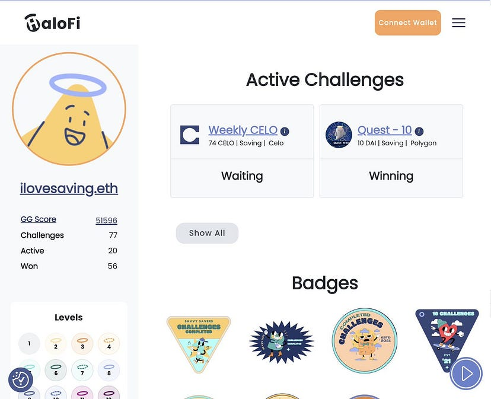

---

slug: halo-fi-teams-up-with-push-to-enable-effortless-savings-with-real-time-notifications
title: HaloFi Teams Up with Push to Enable Effortless Savings with Real-Time Notifications😇
authors: [push]
tags: [ Frensofpush, Web3, Blockchain Technology, Defi]

---

<!--truncate-->

This week, we’re delighted to showcase foremost DeFi savings platform and the newest addition to our ‘Frens of Push’, [HaloFi](https://halofi.me/)😇

HaloFi (previously and popularly known as GoodGhosting) is a DeFi savings platform encouraging people to save in a fun, gamified manner. You can enter a challenge to increase your savings, and earn NFTs, badges, and a spot on the leaderboard. But that’s not all. You can create and vote on challenges of your choice as you watch your savings grow.

Say goodbye to dull financial management and hello to HaloFi.

For a DeFi platform like HaloFi, it’s critical to keep users informed so they don’t miss out on new challenges or lose track of their savings journey. This is where Push comes in. With Push, HaloFi can easily notify users when a new challenge is launched, ensuring they never miss out on any exciting opportunities to save and earn rewards.

In this episode of “Frens of Push”, we are in conversation with [Rachel](https://twitter.com/RachBLondon) from HaloFi to talk about how HaloFi is progressing on its mission to enable easy personal financial management and how Push protocol is helping.

<b>.   .   .</b>

## Hi Rachel, how did you become involved in building in the blockchain space? What’s your story?
I became involved in building in the blockchain space back in 2017 when I was working as a developer. At first, I didn’t really understand blockchain, but that all changed after I spoke to someone at a hackathon who told me “bitcoin has never been hacked.” That statement sent me down the rabbit hole, and I started to learn some Solidity and explore the technology more. This newfound interest ultimately led me to change jobs and start working in developer relations for a protocol. That all happened in 2017/8 and since then I have been working full-time in the industry. That’s the short version of my story!

## Tell us about HaloFi — what’s it about, and what problem does HaloFi solve?
HaloFi is a decentralized finance (DeFi) platform that was first conceptualized in early 2020. While there are many DeFi protocols in the market, HaloFi addresses the issue of accessibility by making it easy for everyday people to save and build their personal wealth. Originally called GoodGhosting, the name was coined during an ETH London Hackathon at 4am, we recently rebranded to HaloFi. But our mission of helping people become their best financial selves, stays.

Within our app, users can join “Saving” or “Hold” challenges, which require them to make regular deposits or hold their tokens for the long term. If users meet these goals, they are rewarded with additional returns from DeFi protocols, badges, and other incentives. Overall, HaloFi aims to make saving and building wealth accessible and fun for everyone. We are bringing gamification to DeFi personal finance.

## What’s your 2023 plan for you and your team?
We recently rebranded, and alongside this launched a suite of new features; badges, leaderboards, shareable profile pages, fiat on and off ramps, and bridging solutions. We will be building on these to make HaloFi even more accessible, fun, and engaging. Ultimately we want to be the place where people start their DeFi journey. I can’t mention specifics, but there will be a lot in the pipeline.

## How is HaloFi using Push’s web3 communication layer?
We are currently using Push to notify users when a new challenge launches, this means anyone using Push can be one of the first to be notified. Meaning you won’t miss a tasty challenge or end up FOMOing.

Let us know if you are using Push and HaloFi, as we have a number of additional integrations that are possible, but we want to make it work with how users are using both our product and Push. The possibilities of a crypto-native messaging layer are huge!

## What cool use cases do you see Push being used for in the future?
There are many! Aside from additional information about transactions, i.e. Venmoing crypto, Push could be one of the main social messaging platform, since we all now have wallet’s it makes very good sense to build more social applications on top of these. For DAOs, this also has the benefit of more identity security. We’ve seen time and time again how dangerous malicious impersonations can be. It think it’s important we build secure and web3 native infra structure to solve this.

## How would you describe your experience using Push? What benefits have you seen?
Push is a great tool for updating our community of new challenges, updates to our product and other news. It feels great to not have to rely on third party email or text solution, which sometimes can cut you out without notice. Ultimately Push is a great community building tool.

## What do you do if you’re not working?
Rollerskating! This has been my latest hobby and it’s a great way to switch off, whilst being tons of fun. Aside from that travel, but I have to be honest, web3 and crypto takes up a lot of my time!

## What haven’t we asked you about that you wish we had?
Something that is important to me is how can we make web3 tech more accessible. We think about this alot at HaloFi, and I’m sure you also do at Push. Personally I’m very excited to see the developments in account abstraction, as wallet UX has always been a pain. However I also think it’s important to build apps that people want to use, and can understand. We saw in 2021 how explosive the growth of NFTs was. In DeFi there is a need for easy to understand, accessible applications. We are working on this daily at HaloFi.

<b>.   .   .</b>
 

For HaloFi users, the Push channel is LIVE. You can opt-in here:

👉 https://app.push.org/#/channels?channel=0xe8381F84a32A4C2B08c328BfF68c0E889a34F255

<b>.   .   .</b>

## About HaloFi

HaloFi is a decentralized finance (DeFi) platform that aims to make personal financial management fun and engaging. With its game-like approach, users can enter savings challenges, earn rewards, and vote on new challenges. The platform is on a mission to make savings fun and enable everyone to become their best financial selves.

Find out more about HaloFi: [Website](https://halofi.me/), [Twitter](https://twitter.com/halofi_me), [Discord](https://discord.com/invite/Y6bPpwbpK3), [Github](https://github.com/Good-Ghosting), [YouTube](https://www.youtube.com/channel/UC3f3s4Xv073AJQtYcmKoH7A)

### About Push Protocol

Push is the communication protocol of web3. Push protocol enables cross-chain notifications and messaging for dapps, wallets, and services tied to wallet addresses in an open, gasless, and platform-agnostic fashion. The open communication layer allows any crypto wallet /frontend to tap into the network and get the communication across.

To keep up-to-date with Push Protocol: [Website](https://push.org/), [Twitter](https://twitter.com/pushprotocol), [Telegram](https://t.me/epnsproject), [Discord](https://discord.gg/pushprotocol), [YouTube](https://www.youtube.com/c/EthereumPushNotificationService), and [Linktree](https://linktr.ee/pushprotocol).