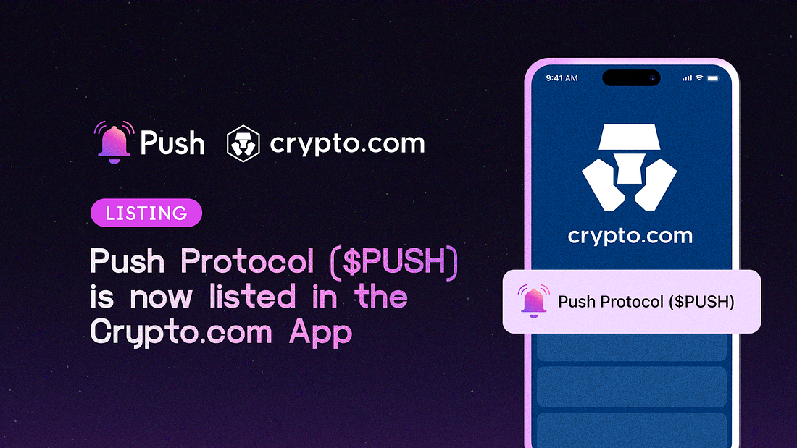

<!--truncate-->

We’re glad to share that Push Protocol ($PUSH) is now listed in the Crypto.com App, one of the biggest exchanges in the US with over 80 million customers.

Crypto.com App users can now purchase PUSH with USD, EUR, GBP, and 20+ fiat currencies, and spend it at over 80 million merchants globally using the Crypto.com Visa Card.

To users of Crypto.com, we are excited to be increasing accessibility to our native token and look forward to new holders joining our growing community!

[Trade $PUSH now on Crypto.com](https://crypto.com/exchange/trade/PUSH_USD)

You can also read the official announcement from Crypto.com here: https://crypto.com/product-news/crypto-com-app-lists-push-protocol-push

<b>.  .  .</b>

## About Crypto.com

Crypto.com is one of the biggest exchanges in the world. Crypto.com is trusted by more than 80 million customers worldwide and is the industry leader in regulatory compliance, security, and privacy certifications

Connect with Crypto.com:
[Website](https://crypto.com/), [Twitter](https://twitter.com/cryptocom), [Telegram](https://crypto.com/product-news/official-crypto-com-communities/), and [Reddit](https://www.reddit.com/r/Crypto_com/)
