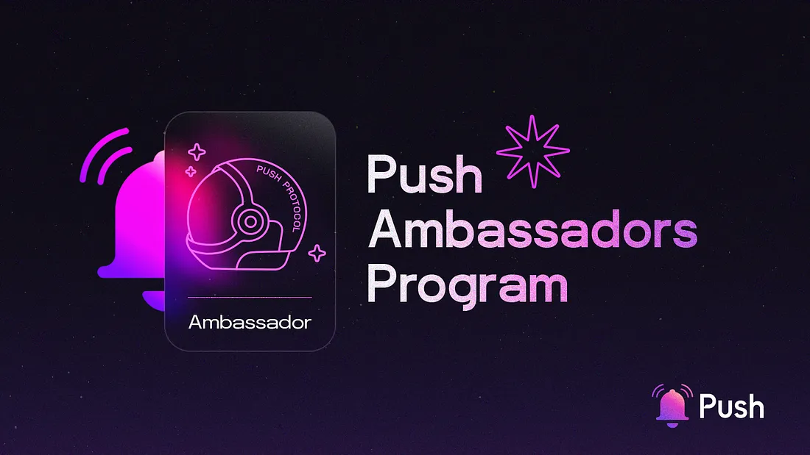

---

slug: launch-of-the-push-ambassadors-program-english-espanol
title: Launch of The Push Ambassadors Program 💜 (English + Español)
authors: [push]
tags: [ Web3, Ambassador Program, Blockchain Technology]

---

import { SubHeader } from '@site/src/components/SharedStylingV2';

<!--truncate-->

<SubHeader>Programa de Embajadores de Push protocol!</SubHeader> 

🔵<b>EN |</b> After a wonderful 2022 during which the Push team had the opportunity to participate in so many events and got to know hackers and frens from all around the world, we’d like to share some exciting news in our process to grow the Push DAO and work closer with the community.

Today, we are excited to announce the <b>Push Ambassadors Program💜</b>

👉[Application link](https://docs.google.com/forms/d/e/1FAIpQLSd4BSSfEghOChslqulXhafRUGyyQzufa7WxpL4Sh136Dsad9Q/viewform)

The Ambassadors program is a unique initiative that allows individuals to represent Push in different ways. Being an ambassador is not just about promoting the brand, but it is also about building relationships with users and potential collaborators. Ambassadors are encouraged to engage with different communities, listen to their feedback, and provide valuable insights to Push. This feedback helps Push to improve its products or services and build a better user experience.

🔴<b>ES |</b> Tras un maravilloso 2022 durante el cual el equipo de Push tuvo la oportunidad de participar en muchos eventos y conocer hackers y amigos de todo el mundo, nos gustaría compartir algunas noticias emocionantes en nuestro proceso de hacer crecer el Push DAO y trabajar más cerca de la comunidad.

Hoy, nos complace anunciar el <b>Programa de Embajadores de Push💜</b>

👉[Enlace de aplicación](https://docs.google.com/forms/d/e/1FAIpQLSd4BSSfEghOChslqulXhafRUGyyQzufa7WxpL4Sh136Dsad9Q/viewform)

El programa de Embajadores es una iniciativa única que permite a las personas representar a Push de diferentes maneras y no se trata solo de promocionar la marca, sino también de construir relaciones con usuarios y posibles colaboradores. Se motiva a los embajadores a interactuar con diferentes comunidades, escuchar sus comentarios y proporcionar información valiosa al equipo de Push. Esta retroalimentación ayuda a Push a mejorar sus productos y servicios, así como para crear una mejor experiencia de usuario.

## How does it work? | ¿Cómo funciona?
🔵<b>EN |</b> During this first iteration the program will focus on the LATAM (Latin America) region and will be run in Spanish. One of the most important outcomes is to create a replicable structure and processes that can be installed in many communities to come.

The Push DAO Lead will work closely with the selected participants ensuring they are knowledgeable about Push, all its products and its values. These group of individuals will receive training to learn about Push and will count with support from Push for their role. This training helps them to understand the brand’s message, and stay up-to-date with products and participation of Push in events. Ambassadors will also receive incentives for their work as rewards for your contributions.

Participants that makes it to the end of the program will potentially become the first DAO contributors coming directly from the community!

🔴<b>ES |</b> Durante esta primera iteración, el programa se centrará en la región de LATAM (Latinoamérica) y se llevará a cabo en español. Uno de los resultados más importantes es crear una estructura y procesos replicables que puedan instalarse en muchas comunidades en el futuro cercano.

El líder de Push DAO trabajará estrechamente con los participantes seleccionados para asegurarse de que estén familiarizados con Push, todos sus productos y sus valores. Este grupo de personas recibirá capacitación para aprender sobre Push y contará con el apoyo de Push para su rol. Esta capacitación les ayudara a comprender el mensaje de la marca y mantenerse actualizados sobre los productos y la participación de Push en diferentes eventos. Los embajadores también recibirán incentivos por su trabajo para recompensar sus esfuerzos.

¡Los participantes que completen el programa potencialmente se convertirán en los primeros contribuyentes DAO provenientes directamente de la comunidad!

## How to apply? | ¿Cómo aplicar?

🔵<b>EN |</b> To apply you will simply fill a form that will be made available soon, and the Push Team will guide you through the process.

We will onboard more ambassadors for other communities through the year and will announce the new round of applications to the public.

🔴<b>ES |</b> Para aplicar, simplemente tendrás que llenar un formulario que se publicará muy pronto, y el equipo Push lo guiará a través del proceso.

Seleccionaremos más embajadores para otras comunidades durante el año y anunciaremos cuando una nueva ronda este disponible al público.

## Wrapping up | En conclusión

🔵<b>EN |</b> The Ambassadors program is an excellent way to build a community of passionate advocates who can promote Push to a specific audience. This program helps to increase brand awareness, drive collaborations, and build a loyal user base. If you are passionate about Push and possess the necessary skills to communicate its message effectively, then becoming an Ambassador could be an excellent opportunity for you.

🔴<b>ES </b>| El programa de Embajadores es una excelente manera de construir una comunidad de personas apasionadas que pueden promocionar Push a un público específico. Este programa ayuda a aumentar el conocimiento de la marca, impulsar collaboraciones y construir una base de usuarios leales. Si eres apasionado por Push y tienes las habilidades necesarias para comunicar su mensaje de manera efectiva, convertirse en Embajador podría ser una excelente oportunidad para ti.

### About Push Protocol

Push is the communication protocol of web3. Push protocol enables cross-chain notifications and messaging for dapps, wallets, and services tied to wallet addresses in an open, gasless, and platform-agnostic fashion. The open communication layer allows any crypto wallet /frontend to tap into the network and get the communication across.

To keep up-to-date with Push Protocol: [Website](https://push.org/), [Twitter](https://twitter.com/pushprotocol), [Telegram](https://t.me/epnsproject), [Discord](https://discord.gg/pushprotocol), [YouTube](https://www.youtube.com/c/EthereumPushNotificationService), and [Linktree](https://linktr.ee/pushprotocol).