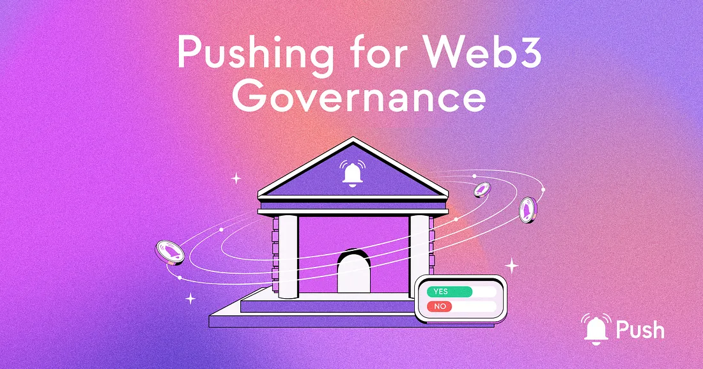

---

slug: enhancing-governance-through-web3-communication-tools
title: Enhancing Governance Through Web3 Communication Tools 🏛️
authors: [push]
tags: [ Blockchain Technology, Web3, Governance, Decentralization]

---

import { SubHeader } from '@site/src/components/SharedStylingV2';

<!--truncate-->

<SubHeader>How Push Protocol can be leveraged to maximize community participation and enhance organizations that rely on decentralized governance.</SubHeader> 

Push Protocol is ushering in a new era of sophisticated web3 middleware. We’re enabling a more efficient, effective, and democratic decentralized ecosystem.

As the backbone for communication and an essential layer of web3 infrastructure, Push Protocol streamlines decentralized coordination and elevates web3 governance structures. From seasoned web3 experts to those just beginning their journey into the decentralized world, Push Protocol is an indispensable tool for anyone looking to build and participate in the web3 ecosystem. Push is poised to be a driving force in the future of decentralized systems by enabling frictionless and permissionless collaboration, decision-making, and innovation.

Push Protocol’s robust and flexible utility empowers developers to break free from the constraints of traditional web2 infrastructure. This infrastructure is often relied on for web3-based systems. Through our web3 tools, developers can now create innovative applications and governance structures that tackle the coordination problem in web3.

With its expansive array of possibilities, Push invites developers to bring the web3 vision to life through custom, creative solutions that deliver on the full potential of decentralized systems.

Let’s explore some examples.

## Enabling Real-Time Communication Between DAOs

Push Protocol revolutionizes communication within the web3 ecosystem, including between DAOs. With the innovative Push Chat and Protocol features, DAOs can incorporate Push to communicate and make decisions in real time, elevating their coordination and decision-making processes. This allows stakeholders in multiple projects and developers working in one or various ecosystems to collaborate and connect seamlessly and efficiently through their associated DAOs, truly scaling the development and building processes within the web3 space.

And it’s not just DAOs that benefit — other agents in the web3 ecosystem can participate in discussions directly from their wallets or dapps, bridging the gap and fostering seamless collaboration.

## Breaking Down Barriers to New Solutions

As we’ve outlined, the current web2 communication infrastructure is centralized and controlled by a few large corporations, resulting in censorship, data privacy breaches, and a lack of transparency. Push Protocol solves these issues by providing a decentralized communication layer controlled by the community. Its open-source codebase and IP program guarantee that the protocol evolves transparently and democratically, with the community having the final say on any changes or improvements.

Moreover, Push Protocol provides a range of tools for developers to build and customize their solutions, including the Push Chat, which enables real-time communication, and the Push-SDK, which offers a range of functionality for building and integrating with the protocol. Additionally, Push Protocol provides seamless integration with other web3 technologies, such as Ethereum and Polygon, making it an invaluable addition to any web3 development stack.

With all this in mind, there are many ways that the governing of this model can be improved, which includes communication directly to interested users and notifications on important updates and changes, web3 style!

## Unlocking Next-Generation Governance Structures

Incorporating a decentralized communication layer like Push Protocol in web3 infrastructure is the key to unlocking next-generation governance structures. The ability for DAOs and other actors in the web3 ecosystem to communicate and coordinate seamlessly opens up new possibilities for improving and refining existing governance structures. From upgrading voting mechanisms to enhancing ownership and communication processes, the introduction of Push Protocol will allow web3 governance-based systems to scale and evolve in ways never before seen.

## Pushing the Limits of Improvement Proposals

Push Protocol’s Improvement Proposal program, PIP or Push Improvement Proposals, provides a transparent and open forum for stakeholders to submit proposals for improvements and changes to the protocol. Like the Ethereum Improvement Proposal (EIP) program and other DAO-facilitated programs, such as the Polygon DAO and Uniswap DAO, the PIP program ensures that Push Protocol stays at the forefront of the web3 landscape, continuously evolving and improving to meet the community’s needs.

However, most improvement proposal programs rely on a subset of web2-based technology and communication channels. By providing a decentralized communication layer for DAOs, Push Protocol is taking the next step in scaling improvement proposals, enabling stakeholders, whether they are users, developers, investors, etc., to coordinate robustly across different improvement proposals.

### About Push Protocol

Push is the communication protocol of web3. Push protocol enables cross-chain notifications and messaging for dapps, wallets, and services tied to wallet addresses in an open, gasless, and platform-agnostic fashion. The open communication layer allows any crypto wallet /frontend to tap into the network and get the communication across.

To keep up-to-date with Push Protocol: [Website](https://push.org/), [Twitter](https://twitter.com/pushprotocol), [Telegram](https://t.me/epnsproject), [Discord](https://discord.gg/pushprotocol), [YouTube](https://www.youtube.com/c/EthereumPushNotificationService), and [Linktree](https://linktr.ee/pushprotocol).