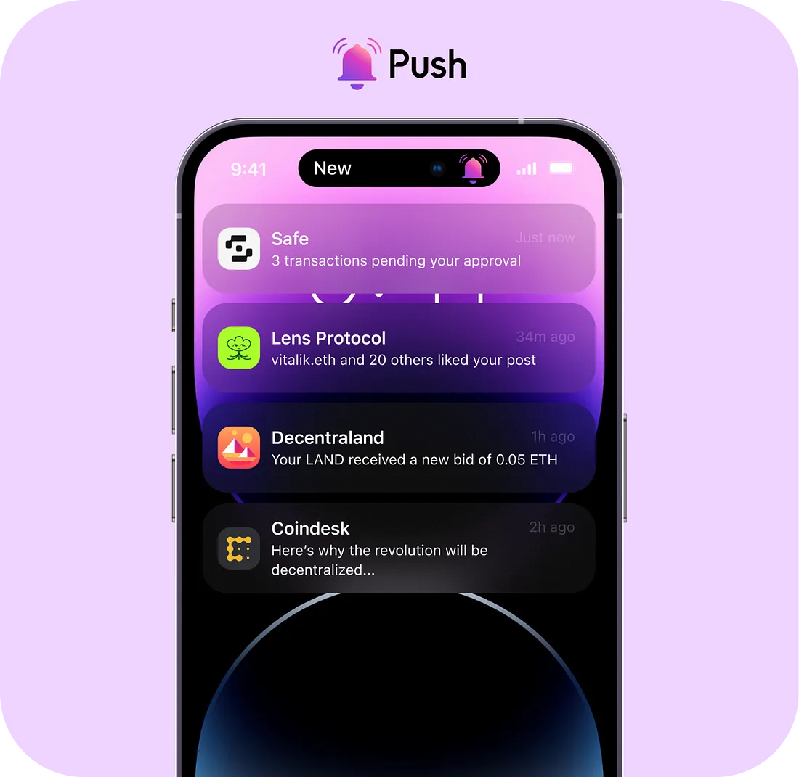
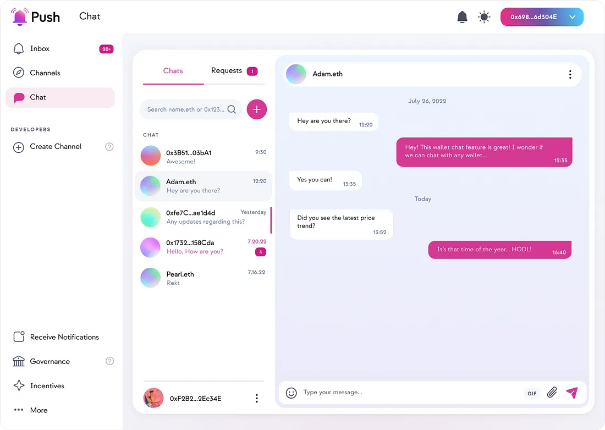

<!--truncate-->

## Push Protocolとは？

Push Protocol（前身はEPNS）は、Web3通信プロトコルであり、任意のdAppsやスマートコントラクト、バックエンド、またはプロトコルが、ユーザーウォレットアドレスを介してオンチェーンとオフチェーンの両方において、オープンで、Gasless、マルチチェーン、及びプラットフォームに依存しない方法で通信できるようにします。

## 提供するもの

Push は、オープンなコミュニケーションのミドルウェアであり、通知、チャット、ストリーミングなどを可能にする製品群を開発しています。現在、Pushには2つの主要製品、Push NotificationsとPush Chatがあります。

## 仕組み

### Push Notifications

任意のdAppやプロトコルがユーザーに通知を送信したい場合、Pushを使ってチャンネルを設定することによって可能になります。

チャンネルを作成するために必要なものは以下の通りです：

- Ethereumのトランザクション手数料（EPNSの手数料ではなく）を支払うために、50 PUSH分のETHが入ったウォレットが必要です。
- チャンネルで使用するための128x128ピクセルのロゴ。
- チャンネルの目的を簡潔に説明する説明文。
- アクションの呼びかけリンク（公式のウェブページ）

チャンネルの作成に成功すると、ウォレットアドレスベースで直接紐づけられたのそのチャネルの登録者に通知を送信できます。

一度オプトインすると、登録者はそのチャンネルから直接通知を受信します。チャンネルの登録者ではないユーザーは、そのチャンネルからの通知をスパムボックスで受信します。

さらに、チャンネルのオーナーは、通知送信権限を他の任意のウォレットアドレスに委任することもできます。これにより、選択されたウォレットアドレスがチャンネルを代表して通知を送信できます。ただし、チャンネルのオーナーはいつでも委任を取り消すことができます。

👉 https://comms.push.org/docs/

### Push Chat

Push Chatは、メッセージをIPFSに暗号化、署名、保存し、Pushノードを介して送信する安全なメッセージングプロトコルです。Push Chatを使用すると、ユーザーは直接自分のウォレットから相手のウォレットに対して通信できます。

Push Chat SDKの統合は非常に簡単で、以下の機能に分かれます：

- ユーザーメタデータ
- ユーザーのチャットの取得
- 特定のチャットの個々のメッセージの取得
- チャットへの返信

👉 https://comms.push.org/docs/chat/ui-components/integrate-push-chat/

### Push Group Chat

Group Chatはその名の通り、Web3のユーザーがグループチャットを作成し、オンラインコミュニティを形成して、Web3上で自然に共有することを可能にする機能です。 Group ChatはPush Nodesの上に構築されており、暗号化されたチャットでは最大30人のユーザーと、暗号化されていないチャットでは無制限のユーザーと一緒にグループチャットを作成できます。

Group Chatには、以下のようなユーザーエクスペリエンスを向上させるための独自の機能がいくつかあります。

- トークンゲート付きグループチャット：特定のERC20またはNFTを所有しているアドレスだけをグループチャットのメンバーとして許可することができます。
- パブリックグループとプライベートグループ：メッセージの内容を誰でも読むことができるオープンなグループ、またはメンバーだけがメッセージを読めるプライベートグループを作成することができます。
- グループメタ情報：管理者はグループ名、説明、およびグループ画像を設定できます。
- アドミンコントロール：グループチャットの作成者は、ユーザーを管理者に昇格させたり、グループ情報の変更、チャットからウォレットを追加または削除することができます。
- ファイル共有：ユーザーはGIF、画像を共有したり、ファイルをアップロードしてグループチャットのメンバーと共有することができます。

👉 [Integrating Push Chat](https://comms.push.org/docs/chat/ 'Docs explaining how to integrate Push Chat')

## ユースケース

### ⛵ NFTマーケットプレイス

NFTマーケットプレイス上でPushChatを介してbuyerとsellerでメッセージを行えます。

### 🖼️ NFT

NFTローンの清算やオークション情報に関する通知をPush Protocolを介して統合できます。

### 🌿 Lens × PushChat

Lens x PushChatを使用して、.lensプロファイル&lt;&gt;プロファイル間のメッセージングを構築できます。

### 🌊💰Superfluid

Superfluidで駆動されたマネーストリーミングアプリを構築し、ストリームの更新、流動性の危機に瀕したストリーム、送信者によってキャンセルされたストリームなどに関するプッシュ通知を提供できます

### 🧑‍🚀 The Graph x Push

サブグラフの監視において、ある閾値、日付、またはイベントに対して通知を作成します。詳細については**こちら**を参照してください。

### 🗳️ DAOツール

PushChatまたはPushを使用して、新しい提案が投票対象になったときにDAOがENSドメイン またはウォレットにメッセージを送信できるようにします。

### 💜 マルチチェーン

Pushが<b>Polygon</b>でローンチされているため、Polygon Mumbaiテストネットまたはメインネット上のdApp（NFT、DeFi、またはソーシャル）が、ユーザーと通信できるようになりました。スケーラブルで使いやすいdAppを構築しましょう。

### 🏦 Aave and other DeFi protocols

ユーザーがプロトコルチームとチャットできるように、PushChatを使用してカスタマーサポート用のチャットボットを追加します。ユーザーのローンが強制清算される直前にプッシュ通知を送信します。

### 💬 PushChat

を使用して、スマートコントラクトのアップグレードや脆弱性がある場合にコミュニティにメッセージを送信する。

### 🚜 Notify Defi farmers

イールドファーミングのAPYアラート、ステーキング報酬の受取可否状態など、Defiユーザーに通知を送信する。

### 🌐 Lens x PushChatを利用した分散型プロフェッショナルネットワーク

例えばLinkedInやAngelListなどを構築する。Push、ENS、Ceramic、IPFSなど、様々なスポンサーのテクノロジーを使用することができる。

### 📺 Livepeer x PushChatを使用した分散型の短い動画プラットフォーム

例えばTikTokやReelなどを構築する。Lens、Push、LivePeer、The Graphを使用して、コンテンツクリエイターが自分のコンテンツを生成し、収益化することができるTikTokの基本機能を作成できる。

### 🦍 NFTローン清算bot

Push [Showrunner Scaffold](https://comms.push.org/docs/notifications/showrunners-scaffold/) とPush [SNS webhook](https://comms.push.org/docs/notifications/tutorials/integrate-notifications-via-aws-sns/) およびNFT APIを使用して、NFTローンの清算が発生する前にメール、Twitter、Telegramでアラートを送信するボットを作成することができます。ユースケースとして[BAYCローン清算](https://cointelegraph.com/news/nearly-55m-worth-of-bored-ape-cryptopunks-nfts-risk-liquidation-amid-debt-crisis)をご参照ください。

### 🌱 Grants

グラント受取人がグラントを受け取ったときに、PushChatを使用して通知またはDMを送信。

### 🏗️ Infrastructure projects

IPFSに何かをアップロードしたとき、またはバリデーターが生成したEtherの量を表示する場合など、プロジェクトが完了したときにユーザーに通知を送信します

## 現在のユーザー

現在のPush Ecosystemのユーザー数は6万人以上で、1,800万件以上の通知を送信しています。主要なパートナーには以下が含まれます。

- Uniswap
- Polygon
- MakerDAO
- Lens
- dYdX
- Aragon
- DeveloperDAO
- Coindesk
- Decentraland
- その他多数

## 次のステップ

- EVM互換チェーンでのデプロイ
- 音声チャット
- 画面共有
- トークングループにおけるトークン/支払いゲートの導入

## 最後に

Push ChatとPush Notificationsの仕組みに興味がある場合は、是非[discordチャンネル](https://discord.com/invite/pushprotocol)に参加し、あなたが何をビルドしているのかを教えてください。Pushチームは、あなたがそれを実現するために必要なすべての開発者リソースを提供できます。

すぐにビルドを開始するには、<a href="https://comms.push.org/docs/"><b>こちら</b></a>のPush開発者ドキュメントにアクセスしてください。
