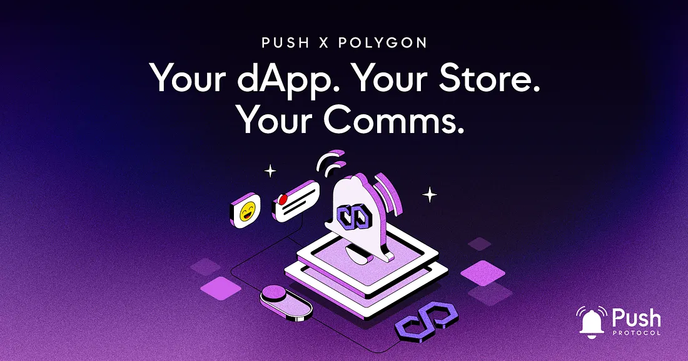

<!--truncate-->

Push Protocol is thrilled to announce that we have been selected as the communication solutions partner for dApp Store Kit!

For Push, this means integrations from hundreds of potential new dApp store fronts that are planning to build with the dApp Store Kit and exposure to the millions of Polygon users who will interact with these dApps.

We are extremely excited to be playing a critical role in dApp Store Kit stack and are looking forward to the integrations to come!

## Breaking down: What is the dApp Store Kit?

dApp Store Kit allows anyone to build a dApp store in web3. Simple. More than that though, the Store Kit enables any dApp store to list every Polygon and EVM dApp, set their own rules for monetization/distribution/curation/governance, brand it as they see fit, and more.

dApp Store Kit stack solves the problem of how Web3 dApps are discovered on mobile devices. For the longest time this has been dominated by centralized stores like Apple and Google. But now, the dApp Store Kit provides an enhanced web3 native alternative that addresses the shortcomings of its web2 counterparts by making dApp store building composable, permissionless, and interoperable.

You can learn more about the dApp Store Kit and building with it [here](https://docs.dappstorekit.io/docs/start-here).

A closer look at the dApp Store Kit stack — featuring Push as the communication solution.

## How will Push be used?

As the chosen communications solution, all dApps building with dApp Store Kit will be able to leverage the full array of Push communication products to enhance their user engagement and experience. This includes Push Notifications, Push Chat, and the newly added Push Video!

Here are some possible use cases for Push communication tools within the dApp store:

1. <b>Push Notifications:</b> Dapp store creators can use Push notifications to alert users about new features, updates, or upcoming events. This can increase user engagement and keep users informed about the latest developments in the dApp store.
2. <b>Instant Chat:</b> Push Protocol’s instant chat feature can be used by dApp store creators to provide customer support to users. This can help to resolve user issues and provide a more personalized experience for users.
3. <b>Video Chat:</b> Dapp store creators can use Push Protocol’s video chat feature to provide personalized support to users. This can be particularly useful for complex issues that require visual explanations or demonstrations.
4. <b>Feedback Systems:</b> Push’s communication tools can be used by dApp store creators to collect user reviews and ratings on the dApps they interact with. This can help to improve the quality of the dApps and provide valuable insights to dApp store creators.
5. <b>Social Features (Group Chat):</b> Push Protocol’s group messaging can be used by dApp store creators to add social features to their dApps, such as chat rooms and forums. This can increase user engagement and create a sense of community within the dApp store.

While these are just a few possible integrations, the full breadth of innovation is yet to be discovered as more dApp stores begin building using Push.

We are excited to be playing a critical role in providing our communication solutions, and hence giving access to an extensive range of new features.

## Excited for the Future of Polygon x Push

All in all, we believe Push will be a game-changer for dApp store creators. Push Protocol will enable these creators to offer a more personalized experience while interacting with their users more efficiently and seamlessly. Together, this will enhance user engagement and the overall user experience for dApp store users.

We are excited about this new integration and the potential it brings to the world of decentralized applications. We look forward to collaborating with dApp store creators and their users to create a more personalized and seamless experience for everyone!

Learn more about dApp Store Kit using Push on our [Discord](https://discord.gg/pushprotocol)

Learn how to integrate Push into your dApp: [Push developer docs](https://comms.push.org/docs/)
