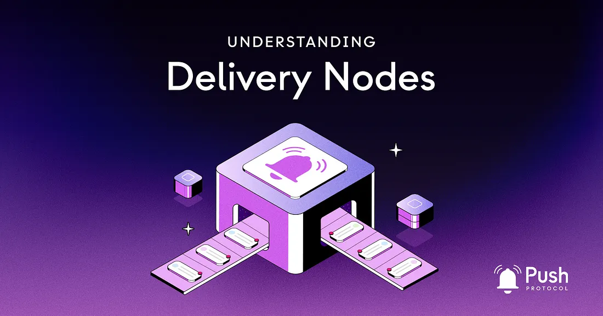

---

slug: understanding-delivery-nodes
title: Understanding Delivery Nodes🚂
authors: [push]
image: './cover-image.webp'
text: "To fully grasp the concept of push notifications and messages, it is essential to first understand the role of delivery nodes in a communication protocol.
Delivery nodes are endpoints where messages are sent and received. They can be physical devices, applications, or servers and are tasked with relaying messages from one point to another."
tags: [ Web3, Push Protocol, Delivery Nodes]

---

<!--truncate-->

To fully grasp the concept of push notifications and messages, it is essential to first understand the role of delivery nodes in a communication protocol.

Delivery nodes are endpoints where messages are sent and received. They can be physical devices, applications, or servers and are tasked with relaying messages from one point to another.

In this blog post, we will explore the various types of delivery nodes and their involvement in push notifications.

## Types of Delivery Nodes in Communication Protocols

Delivery nodes in communication protocols can be classified into the following categories:

- User devices
- Application servers
- Message brokers
- Cloud messaging services

### User Devices:

User devices are the most prevalent type of delivery node. These devices, including smartphones, tablets, and computers, receive messages from application servers and display them to the user.

### Application Servers:

Application servers serve as intermediaries between a user device and the message source, ensuring that messages are delivered to the correct device and that the device can display the message. They perform additional functions such as message processing and storage, and may also provide features like message filtering or user authentication. Application servers are primarily responsible for delivering messages to the intended recipients.

### Message Brokers:

Message brokers act as intermediaries between different applications and services, receiving messages from the source and forwarding them to the appropriate destination. They provide a middleware layer that facilitates efficient and reliable message delivery. Unlike application servers, message brokers do not process or store messages, but instead route messages between different applications or services based on their intended destination. They may also perform additional functions like message filtering or message transformation to ensure successful delivery.

### Cloud Messaging Services:

Cloud messaging services are delivery nodes that send push notifications to user devices. These services act as intermediaries between the application server and the user device, processing and delivering messages from the application server to the user device through push notifications.

## The Train Analogy🚂

Delivery nodes in communication protocols can be compared to the different components of a train system.

<b>Cloud messaging services</b> are like the train tracks that connect different destinations. They provide a reliable and efficient route for messages to travel between different devices and services.

  <b>Application servers</b> are like the trains that run on the tracks, carrying messages to their intended destinations. They ensure that messages are delivered to the correct device and can be displayed to the user. Application servers also perform additional functions like message processing and storage, as well as providing features like message filtering and user authentication.

  <b>Message brokers</b> are like the engines that propel the trains, ensuring they are running efficiently and reliably. The message brokers act as intermediaries between different applications and services, providing a middleware layer that facilitates efficient and reliable message delivery. Message brokers may also perform additional functions like message filtering or message transformation to ensure successful delivery.

  <b>User devices</b> are like train destinations, which receive the messages and display them to the users. They are the ultimate destination of the messages, and it is important that they receive the messages in a reliable and efficient manner.

Together, these delivery nodes work together to enable seamless and secure communication in a communication protocol. By understanding the different roles of each component and how they work together, businesses and organizations can implement effective messaging solutions that meet their specific communication needs.

## Key Features of Push Notifications in Communication Protocols

Push notifications are a crucial feature of modern communication protocols as they enable real-time updates to be delivered directly to a user’s device even when the application is inactive. To enable push notifications, several key components must work together.

### Cloud Messaging Services for Real-time Push Notifications

Different cloud messaging services are available to enable real-time push notifications in applications. Firebase Cloud Messaging (FCM), Apple Push Notification Service (APNS), and Amazon Simple Notification Service (SNS) are some of the popular options that provide similar functionality for sending real-time updates to user devices.

### Firebase Cloud Messaging (FCM):

One popular cloud messaging service is Firebase Cloud Messaging (FCM), a cross-platform messaging service that supports real-time messaging for Android, iOS, and web applications. FCM is a reliable and efficient way to send push notifications to user devices, making it ideal for applications that require real-time updates.

To utilize FCM, an application must first integrate the FCM SDK, which provides the required functionality for sending and receiving messages. Once the SDK is integrated, the application can send messages to FCM using the FCM API.

The FCM API enables applications to send messages to individual devices, groups of devices, or topics. The ‘topics’ feature allows messages to be transmitted to multiple devices subscribed to a specific topic. This simplifies the process of messaging groups of users based on their interests or preferences.

Upon receiving a message, FCM processes and delivers it as a push notification to the user device, which then displays the notification, providing real-time updates.

### Alternative Cloud Messaging Services:

Apart from FCM, other cloud messaging services, such as Apple Push Notification Service (APNS) and Amazon Simple Notification Service (SNS), are available. These services offer similar functionality to FCM, allowing applications to send real-time push notifications to user devices.

## The 5 Core Components of Push Chat

The Push Protocol is designed to allow developers to build messaging applications with a highly scalable, secure, and efficient messaging system. It relies on several services that make up the delivery nodes that handle the transmission of messages from sender to receiver.

### 1. Push Tokens Service: Device Token Management

The first service in the Push Protocol is the Push Tokens Service. This crucial component is tasked with managing the registration of device tokens and their corresponding wallet addresses. When a user installs a messaging application, the Push Tokens Service generates a unique device token for their device and links it with their wallet address. This information is then stored in a database for future reference.

### 2. Feed Processor Service: Message Payload Distribution

The next key service is the Feed Processor Service, which processes incoming feeds containing messages and data (also known as message payloads) along with recipient wallet addresses. This service retrieves the device tokens linked to the recipient wallet addresses from the Push Tokens Service and organizes them into batches based on the messaging platform’s maximum size allowance. Each batch of device tokens and its corresponding message payload are then dispatched to the Push Message Service.

### 3. Push Message Service: Message Transmission

The Push Message Service is at the heart of the message transmission process. Upon receiving batches of device tokens and message payloads from the Feed Processor Service, the Push Message Service stores this data in a database. The Push Message Service then processes the messages in batches, forwarding them to the appropriate devices via Firebase Cloud Messaging (FCM).

### 4. FCM Service: Delivering Messages to Devices

The FCM Service is responsible for ensuring that messages reach their intended devices. Utilizing the Firebase Cloud Messaging platform, it sends the message payload to the device tokens provided by the Push Message Service. The FCM Service subsequently receives a response from FCM, indicating whether each message was successfully delivered. In a failed delivery, the FCM Service forwards the device token to the Push Tokens Service for removal.

### 5. Authentication Service: Securing Communication

The final puzzle piece of the process is the Authentication (Auth) Service. This service generates and administers server tokens to authenticate communication between the various services aforementioned.

For each wallet address that wants to receive messages, it must first request a token from the Auth Service. The Auth Service then generates a unique server token and associates it with a secret key for that wallet address. This information is stored in a database, and the server token is made available to the other services for authentication purposes when making requests.

With all these services working together, messages can be sent from one wallet to another through the messaging platform. The Feed Processor Service first processes the message, retrieves the recipient device tokens from the Push Tokens Service, and sends them to the Push Message Service. The Push Message Service then sends the messages to the devices using the FCM Service, which reports whether the message was delivered successfully or not. The Auth Service ensures that communication between the services is secure and authenticated.

## Build With Push Delivery Nodes

To begin building with Push Delivery Nodes, read up on our documentation specifically for it here:

👉👉👉https://comms.push.org/docs/notifications/tutorials/integrate-notifications-via-delivery-node/
