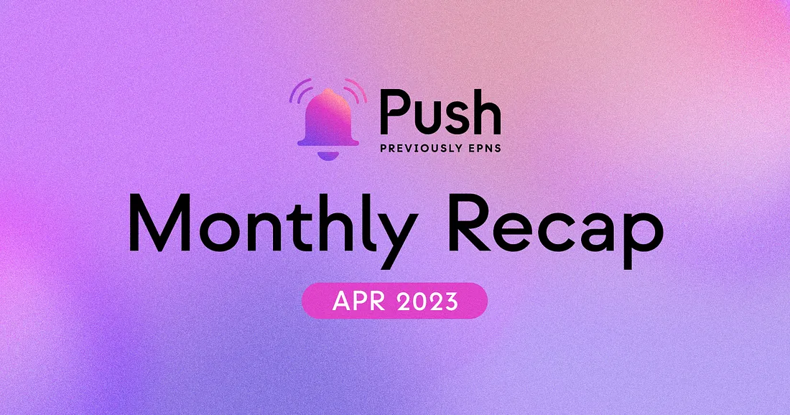

---

slug: april-monthly-recap
title: April Monthly Recap✨
authors: [push]
image: './cover-image.webp'
text: "Welcome to another exciting month at Push Protocol!
While there’s a lot to get through, there is one announcement that stands out and we think is worthwhile giving extra attention."
tags: [ Web3, NewsLetter, Blockchain Development, Blockchain Technology]

---

<!--truncate-->

Welcome to another exciting month at Push Protocol!

While there’s a lot to get through, there is one announcement that stands out and we think is worthwhile giving extra attention.

As we’ve been busy expanding our reach, adding to our suite of decentralized communication tools, and working to revolutionize web3 communication, April hosted the release of our latest development. Introducing [Push Video Chat](https://x.com/PushChain/status/1646483829287182339) — a groundbreaking wallet-to-wallet video chat that allows web3 users to connect in real time.

We’re extremely excited for the new opportunities Push Video Chat presents — so let’s now dive deeper into everything else that happened at Push in April.

## Development🛠️

The [launch of Push Video](https://medium.com/push-protocol/push-launches-wallet-to-wallet-video-chat-3240f3c6bf8) is revolutionizing communication in web3 by allowing a whole new generation of functionality to web3 projects. We’re excited to see all the innovations that will follow. In the pipeline are plans to add features like group video chat, video streaming, and a web3 social audio experience for decentralized online forums. With these developments, Push Protocol aims to build a decentralized social networking ecosystem for the internet of the future.

There’s more! Push team has been hard at work on several other exciting developments, including:

- Dapp and Mobile App optimizations
- SDK: Added more functionalities and fixed bugs
- Time-bound channels feature has gone live
- Push Chat AI Bot is coming soon
- Group chat feature improvements and optimizations are in their final stages
- Final QA of Push Video feature will be completed soon

## Frens of Push & Ecosystem Growth🌱

Our commitment to collaborate with other projects in the web3 ecosystem keeps growing, and we are thrilled to have made some exciting new frens this month.

We are delighted to announce our collaboration with [Polygon zkEVM](https://x.com/PushChain/status/1640396503029104640?s=20), bringing zkEVM notifications and Chat to users soon. We are also honored to have been selected as a [communications partner for Polygon dApp Store Kit](https://x.com/PushChain/status/1646621032420196353), further solidifying our commitment to building a more secure and transparent web3 ecosystem.

Additionally, we [integrated with Safe](https://x.com/PushChain/status/1646182889632018432), bringing enhanced security to the collective asset management protocol.

As we continue to work with like-minded partners, we look forward to achieving great things together and bringing new value to our users.

A look at the Push Ecosystem as of April, 2023

## Featured📰

We’re thrilled to share some exciting news about Push Protocol’s recent features and media recognition.

- We’re thrilled to celebrate the Push Video launch with special messages from [Sandeep](https://x.com/PushChain/status/1648390010444324871?s=20) of Polygon, [DeFiDad](https://x.com/PushChain/status/1649095591060815892?s=20), [Kartik](https://x.com/PushChain/status/1648733201618042898?s=20) of ETHGlobal, [Samyak](https://x.com/PushChain/status/1649820359280017409?s=20) of InstaDapp, and [Dawson](https://x.com/PushChain/status/1649442872486182912?s=20) of Earnifi and Bankless.
- Push Protocol is now [live on Magic Square](https://x.com/PushChain/status/1641771423411699717?s=20), a Discovery & Engagement Platform for the Web3 Ecosystem, and was also recognized as [‘App of the Week’](https://x.com/PushChain/status/1647869769138184193?s=20).
- We’re honored to have been listed as one of the [20 top dApps on BNB Chain’s DappBay](https://x.com/PushChain/status/1646911286603554817?s=20) in April 2023.
- Push and Push Video Chat launch were featured in the latest articles by [Blockworks](https://x.com/PushChain/status/1646936356554194946?s=20), [Blockster](https://x.com/PushChain/status/1647268544063721473?s=20), and [Cryptonews](https://x.com/PushChain/status/1647630940108206080?s=20).- [Fleek](https://x.com/PushChain/status/1649004992227954688?s=20) featured Push as an integral part of Web3 tech stack.
- Our core dev [Fabio delivered a workshop](https://twitter.com/ETHGlobal/status/1646823876880416769?s=20) during ETHTokyo on the topic: ‘Building Native Web3 Messaging & Notification Apps with Push Protocol’, providing insights into the latest developments in decentralized communication.

## Push DAO🤝

Our DAO is constantly evolving, and we’re excited to share our progress in our various programs.

- The <a href="https://twitter.com/Push_DAO/status/1640749633746993167"><b>Push Bug Bounty Program</b></a> went live and we’re thrilled to have already processed and addressed five reports from our community. We’re grateful for the support of our community in identifying and addressing potential vulnerabilities.
- Our <b>Push Ambassadors Program</b>, [announced earlier this month](https://x.com/PushChain/status/1641425465192660997), has received an overwhelming response from our community. We received over 270 applications from 13 countries, and our Discord and Twitter sessions were packed with interested candidates. We’ve officially started the program with [10 amazing ambassadors](https://x.com/PushChain/status/1653066991928852480) and can’t wait to see their contribution to the Push Ecosystem.
- Finally, our <b>Push Grants Program</b> continues to be a huge success, with exciting new submissions this month. We’re impressed by the creativity of our community members and are excited to support their efforts through our Grants Program.

## Community💜

Our community’s enthusiasm and support inspire us to continue building. Let’s take a look at some of the ways we’ve been connecting with our community over the past month:

1. The [Push x CyberConnect AMA](https://x.com/PushChain/status/1641800699049570306?s=20) received an amazing response.
2. Amazing response for the [Hackathon 101 Twitter Spaces](https://x.com/PushChain/status/1643218238573035523?s=20) joined by our friends from Livepeer, Goldman Sachs, and Fuel Network.
3. Our founder Harsh was featured on [The Defiant](https://twitter.com/DefiantNews/status/1646377694018568198) podcast to discuss the power of decentralized messaging and the intersection between AI and Web3.

What’s more? We’re hosting very exciting [Trivia Nights](https://x.com/PushChain/status/1648310413006610432?s=20) every Wednesday on [Push Discord](https://discord.com/invite/pushprotocol). Don’t miss out on all the fun and rewards!

Lastly, we attended [ETH Tokyo](https://x.com/PushChain/status/1646830660001341440) and had the most amazing time interacting with our community. We’re taking away some amazing learnings and can’t wait to see you all next time.

## Contests💸

Every month, we’re giving away bounties and rewards for our community.

We were thrilled to see the fantastic projects and presentations at ETH Tokyo, and we congratulate all the winners of the event. [13 incredible ideas, projects, and teams won incredible Push bounties](https://x.com/PushChain/status/1648661237998182400?s=20).

Additionally, we hosted the Crypto.com [$PUSH Trading Competition](https://twitter.com/cryptocom/status/1646133273893175297), which was a huge success. Lastly, we partnered with [Superteam Earn](https://x.com/PushChain/status/1648276918045745152?s=20) to offer bounties to the best articles written by our community.

We look forward to hosting more exciting events in the future to reward our amazing community. Stay tuned for more updates!

<b>.   .   .</b>

As we wrap up another exciting month at Push, we are grateful for the tremendous support from our community and partners in the web3 ecosystem.

We’re excited to see what the future holds for Push. Until next time!
