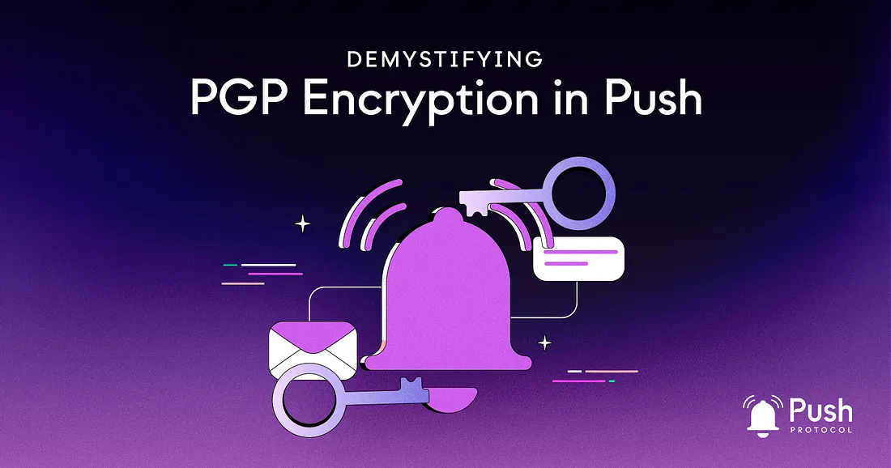

---

slug: demystifying-pgp-encryption-in-push
title: Demystifying PGP Encryption in Push🛡️
authors: [push]
tags: [ Web3, Pgp, Cybersecurity, Blockchain Technology]

---

<!--truncate-->

PGP Encryption, or Pretty Good Privacy as its also known, is a critical element of what makes Push messages so secure. It’s a security program that enables users to communicate securely by decrypting and encrypting messages — but how does it work?

In this article we will explore how PGP encryption works and how it pertains to Push Protocol. Let’s dive in.

## The Fundamentals of PGP Encryption

PGP encryption works by combining symmetric-key and public-key cryptography. The process involves the following steps:

### Key Generation:

Each user generates a public and private key pair. The public key is shared openly, while the private key remains confidential.

### Encryption:

When sending a message, the sender uses the recipient’s public key to encrypt the message. This ensures that only the intended recipient with the corresponding private key can decrypt the message.

### Signing:

The sender can digitally sign the message using their private key, creating a unique signature. This signature can be verified using the sender’s public key, ensuring the message’s authenticity and integrity.

### Decryption:

Upon receiving the message, the recipient uses their private key to decrypt it and, if applicable, verify the digital signature using the sender’s public key.

## An Example with Bundesbank🏦

According to their [official website](https://www.bundesbank.de/en/service/banks-and-companies/pki/pgp/pretty-good-privacy-pgp--621112), the Bundesbank, Germany’s central bank, uses PGP encryption to secure confidential email communications. They employ a single PGP key for the entire organization (except for a few local installations). The key is 2048 bits long and valid until June 9, 2030. This key can be used to reach almost all Bundesbank email addresses securely.

Here is an example of Bundesbank uses PGP encryption for emails:

<b>Step 1: Obtain the Bundesbank’s PGP Public Key</b> First, you need to obtain the Bundesbank’s PGP public key. You can find it on their website or request it from the bank’s contact. The fingerprint of their PGP public key is:

7976 022F 5061 3189 F250 A187 3746 D004 4D8B 595E

<b>Step 2: Import the Bundesbank’s PGP Public Key</b> Import the Bundesbank’s public key into your PGP software or email client (such as GnuPG, Thunderbird with Enigmail, or Outlook with Gpg4win).

<b>Step 3: Compose Your Confidential Email</b> Write your confidential email to the Bundesbank using your preferred email client.

<b>Step 4: Encrypt the Email</b> Before sending the email, use your email client’s PGP functionality to encrypt the email with Bundesbank’s public key. This ensures that only the Bundesbank, with the corresponding private key, can decrypt and read the email.

<b>Step 5: Sign the Email (Optional)</b> You can also choose to sign the email using your own PGP private key digitally. This allows the Bundesbank to verify your identity and the integrity of your message using your public key.

<b>Step 6: Send the Encrypted Email</b> Finally, send the encrypted email to the intended Bundesbank email address. The email will be securely transmitted and can only be decrypted and read by the Bundesbank.

By using PGP encryption, you can ensure that your confidential email communication with the Bundesbank remains secure and private, protecting sensitive information from unauthorized access or tampering.

The example of Bundesbank using PGP encryption for secure email communication demonstrates the effectiveness of PGP encryption in protecting sensitive information in the traditional financial world. However, with the increasing connectivity and decentralization of communication systems, there is a need for secure messaging protocols that can ensure safe and confidential communication across a distributed network.

This is where the use of PGP in a decentralized communication protocol like Push Protocol comes in. Push Protocol provides high security and privacy for messaging systems by using PGP encryption in a distributed network of push delivery nodes. The push delivery nodes are responsible for delivering encrypted messages to their intended recipients in a secure and reliable manner.

The use of PGP encryption in the Push Protocol ensures that messages are encrypted end-to-end, meaning that only the sender and the recipient can decrypt and read the message. This provides a high level of security and privacy, even in a decentralized network.

## PGP Encryption in Push Protocol: A Step-by-Step Process

The implementation of PGP encryption inPush Protocol involves several steps:

### Key Storage:

A PGP key pair is generated for their address when a user logs into Push Protocol for the first time. The private key is encrypted using the user’s public key and sent to Push Nodes for storage, while the public key is stored locally on the user’s device and used to encrypt outgoing messages.

### Message Encryption:

When a message is sent, the client-side application encrypts the message payload using the [Advanced Encryption Standard (AES) algorithm](https://en.wikipedia.org/wiki/Advanced_Encryption_Standard), which is a widely used and secure encryption algorithm. The AES algorithm is a complex encryption algorithm that uses a symmetric key to encrypt and decrypt data.

A unique AES secret key is generated for each message, which is then encrypted using the PGP public keys of the sender and recipient. This ensures that only the intended recipient can decrypt and read the message, and that the message content remains secure and private during transit.

### Message Transmission:

The encrypted message payload and AES secret key are sent to the Push Nodes, which then forward the message to the recipient.

### Message Decryption:

Upon receiving the message, the recipient decrypts the AES key using their PGP private key and then decrypts the message payload using the decrypted AES key.

## Future-proofing PGP Encryption in Push Protocol

The flexibility and extensibility of PGP encryption in Push Protocol ensure that the system remains future-proof and adaptable. This means:

### Multi-Chain Compatibility:

As blockchain networks adopt various encryption methods, Push Protocol can still facilitate secure communication by encrypting PGP keys using multiple methods.

### Security Evolution:

As new security threats and vulnerabilities emerge, Push Protocol can upgrade its encryption methods easily, ensuring users’ communications remain protected and private.

In conclusion, by integrating PGP encryption into Push Protocol, Push’s messaging system provides a secure and private messaging solution for blockchain-based applications. The decentralized nature of Push Protocol, combined with the reliability and adaptability of PGP encryption, ensures users can communicate and transact with confidence. This is thanks to the fact messages and transactions are protected against interception and tampering. Additionally, Push Protocol’s ability to easily upgrade its encryption methods in response to new security threats and vulnerabilities further enhances its ability to provide secure and private messaging services.

### About Push Protocol

Push is the communication protocol of web3. Push protocol enables cross-chain notifications and messaging for dapps, wallets, and services tied to wallet addresses in an open, gasless, and platform-agnostic fashion. The open communication layer allows any crypto wallet /frontend to tap into the network and get the communication across.

To keep up-to-date with Push Protocol: [Website](https://push.org/), [Twitter](https://twitter.com/pushprotocol), [Telegram](https://t.me/epnsproject), [Discord](https://discord.gg/pushprotocol), [YouTube](https://www.youtube.com/c/EthereumPushNotificationService), and [Linktree](https://linktr.ee/pushprotocol).