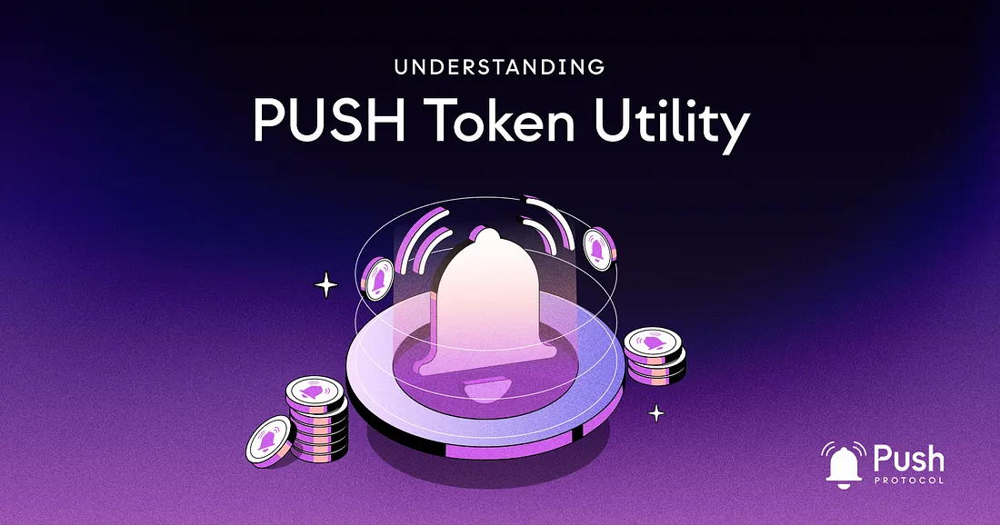

---

slug: unlocking-the-full-potential-of-push-a-look-at-push-token-utility
title: 'Unlocking the Full Potential of Push: A Look at $PUSH Token Utility🪙'
authors: [push]
tags: [ Web3, Cryptocurrency, Tokenomics, Blockchain Technology]

---

<!--truncate-->

Token economics (or tokenomics) are a critical component of any blockchain or cryptocurrency project. It dictates how incentives are created, distributed, and managed within the network. Push Protocol is a decentralized communication layer for Web3 that uses a native token, $PUSH, to incentivize its network participants.

In this post, we’ll take a closer look at Push token economics and explore how it differs from other token systems. We’ll also examine the specific incentives driving the Push Protocol network and how they contribute to the network’s overall success.

## Push Token Economics: An Overview

Push Protocol’s token economics aim to create a circular economy run by the community, for the community. The goal is for every participant to be rewarded for their contributions while simultaneously discouraging behavior that would be detrimental to the network. The $PUSH token is at the center of the ecosystem, providing incentives for all network participants.

The $PUSH token is used in four primary ways within the Push Protocol ecosystem: securing the network, network utility, Push DAO and governance, and the reward pool fee. As Push Protocol expands to more chains and adds new forms of communication, more utility for $PUSH may emerge in addition to the four primary use cases.

## 1. Securing the Network

Push Nodes are an integral part of the Push Protocol network. These nodes allow Push Protocol to facilitate communication across multiple blockchains while retaining governance on the Ethereum mainnet. Push Nodes can be run by anyone and are incentivized to act in the network’s best interest through the use of $PUSH tokens in Proof of Stake. Nodes that continue to reach consensus and operate in the network’s best interest are rewarded in $PUSH tokens. Conversely, Push Nodes that do not remain synced with consensus or attempt to damage the network are penalized with the $PUSH tokens these bad actors staked.

## 2. Network Utility

$PUSH tokens are used as payment for message broadcasting on the Push Protocol network. When users broadcast a message, they must pay in $PUSH tokens to deliver that message to all interested parties. This payment incentivizes nodes on the network to relay the message to their peers, ensuring that the network remains fast and reliable.

## 3. Push DAO and Governance

53% of the supply of $PUSH has been allocated to the community to define the future of Push Protocol and its development. $PUSH also gives owners the right to vote on critical protocol decisions, including the staking structure, staking mechanisms, and reward distribution rates.

Governance votes can include:

- The structure of the fees paid by services
- The DeFi mechanism for the staking pool
- Other protocol incentivization and financial elements

Push Protocol adheres to Progressive Decentralized Governance. That is, a structure where power in decisions making is gradually distributed to the community. This approach allows token holders to have a say in the protocol’s future direction, ensuring that the network remains aligned with the community’s interests.

## 4. Push Fee Pool

The Push Fee Pool is designed to reward various participants, fostering a circular economy within the Push Protocol ecosystem. As the community moves towards greater decentralization, the network will determine fees, such as those charged to “super users” of chat and notifications (protocols sending large volumes of notifications) and fees related to the utility features of the protocol. It is essential to note that all fees are charged at the protocol level.

These fees are then distributed to $PUSH token holders and cryptocurrency wallets adopting the Push Protocol. The participants receiving rewards include token holders, wallet providers, and other stakeholders contributing to the ecosystem’s growth and decentralization.

The $PUSH token incorporates a time-weighted feature, enabling the protocol to identify and reward token holders who have maintained their $PUSH holdings for extended periods. This mechanism ensures that long-term supporters of the project receive proportionally higher rewards.

In summary, the Push Fee Pool aims to clarify the following points:

- Various participants, including token holders, wallet providers, and other stakeholders, are rewarded through the Push Fee Pool.
- Fees are charged at the protocol level and can include charges for “super users” and utility features within the Push Protocol.- 
- The fees collected are not from liquidity pools but rather from protocol-level activities.
- The $PUSH token’s time-weighted feature ensures that long-term token holders receive proportionally higher rewards.

## Key Features of Push Tokenomics:

Push Protocol’s token economics model is designed with several essential features to promote a robust and sustainable ecosystem:

1. Circular Economy: The tokenomics aims to reward all network participants, encouraging them to hold onto tokens and contribute to the network’s growth and development.
2. Hybrid Proof of Stake Mechanism: Push Protocol utilizes a hybrid Proof of Stake mechanism to secure the network. Rewards and penalties in $PUSH tokens incentivize good behavior and deter bad actors.
3. Community-driven Governance: The Push DAO and governance system empower the community to influence the network’s future direction, ensuring alignment with the interests of its members.

While some of these features may share similarities with other tokenomic models, the combination of these elements within Push Protocol’s ecosystem helps create a unique and thriving environment for its users and stakeholders.

## The Role of Incentive Schemes in Blockchain Networks

Incentive schemes play a significant role in driving participation and fostering growth in blockchain and cryptocurrency projects. While they are not the sole determinant of success, well-designed incentives can encourage users to hold onto their tokens, actively engage with the network, and contribute to its growth and development. Common incentive schemes include proof of stake, proof of work, token burning, airdrops, staking, liquidity mining, and gamification. By striking a balance between incentivization and other factors such as technology, governance, and community engagement, a project can increase its chances of long-term success and sustainability.

Let’s break them all down:

Proof of Stake (PoS) is a consensus mechanism that uses token staking to incentivize network participants to act in the network’s best interest. In PoS, validators stake tokens to verify transactions, and those who verify transactions correctly are rewarded with additional tokens. Those who act against the network’s best interests may lose their staked tokens.

Proof of Work (PoW) is a consensus mechanism that uses computational power to verify transactions. In PoW, miners solve complex mathematical problems to add new blocks to the blockchain. The first miner to solve the problem is rewarded with new tokens, and their block is added to the blockchain. PoW is resource-intensive and may lead to centralization.

Token Burning removes tokens from circulation by sending them to an address that no one can access. Token burning can be used to increase the value of existing tokens by decreasing the overall supply.

Airdrops are used by cryptocurrency projects to distribute free tokens to users. Airdrops can be used to increase network participation and attract new users. This is especially helpful for a project just starting out.

Staking is a mechanism that allows users to hold tokens for a specific period to receive rewards in return. Staking incentivizes participants to hold onto their tokens and participate in the network; the longer they stake, the greater their rewards will be.

Liquidity Mining incentivizes users to provide liquidity to a specific pool in exchange for tokens collected from trading fees. The more liquidity that is provided, the greater the rewards will be.

Gamification is a process of incentivizing users to complete specific actions. This can include completing transactions, referring friends, or engaging with the platform in other ways. By providing rewards for these actions, users are encouraged to continue using the platform and contributing to its growth and development.

## Conclusion

Push Protocol’s token economics are designed to create a circular economy that incentivizes and rewards all network participants, while deterring behavior that would be detrimental to the network. Token economics and the resulting incentives play a crucial role in accelerating the adoption of a given cryptocurrency or project. Push Protocol achieves this through its use of a hybrid Proof of Stake mechanism and its Push DAO and governance system, which give the community a say in the network’s future direction and foster a collaborative environment.

As the Push Protocol community continues to grow and evolve, the team is constantly looking to add more utility for the $PUSH token. This includes exploring new use cases for the token and incentivizing more participants to hold and use the token. The community plays a crucial role in fostering this innovation and contributing to the network’s growth and development.

Incentives and token economics are essential components of any successful blockchain or cryptocurrency project. Push Protocol’s token economics exemplify a system that incentivizes participants to secure the network, pay for message broadcasting, and participate in network governance. As Push Protocol expands to more chains and adds new forms of communication, it will be exciting to see how its token economics evolve to create even more incentives for network participants. We invite you to join the Push Protocol community and discover the power of its token economics for yourself.

### About Push Protocol

Push is the communication protocol of web3. Push protocol enables cross-chain notifications and messaging for dapps, wallets, and services tied to wallet addresses in an open, gasless, and platform-agnostic fashion. The open communication layer allows any crypto wallet /frontend to tap into the network and get the communication across.

To keep up-to-date with Push Protocol: [Website](https://push.org/), [Twitter](https://twitter.com/pushprotocol), [Telegram](https://t.me/epnsproject), [Discord](https://discord.gg/pushprotocol), [YouTube](https://www.youtube.com/c/EthereumPushNotificationService), and [Linktree](https://linktr.ee/pushprotocol).